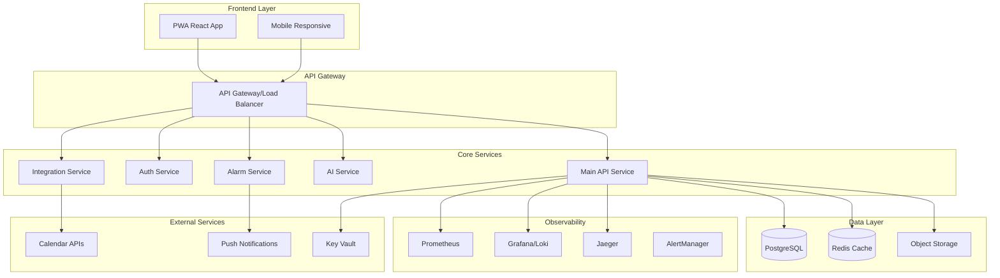
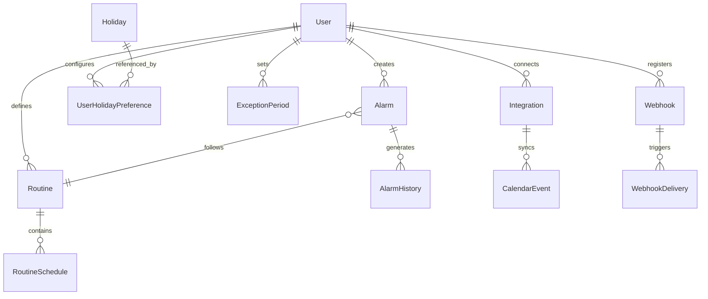

# Design Document - Finalização e Entrega do Smart Alarm

## Overview

Este documento detalha o design técnico para finalizar o projeto Smart Alarm, transformando-o de um estado funcional para um produto completo pronto para produção. O design foca em estabilização, completude funcional, qualidade e preparação para deploy em produção.

## Architecture

### Current State Analysis
- **Backend**: .NET 8 com Clean Architecture (Domain, Application, Infrastructure, API)
- **Frontend**: React 18 + TypeScript + Vite + Tailwind CSS
- **Database**: PostgreSQL com Entity Framework Core
- **Authentication**: JWT + FIDO2 implementado
- **Observability**: OpenTelemetry + Prometheus + Grafana configurado
- **Microservices**: AI Service, Alarm Service, Integration Service (parcialmente implementados)
- **Infrastructure**: Docker + Kubernetes configurado

### Target Architecture


## Components and Interfaces

### 1. Frontend Completion
**Components to Complete:**
- Dashboard with real-time metrics
- Alarm management (CRUD operations)
- Calendar integration view
- Settings and preferences
- User profile management
- Notification management
- Import/Export functionality

**Technical Implementation:**
- React Query for state management and caching
- React Router for navigation
- Tailwind CSS for responsive design
- PWA configuration for offline support
- SignalR for real-time updates

### 2. Backend API Stabilization
**Core Controllers:**
- AlarmController (complete CRUD + scheduling)
- AuthController (JWT + FIDO2 + refresh tokens)
- UserController (profile management)
- RoutineController (recurring patterns)
- HolidayController (holiday management)
- ExceptionPeriodController (temporary overrides)
- ImportController (CSV processing)

**Service Layer Enhancements:**
- Background services for alarm triggering
- Notification service integration
- Calendar synchronization service
- File processing service
- Audit logging service

### 3. Microservices Completion
**AI Service:**
- ML models for optimal alarm timing
- Pattern analysis for user behavior
- Recommendation engine
- Performance optimization suggestions

**Alarm Service:**
- Real-time alarm triggering
- Notification delivery
- Escalation policies
- Snooze and dismiss handling

**Integration Service:**
- Google Calendar integration
- Outlook Calendar integration
- Apple Calendar integration
- Webhook management
- External API rate limiting

### 4. Database Optimization
**Performance Improvements:**
- Index optimization for frequent queries
- Query performance analysis
- Connection pooling configuration
- Read replicas for reporting

**Data Integrity:**
- Foreign key constraints validation
- Data validation rules
- Backup and recovery procedures
- Migration scripts validation

## Data Models

### Enhanced Entity Relationships


### New Entities for Production
- **AlarmHistory**: Track alarm executions and user interactions
- **AuditLog**: System-wide audit trail
- **SystemConfiguration**: Runtime configuration management
- **NotificationTemplate**: Customizable notification templates
- **UserSession**: Active session management
- **ApiKey**: External API access management

## Error Handling

### Comprehensive Error Strategy
1. **Client-Side Errors**
   - Form validation with real-time feedback
   - Network error handling with retry logic
   - Offline state management
   - User-friendly error messages

2. **Server-Side Errors**
   - Global exception handling middleware
   - Structured error responses
   - Error correlation IDs
   - Automatic error reporting

3. **Integration Errors**
   - Circuit breaker pattern for external APIs
   - Fallback mechanisms
   - Retry policies with exponential backoff
   - Dead letter queues for failed operations

### Error Response Format
```json
{
  "error": {
    "code": "VALIDATION_ERROR",
    "message": "Invalid alarm time format",
    "correlationId": "abc-123-def",
    "details": [
      {
        "field": "time",
        "message": "Time must be in HH:mm format"
      }
    ],
    "timestamp": "2025-01-14T10:30:00Z"
  }
}
```

## Testing Strategy

### 1. Unit Testing
- **Target Coverage**: 80%+ for business logic
- **Frameworks**: xUnit for .NET, Vitest for React
- **Mocking**: Moq for .NET, MSW for React
- **Test Categories**: Domain logic, API controllers, Services

### 2. Integration Testing
- **Database Tests**: TestContainers with PostgreSQL
- **API Tests**: WebApplicationFactory with test database
- **External Service Tests**: WireMock for API mocking
- **Message Queue Tests**: TestContainers with RabbitMQ

### 3. End-to-End Testing
- **Framework**: Playwright for cross-browser testing
- **Scenarios**: Complete user workflows
- **Data Management**: Test data seeding and cleanup
- **Environment**: Dedicated test environment

### 4. Performance Testing
- **Load Testing**: Artillery.js or k6
- **Stress Testing**: Gradual load increase
- **Endurance Testing**: Extended duration tests
- **Metrics**: Response time, throughput, error rate

## Security Implementation

### Authentication & Authorization
- **JWT Tokens**: Short-lived access tokens (15 minutes)
- **Refresh Tokens**: Long-lived, securely stored (7 days)
- **FIDO2**: Passwordless authentication option
- **Role-Based Access**: Admin, User, ReadOnly roles
- **API Keys**: For external integrations

### Data Protection
- **Encryption at Rest**: Database encryption
- **Encryption in Transit**: TLS 1.3 for all communications
- **Sensitive Data**: Key Vault for secrets management
- **PII Handling**: LGPD/GDPR compliance measures
- **Audit Trail**: All data access logged

### Security Headers
```
Content-Security-Policy: default-src 'self'
X-Frame-Options: DENY
X-Content-Type-Options: nosniff
Strict-Transport-Security: max-age=31536000
X-XSS-Protection: 1; mode=block
```

## Deployment Strategy

### Container Strategy
```dockerfile
# Multi-stage build for production optimization
FROM mcr.microsoft.com/dotnet/sdk:8.0 AS build
FROM mcr.microsoft.com/dotnet/aspnet:8.0 AS runtime
# Optimized layers for caching
# Security scanning integration
# Health check endpoints
```

### Kubernetes Deployment
- **Namespace Isolation**: Separate environments
- **Resource Limits**: CPU and memory constraints
- **Health Checks**: Liveness and readiness probes
- **Scaling**: Horizontal Pod Autoscaler
- **Secrets Management**: Kubernetes secrets + External Secrets Operator

### CI/CD Pipeline
1. **Build Stage**: Compile, test, security scan
2. **Test Stage**: Unit, integration, E2E tests
3. **Security Stage**: Vulnerability scanning, SAST/DAST
4. **Deploy Stage**: Blue-green deployment
5. **Monitoring Stage**: Health checks, smoke tests

## Monitoring and Observability

### Metrics Collection
- **Application Metrics**: Custom business metrics
- **Infrastructure Metrics**: CPU, memory, disk, network
- **Database Metrics**: Query performance, connections
- **External API Metrics**: Response times, error rates

### Logging Strategy
- **Structured Logging**: JSON format with correlation IDs
- **Log Levels**: Appropriate use of Debug, Info, Warn, Error
- **Log Aggregation**: Centralized logging with Grafana Loki
- **Log Retention**: 30 days for debug, 1 year for audit

### Alerting Rules
- **Critical Alerts**: System down, high error rate (>5%)
- **Warning Alerts**: High response time (>2s), resource usage (>80%)
- **Info Alerts**: Deployment notifications, scheduled maintenance

### Dashboards
- **System Overview**: Health, performance, usage metrics
- **Business Metrics**: Active users, alarms created, success rate
- **Infrastructure**: Resource utilization, scaling events
- **Security**: Failed logins, suspicious activities

## Performance Optimization

### Backend Optimizations
- **Database**: Query optimization, indexing strategy
- **Caching**: Redis for session data and frequent queries
- **Connection Pooling**: Optimized database connections
- **Async Operations**: Non-blocking I/O operations

### Frontend Optimizations
- **Code Splitting**: Lazy loading of routes and components
- **Bundle Optimization**: Tree shaking, minification
- **Caching Strategy**: Service worker for offline support
- **Image Optimization**: WebP format, lazy loading

### Infrastructure Optimizations
- **CDN**: Static asset delivery
- **Load Balancing**: Traffic distribution
- **Auto Scaling**: Dynamic resource allocation
- **Resource Limits**: Prevent resource exhaustion
