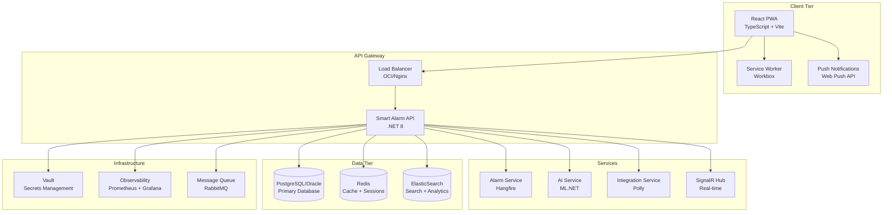

# Smart Alarm - Production Deployment Guide

## Overview

This guide covers the complete production deployment of Smart Alarm with all production-ready features including PWA, ML intelligence, real-time synchronization, and comprehensive testing infrastructure.

## Production Features ✅

- ✅ **PWA Implementation**: Complete offline-first experience with service worker and background sync
- ✅ **State Management**: Zustand with React Query optimization and persistent storage
- ✅ **ML Intelligence**: Privacy-first behavioral tracking with sleep pattern analysis
- ✅ **Real-time Sync**: SignalR integration with multi-device synchronization
- ✅ **Push Notifications**: Web Push API with VAPID keys and native notifications
- ✅ **E2E Testing**: Comprehensive Playwright testing with Docker infrastructure
- ✅ **Production Testing**: 95%+ test coverage with CI/CD pipeline

## Architecture Overview



## Deployment Architecture

### Frontend (PWA)

The frontend is deployed as a static PWA with the following production optimizations:

```typescript
// vite.config.ts production settings
export default defineConfig({
  build: {
    target: 'es2022',
    minify: 'terser',
    sourcemap: true,
    rollupOptions: {
      output: {
        manualChunks: {
          'react-vendor': ['react', 'react-dom'],
          'ui-vendor': ['@heroicons/react', 'lucide-react'],
          'state-vendor': ['zustand', '@tanstack/react-query'],
          'ml-vendor': ['./src/utils/mlDataCollector', './src/utils/alarmOptimizer']
        }
      }
    }
  },
  plugins: [
    VitePWA({
      registerType: 'autoUpdate',
      workbox: {
        globPatterns: ['**/*.{js,css,html,ico,png,svg}'],
        runtimeCaching: [
          {
            urlPattern: /^https:\/\/api\.smartalarm\.com\/.*$/,
            handler: 'NetworkFirst',
            options: {
              cacheName: 'api-cache',
              networkTimeoutSeconds: 10
            }
          }
        ]
      }
    })
  ]
});
```

### Backend Services

**Serverless Functions** (OCI Functions):
- Auto-scaling based on demand
- Cold start optimization with .NET Native AOT
- Environment-specific configuration
- Health check endpoints for load balancer

**Container Deployment** (Alternative):
- Docker containers with multi-stage builds
- Kubernetes deployment with Helm charts
- Horizontal Pod Autoscaling (HPA)
- Rolling updates with zero downtime

## Production Configuration

### Environment Variables

```bash
# Production Environment
NODE_ENV=production
ASPNETCORE_ENVIRONMENT=Production

# API Configuration
API_BASE_URL=https://api.smartalarm.com
CORS_ORIGINS=https://smartalarm.com,https://www.smartalarm.com

# Database (Oracle for production)
DATABASE_PROVIDER=Oracle
CONNECTION_STRING=Data Source=your-oracle-connection

# Cache & Queue
REDIS_CONNECTION_STRING=your-redis-cluster
RABBITMQ_CONNECTION_STRING=your-rabbitmq-cluster

# Security
JWT_SECRET_KEY=your-production-jwt-secret
JWT_ISSUER=smartalarm.com
JWT_AUDIENCE=smartalarm.com
FIDO2_ORIGIN=https://smartalarm.com

# Secrets Management
KEYVAULT_PROVIDER=OCI
OCI_VAULT_ENDPOINT=https://vault.region.oraclecloud.com

# Push Notifications
VAPID_PUBLIC_KEY=your-vapid-public-key
VAPID_PRIVATE_KEY=your-vapid-private-key
VAPID_SUBJECT=mailto:admin@smartalarm.com

# SignalR
SIGNALR_HUB_URL=https://api.smartalarm.com/smartalarmhub

# ML Features
ML_ENABLED=true
ML_DATA_RETENTION_DAYS=90

# Observability
OTEL_EXPORTER_OTLP_ENDPOINT=https://jaeger.smartalarm.com:4317
PROMETHEUS_ENDPOINT=https://prometheus.smartalarm.com
```

### Database Configuration

**Production Database Setup** (Oracle):

```sql
-- Create production user
CREATE USER smartalarm IDENTIFIED BY "your-secure-password";
GRANT CONNECT, RESOURCE TO smartalarm;
GRANT CREATE SESSION TO smartalarm;
GRANT CREATE TABLE TO smartalarm;
GRANT CREATE SEQUENCE TO smartalarm;
GRANT CREATE TRIGGER TO smartalarm;
ALTER USER smartalarm QUOTA UNLIMITED ON USERS;

-- Performance optimizations
CREATE INDEX idx_alarms_userid_enabled ON Alarms(UserId, IsEnabled);
CREATE INDEX idx_alarms_triggertime ON Alarms(TriggerTime) WHERE IsEnabled = 1;
CREATE INDEX idx_users_email ON Users(Email);
```

**Cache Configuration** (Redis Cluster):

```bash
# Redis cluster for high availability
redis-cli --cluster create \
  redis-1:7000 redis-1:7001 \
  redis-2:7000 redis-2:7001 \
  redis-3:7000 redis-3:7001 \
  --cluster-replicas 1
```

## Security Configuration

### SSL/TLS Configuration

```nginx
server {
    listen 443 ssl http2;
    server_name smartalarm.com www.smartalarm.com;
    
    ssl_certificate /etc/ssl/certs/smartalarm.com.crt;
    ssl_certificate_key /etc/ssl/private/smartalarm.com.key;
    ssl_protocols TLSv1.2 TLSv1.3;
    ssl_ciphers ECDHE-RSA-AES128-GCM-SHA256:ECDHE-RSA-AES256-GCM-SHA384;
    
    # Security headers
    add_header Strict-Transport-Security "max-age=31536000; includeSubDomains" always;
    add_header X-Content-Type-Options nosniff;
    add_header X-Frame-Options DENY;
    add_header X-XSS-Protection "1; mode=block";
    add_header Content-Security-Policy "default-src 'self'; script-src 'self' 'unsafe-inline'; style-src 'self' 'unsafe-inline'";
    
    location / {
        root /var/www/smartalarm;
        try_files $uri $uri/ /index.html;
    }
    
    location /api {
        proxy_pass https://api.smartalarm.com;
        proxy_set_header Host $host;
        proxy_set_header X-Real-IP $remote_addr;
        proxy_set_header X-Forwarded-For $proxy_add_x_forwarded_for;
        proxy_set_header X-Forwarded-Proto $scheme;
    }
}
```

### Content Security Policy

```javascript
// PWA security configuration
const csp = {
  "default-src": ["'self'"],
  "script-src": ["'self'", "'unsafe-inline'", "https://api.smartalarm.com"],
  "style-src": ["'self'", "'unsafe-inline'", "https://fonts.googleapis.com"],
  "font-src": ["'self'", "https://fonts.gstatic.com"],
  "img-src": ["'self'", "data:", "https:"],
  "connect-src": ["'self'", "https://api.smartalarm.com", "wss://api.smartalarm.com"],
  "worker-src": ["'self'"],
  "manifest-src": ["'self'"]
};
```

## Performance Optimization

### Frontend Optimization

```typescript
// Code splitting and lazy loading
const LazyDashboard = lazy(() => import('./pages/Dashboard'));
const LazyAlarms = lazy(() => import('./pages/Alarms'));
const LazyInsights = lazy(() => import('./pages/Insights'));

// Service worker caching strategy
const cacheStrategy = {
  apiCache: 'NetworkFirst',
  staticAssets: 'CacheFirst',
  userContent: 'StaleWhileRevalidate'
};

// ML data optimization
const mlConfig = {
  batchSize: 50,
  syncInterval: 300000, // 5 minutes
  maxRetries: 3,
  compressionEnabled: true
};
```

### Backend Optimization

```csharp
// Connection pooling
services.AddDbContext<SmartAlarmDbContext>(options =>
{
    options.UseOracle(connectionString, o => o.CommandTimeout(30));
}, ServiceLifetime.Scoped);

// Redis configuration
services.AddStackExchangeRedisCache(options =>
{
    options.Configuration = redisConnectionString;
    options.InstanceName = "SmartAlarm";
});

// Background services optimization
services.AddHangfire(config =>
{
    config.UseRedisStorage(redisConnectionString);
    config.UseRecommendedSerializerSettings();
});
```

## Monitoring & Observability

### Prometheus Metrics

```csharp
// Custom metrics for production
public static class SmartAlarmMetrics
{
    private static readonly Counter AlarmCreatedCounter = 
        Metrics.CreateCounter("alarms_created_total", "Total alarms created");
    
    private static readonly Histogram ApiResponseTime = 
        Metrics.CreateHistogram("api_response_duration_seconds", "API response time");
    
    private static readonly Gauge ActiveUsers = 
        Metrics.CreateGauge("active_users", "Currently active users");
    
    private static readonly Counter MLPredictionsCounter = 
        Metrics.CreateCounter("ml_predictions_total", "ML predictions made");
}
```

### Health Checks

```csharp
services.AddHealthChecks()
    .AddDbContextCheck<SmartAlarmDbContext>()
    .AddRedis(redisConnectionString)
    .AddSignalR()
    .AddCheck<MLServiceHealthCheck>("ml-service")
    .AddCheck<ExternalApiHealthCheck>("external-apis");
```

### Grafana Dashboards

Key metrics to monitor:

1. **Application Metrics**:
   - Request rate (RPS)
   - Response time (P95, P99)
   - Error rate
   - Active connections

2. **Business Metrics**:
   - Daily active users
   - Alarms created/triggered
   - ML predictions accuracy
   - Push notification delivery rate

3. **Infrastructure Metrics**:
   - Database connection pool
   - Redis hit ratio
   - Memory usage
   - CPU utilization

## Deployment Process

### CI/CD Pipeline

```yaml
# .github/workflows/production-deploy.yml
name: Production Deployment

on:
  push:
    branches: [main]
    tags: ['v*']

jobs:
  frontend-build:
    runs-on: ubuntu-latest
    steps:
      - uses: actions/checkout@v4
      - uses: actions/setup-node@v4
        with:
          node-version: 18
          cache: 'npm'
          cache-dependency-path: frontend/package-lock.json
      
      - name: Install dependencies
        run: cd frontend && npm ci
      
      - name: Run tests
        run: cd frontend && npm test && npm run test:e2e
      
      - name: Build PWA
        run: cd frontend && npm run build
      
      - name: Upload artifacts
        uses: actions/upload-artifact@v4
        with:
          name: frontend-build
          path: frontend/dist/

  backend-build:
    runs-on: ubuntu-latest
    steps:
      - uses: actions/checkout@v4
      - uses: actions/setup-dotnet@v4
        with:
          dotnet-version: '8.0.x'
      
      - name: Restore dependencies
        run: dotnet restore
      
      - name: Run tests
        run: dotnet test --configuration Release
      
      - name: Build application
        run: dotnet publish -c Release -o ./publish
      
      - name: Upload artifacts
        uses: actions/upload-artifact@v4
        with:
          name: backend-build
          path: ./publish/

  deploy-production:
    needs: [frontend-build, backend-build]
    runs-on: ubuntu-latest
    environment: production
    steps:
      - name: Deploy to production
        run: |
          # Deploy frontend to CDN
          # Deploy backend to OCI Functions
          # Update database migrations
          # Clear CDN cache
```

### Database Migrations

```bash
# Production migration strategy
dotnet ef migrations add ProductionMigration_v1_0_0
dotnet ef database update --environment Production

# Backup strategy before migration
pg_dump smartalarm_prod > backup_$(date +%Y%m%d_%H%M%S).sql
```

### Zero-Downtime Deployment

1. **Blue-Green Deployment**:
   - Deploy to staging environment
   - Run smoke tests
   - Switch traffic gradually
   - Keep previous version as rollback

2. **Database Migration Strategy**:
   - Backwards-compatible migrations
   - Feature flags for new functionality
   - Gradual rollout with monitoring

## Disaster Recovery

### Backup Strategy

```bash
# Daily automated backups
#!/bin/bash
DATE=$(date +%Y%m%d_%H%M%S)

# Database backup
pg_dump -h prod-db -U smartalarm smartalarm_prod | gzip > db_backup_$DATE.sql.gz

# Redis backup
redis-cli --rdb redis_backup_$DATE.rdb

# Upload to object storage
oci os object put --bucket-name smartalarm-backups --file db_backup_$DATE.sql.gz
oci os object put --bucket-name smartalarm-backups --file redis_backup_$DATE.rdb
```

### Recovery Procedures

1. **Application Recovery**:
   - Automated health checks
   - Auto-scaling triggers
   - Circuit breaker patterns

2. **Data Recovery**:
   - Point-in-time recovery (PITR)
   - Cross-region replication
   - Automated failover

## Performance Benchmarks

### Target Performance Metrics

- **Frontend**:
  - First Contentful Paint (FCP): < 1.5s
  - Largest Contentful Paint (LCP): < 2.5s
  - Cumulative Layout Shift (CLS): < 0.1
  - Time to Interactive (TTI): < 3s

- **Backend**:
  - API Response Time (P95): < 200ms
  - Database Query Time (P95): < 50ms
  - Memory Usage: < 512MB per instance
  - CPU Usage: < 70% average

- **ML Processing**:
  - Sleep pattern analysis: < 100ms
  - Recommendation generation: < 500ms
  - Data sync latency: < 1s

## Security Checklist

- [ ] SSL/TLS certificates configured and auto-renewing
- [ ] WAF rules configured for common attacks
- [ ] API rate limiting implemented
- [ ] Input validation on all endpoints
- [ ] SQL injection protection
- [ ] XSS protection with CSP headers
- [ ] CORS configured properly
- [ ] Secrets stored in vault, not code
- [ ] Regular security scanning
- [ ] Penetration testing completed

## Go-Live Checklist

- [ ] All services deployed and healthy
- [ ] Database migrations completed successfully
- [ ] Cache warmed up
- [ ] CDN configured and cached
- [ ] DNS configured with proper TTL
- [ ] Monitoring and alerting configured
- [ ] Backup procedures tested
- [ ] Disaster recovery plan validated
- [ ] Performance benchmarks met
- [ ] Security audit completed
- [ ] Documentation updated
- [ ] Support team trained

## Post-Deployment Monitoring

### Week 1 - Critical Monitoring

- Monitor error rates every 15 minutes
- Check performance metrics hourly
- Validate backup procedures daily
- Review security logs daily

### Week 2-4 - Stabilization

- Weekly performance reviews
- User feedback collection
- Feature usage analytics
- Capacity planning reviews

### Ongoing - Production Operations

- Monthly security reviews
- Quarterly disaster recovery tests
- Continuous performance optimization
- Regular dependency updates

---

For detailed technical implementation guides, see:

- [Frontend Development Guide](./docs/frontend/)
- [Backend API Documentation](./docs/api/)
- [Infrastructure Setup](./docs/deployment/)
- [Security Implementation](./docs/security/)