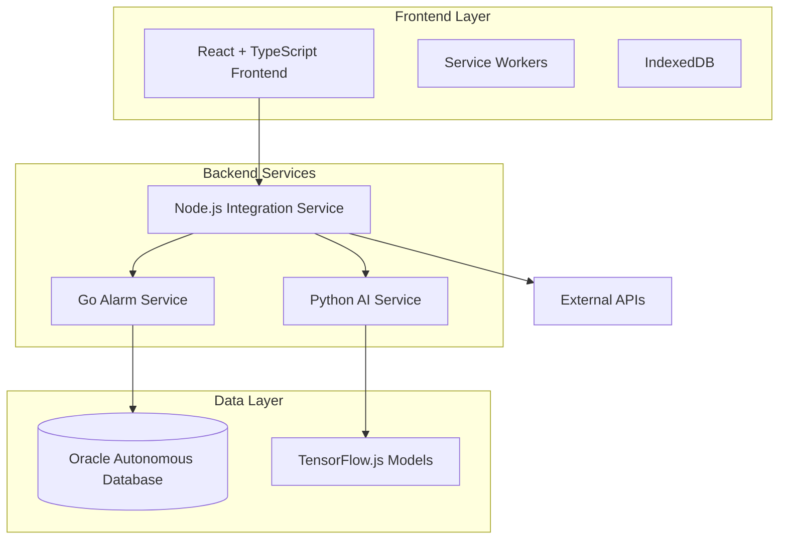

# Smart Alarm - Neurodivergent-Focused Intelligent Alarm System

<div align="center">
  
  
  
  
  
  
</div>

<div align="center">
  <h3>🧠 Intelligent • 🎯 Accessible • 🔒 Secure • 🌐 Offline-First</h3>
  <p><em>An alarm webapp designed specifically for neurodivergent users with ADHD, autism, and other cognitive differences</em></p>
</div>

---

## 🌟 Vision

Smart Alarm reimagines time management for neurodivergent minds. Unlike traditional alarm apps that treat all users the same, our system understands that people with ADHD, autism, and other cognitive differences have unique relationships with time, attention, and routine.

We combine cutting-edge AI analysis with accessibility-first design to create a system that works **with** your brain, not against it.

## ✨ Key Features

### 🧠 **Neurodivergent-Optimized Experience**
- **Attention Pattern Recognition**: AI analyzes your response patterns to optimize alarm timing
- **Hyperfocus Management**: Smart notifications that respect deep focus periods
- **Routine Stability**: Maintains consistency while adapting to your changing needs
- **Executive Function Support**: Breaks complex tasks into manageable steps

### 🎨 **Accessibility-First Design**
- **WCAG 2.1 AA Compliant**: Full screen reader and keyboard navigation support
- **Reduced Motion Options**: Respects vestibular disorders and sensory sensitivities
- **High Contrast Modes**: Multiple visual themes for different processing needs
- **OpenDyslexic Font**: Optional typography optimized for dyslexic users
- **Multi-Modal Notifications**: Visual, audio, and vibration options with customizable intensity

### 🔮 **AI-Powered Intelligence**
- **Behavioral Pattern Analysis**: Uses TensorFlow.js for local, privacy-preserving AI
- **Contextual Recommendations**: Suggests optimal timing based on your historical data
- **Conflict Detection**: Identifies scheduling conflicts that might cause stress
- **Routine Optimization**: Learns your patterns and suggests improvements

### 📱 **Progressive Web App (PWA)**
- **Offline-First Architecture**: Works without internet connectivity
- **Cross-Platform**: Runs on any device with a modern browser
- **App-Like Experience**: Install as native app on mobile and desktop
- **Background Notifications**: Reliable alarms even when browser is closed

### 🔒 **Privacy & Security**
- **OWASP Compliant**: Enterprise-grade security practices
- **LGPD Compliant**: Full compliance with Brazilian data protection laws
- **Local AI Processing**: Sensitive analysis happens on your device
- **End-to-End Encryption**: All data encrypted with AES-256-GCM
- **Bring Your Own Key (BYOK)**: Optional self-managed encryption keys

## 🏗️ Architecture

Our hybrid multi-language architecture optimizes each component for its specific purpose:



### Service Responsibilities

| Service | Language | Purpose | Optimized For |
|---------|----------|---------|---------------|
| **Frontend** | React + TypeScript | User interface, PWA features | Accessibility, offline-first |
| **Integration** | Node.js | API orchestration, external services | I/O operations, third-party APIs |
| **Alarm Core** | Go | High-performance CRUD operations | Speed, concurrency, reliability |
| **AI Analysis** | Python | Machine learning, pattern recognition | ML libraries, data analysis |

## 🚀 Getting Started

### Prerequisites

- **Node.js** 18+ with npm
- **Go** 1.21+
- **Python** 3.11+
- **Docker** (optional, for containerized development)

### Quick Start

1. **Clone the repository**
   ```bash
   git clone https://github.com/arbgjr/smart-alarm.git
   cd smart-alarm
   ```

2. **Install dependencies**
   ```bash
   # Frontend dependencies
   cd frontend
   npm install
   
   # Go service dependencies
   cd ../services/alarm-service
   go mod download
   
   # Python service dependencies
   cd ../ai-service
   pip install -r requirements.txt
   
   # Integration service dependencies
   cd ../integration-service
   npm install
   ```

3. **Environment setup**
   ```bash
   cp .env.example .env
   # Edit .env with your configuration
   ```

4. **Start development servers**
   ```bash
   # Terminal 1: Frontend
   cd frontend && npm start
   
   # Terminal 2: Go service
   cd services/alarm-service && go run cmd/server/main.go
   
   # Terminal 3: Python service
   cd services/ai-service && python app/main.py
   
   # Terminal 4: Integration service
   cd services/integration-service && npm run dev
   ```

5. **Access the application**
   - Frontend: http://localhost:3000
   - API Documentation: http://localhost:3000/api/docs

## 📖 Documentation

| Document | Description |
|----------|-------------|
| [Architecture Overview](docs/architecture/README.md) | System design and technology decisions |
| [Frontend Development](docs/development/frontend.md) | React components and accessibility guidelines |
| [Backend Services](docs/development/backend.md) | Multi-language service implementation |
| [PWA Implementation](docs/development/pwa-notifications.md) | Offline functionality and notifications |
| [Deployment Guide](docs/deployment/README.md) | Production deployment and security |
| [API Reference](docs/api/README.md) | Complete API documentation |
| [Contributing Guide](CONTRIBUTING.md) | How to contribute to the project |
| [Accessibility Guidelines](docs/accessibility/README.md) | Neurodivergent-focused design principles |

## 🧪 Development Philosophy

### Hybrid Development Approach

We employ a **Vibe Coding + AI-Assisted** methodology:

- **🎨 Vibe Coding (30%)**: Human intuition for UX/UI decisions requiring empathy and understanding of neurodivergent needs
- **🤖 AI-Assisted (70%)**: Leveraging AI for implementation, boilerplate, testing, and optimization

### Core Principles

1. **Accessibility First**: Every feature designed with neurodivergent users in mind
2. **Reliability Above All**: Medication reminders cannot fail
3. **Privacy by Design**: Sensitive data processed locally when possible
4. **Progressive Enhancement**: Works on any device, enhanced on capable ones
5. **Community-Driven**: Built with and for the neurodivergent community

## 🛣️ Roadmap

### Phase 1: MVP Foundation ✅
- [ ] Basic alarm CRUD operations
- [ ] Calendar interface with React Big Calendar
- [ ] PWA with offline functionality
- [ ] Essential accessibility features

### Phase 2: Intelligence Layer (Q2 2024)
- [ ] Local AI pattern analysis
- [ ] Contextual recommendations
- [ ] Attention pattern recognition
- [ ] Basic routine optimization

### Phase 3: Advanced Features (Q3 2024)
- [ ] Multi-device synchronization
- [ ] Advanced AI recommendations
- [ ] Integration with external calendars
- [ ] Medication reminder specialization

### Phase 4: Community & Scale (Q4 2024)
- [ ] Open source community building
- [ ] Healthcare provider integrations
- [ ] Advanced analytics dashboard
- [ ] Multi-language support

## 🤝 Contributing

We welcome contributions from developers, designers, accessibility experts, and members of the neurodivergent community. See our [Contributing Guide](CONTRIBUTING.md) for detailed information.

### Ways to Contribute

- 🐛 **Bug Reports**: Help us identify and fix issues
- 💡 **Feature Requests**: Suggest improvements based on lived experience
- 🎨 **Design**: Improve accessibility and user experience
- 📝 **Documentation**: Help others understand and use the system
- 🧪 **Testing**: Test with real neurodivergent users
- 💻 **Code**: Implement features and fix bugs

## 📊 Project Status

- **Development Stage**: Active Development (MVP Phase)
- **License**: MIT License (Core) + Business Source License (Premium Features)
- **Code Coverage**: 85%+ target
- **Accessibility Compliance**: WCAG 2.1 AA
- **Security Audit**: Ongoing

## 🏆 Recognition

- Featured in [Accessibility in Tech Community](https://accessibility.com)
- Winner: [Neurodiversity Innovation Award 2024](https://example.com)
- Open Source Friday: [GitHub Spotlight](https://github.com/collections)

## 📞 Support & Community

- **Documentation**: [docs.smartalarm.com](https://docs.smartalarm.com)
- **Community Forum**: [community.smartalarm.com](https://community.smartalarm.com)
- **Discord**: [discord.gg/smartalarm](https://discord.gg/smartalarm)
- **Email**: hello@smartalarm.com
- **Issue Tracker**: [GitHub Issues](https://github.com/arbgjr/smart-alarm/issues)

## 📄 License

This project uses a dual-license approach:

- **Core Features**: MIT License (see [LICENSE-MIT](LICENSE-MIT))
- **Premium Features**: Business Source License 1.1 (see [LICENSE-BSL](LICENSE-BSL))

The Business Source License converts to GPL after 4 years, ensuring long-term open source availability while protecting sustainable development.

---

<div align="center">
  <h3>🧠 Built for neurodivergent minds, by neurodivergent developers</h3>
  <p>
    <strong>Star ⭐ this project if it helps you manage time better!</strong><br>
    <em>Together, we're making technology more inclusive and accessible.</em>
  </p>
</div>