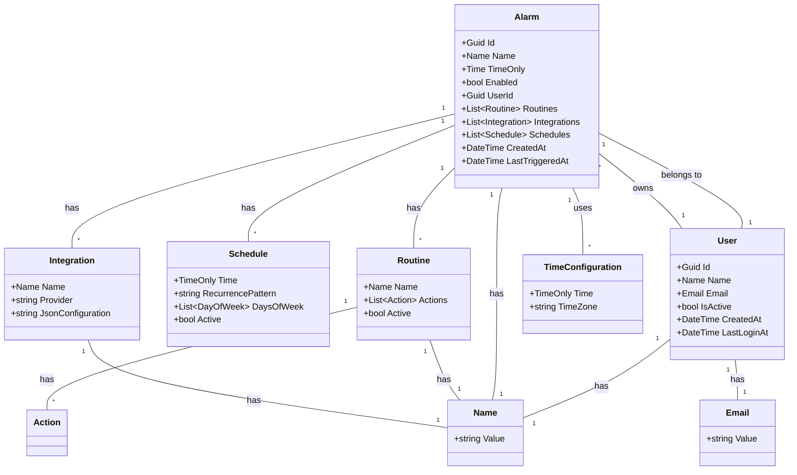

# Smart Alarm - Domain Model Documentation

## Overview

The domain layer represents the core business logic of the Smart Alarm system, following Clean Architecture principles and Domain-Driven Design (DDD) patterns.

## Entities

### Alarm

- **Purpose**: Represents a user-configured alarm
- **Key Properties**:
  - Id, Name (Value Object), Time, Enabled status, UserId
  - Collections of Routines, Integrations, and Schedules
  - Audit fields (CreatedAt, LastTriggeredAt)
- **Business Rules**:
  - Cannot be triggered when disabled
  - Prevents duplicate routines and integrations
  - Validates schedule ownership
  - Tracks trigger history

### User

- **Purpose**: Represents a system user
- **Key Properties**:
  - Id, Name (Value Object), Email (Value Object), IsActive status
  - Audit fields (CreatedAt, LastLoginAt)
- **Business Rules**:
  - Name and Email are required and validated via Value Objects
  - Tracks login activity
  - Can be activated/deactivated

### Schedule

- **Purpose**: Defines when an alarm should trigger
- **Key Properties**:
  - Time (TimeOnly), Recurrence pattern, Days of week, Active status
- **Business Rules**:
  - Supports multiple recurrence patterns (Once, Daily, Weekly, Weekdays, Weekends)
  - Uses flags for flexible day-of-week selection
  - Contains business logic for determining trigger eligibility

### Routine

- **Purpose**: Defines actions to execute when alarm triggers
- **Key Properties**:
  - Name (Value Object), Actions collection, Active status
- **Business Rules**:
  - Prevents duplicate actions
  - Validates action content
  - Can be activated/deactivated

### Integration

- **Purpose**: External service integration for alarm actions
- **Key Properties**:
  - Name (Value Object), Provider, JSON Configuration
- **Business Rules**:
  - Validates JSON configuration format
  - Tracks execution history
  - Provides configuration value extraction

## Value Objects

### Name

- **Purpose**: Represents and validates entity names
- **Validation**: Non-empty, non-whitespace strings
- **Behavior**: Immutable, implements equality comparison

### Email

- **Purpose**: Represents and validates email addresses
- **Validation**: Uses regex pattern for proper email format validation
- **Behavior**: Immutable, implements equality comparison

### TimeConfiguration

- **Purpose**: Timezone-aware time handling
- **Features**: Time zone validation, UTC conversion, today date calculation
- **Behavior**: Immutable, handles timezone conversions

## Domain Services

### IAlarmDomainService

- **Purpose**: Complex business logic for alarm operations
- **Responsibilities**:
  - User alarm creation validation
  - Trigger eligibility checking
  - Due alarm discovery
  - Next trigger time calculation

### IUserDomainService

- **Purpose**: Complex business logic for user operations
- **Responsibilities**:
  - Email uniqueness validation
  - User activation/deactivation rules
  - Active alarm detection

## Repository Interfaces

All entities have corresponding repository interfaces following the Repository pattern:

- `IAlarmRepository`
- `IUserRepository`
- `IScheduleRepository`
- `IRoutineRepository`
- `IIntegrationRepository`

## Design Patterns Applied

1. **Entity Pattern**: Rich domain entities with behavior
2. **Value Object Pattern**: Immutable objects representing concepts
3. **Repository Pattern**: Data access abstraction
4. **Domain Service Pattern**: Complex business logic coordination
5. **Factory Pattern**: Object creation with validation

## Business Rules Summary

- **Validation**: All input validation handled at entity construction
- **Encapsulation**: Private setters, controlled state changes
- **Immutability**: Value objects are immutable
- **Consistency**: Business rules enforced within entity boundaries
- **Auditability**: Creation and modification tracking

## Testing Coverage

- **45 Unit Tests** covering all domain entities and value objects
- **100% Coverage** of business rules and validation logic
- **AAA Pattern** (Arrange, Act, Assert) consistently applied
- **FluentAssertions** for readable test assertions

## View

