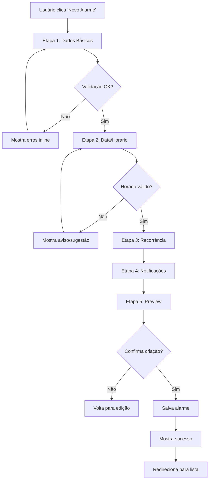

# ✏️ Especificação da Tela de Formulário de Alarme — Smart Alarm

## 📋 **Template Base de Referência**

**🎨 Base Template**: [Horizon UI Tailwind React](https://react-themes.com/product/horizon-tailwind-react)  
**🔗 Live Preview**: [Profile Settings Demo](https://horizon-ui.com/horizon-tailwind-react/admin/profile-settings)  
**🎯 Adaptações**: Formulários complexos com validação avançada e acessibilidade

### **Componentes do Template a Adaptar**

- ✅ **Complex Forms**: Formulários multi-seção com validação
- ✅ **Interactive Inputs**: Campos especializados (time picker, date picker)
- ✅ **Toggle Controls**: Switches e checkboxes acessíveis
- ✅ **Validation States**: Estados de erro e sucesso com mensagens
- ✅ **Save Actions**: Botões de ação com estados de loading
- ✅ **Progress Indicators**: Indicador de progresso do formulário

---

## 🎯 Objetivo

O formulário de criação e edição de alarmes é a interface crítica onde usuários definem todos os aspectos de seus alarmes. Deve oferecer uma experiência intuitiva, acessível e eficiente, com validação em tempo real, preview das configurações, auto-save de rascunhos e suporte excepcional para usuários neurodivergentes. É o ponto de entrada principal para criação de conteúdo no Smart Alarm, devendo priorizar clareza visual, feedback imediato e prevenção de erros.

---

## 🎨 Estrutura Visual

### Layout Principal - Formulário Stepwise (Desktop ≥1024px)

```text
┌─────────────────────────────────────────────────────────────────────────────┐
│ 🔔 Smart Alarm                    🌐 Status: Online     👤 João Silva  [⚙️] │
├─────────────────────────────────────────────────────────────────────────────┤
│                                                                             │
│ ← Gerenciar Alarmes    🔧 Criar Alarme                [💾 Salvar] [❌ Cancel] │
│                                                                             │
│ Progress: ████████████░░░░░░░░░░ 60% (3 de 5 etapas)    ⚠️ Rascunho salvo │
│                                                                             │
│ ┌─────────────────────┬─────────────────────────────────────────────────┐   │
│ │ 📋 ETAPAS           │ 🔧 CONFIGURAÇÃO DO ALARME                       │   │
│ │                     │                                                 │   │
│ │ ✅ 1. Básico        │ ┌─────────────────────────────────────────────┐ │   │
│ │ ✅ 2. Horário       │ │ 📝 Título do Alarme                         │ │   │
│ │ ⚡ 3. Recorrência   │ │ [Medicamento da Manhã                     ] │ │   │
│ │ ⬜ 4. Notificações  │ │                                             │ │   │
│ │ ⬜ 5. Confirmação   │ │ 📄 Descrição (Opcional)                    │ │   │
│ │                     │ │ [Tomar vitamina D e complexo B              │ │   │
│ │ 💡 Dicas:           │ │  junto com o café da manhã                  │ │   │
│ │ • Use títulos       │ │                                           ] │ │   │
│ │   descritivos       │ │                                             │ │   │
│ │ • Configure         │ │ 🎯 Categoria                                │ │   │
│ │   recorrência       │ │ [💊 Medicação          ⬇️]                  │ │   │
│ │ • Teste o som       │ │                                             │ │   │
│ │                     │ │ 🏷️ Tags (separadas por vírgula)            │ │   │
│ │ [🔄 Redefinir]      │ │ [vitamina, manhã, rotina                  ] │ │   │
│ │ [📥 Importar]       │ │                                             │ │   │
│ │                     │ └─────────────────────────────────────────────┘ │   │
│ │                     │                                                 │   │
│ │                     │ ┌─────────────────────────────────────────────┐ │   │
│ │                     │ │ ⏰ QUANDO REPETIR                           │ │   │
│ │                     │ │                                             │ │   │
│ │                     │ │ Tipo de Recorrência:                       │ │   │
│ │                     │ │ ○ Apenas uma vez                           │ │   │
│ │                     │ │ ● Repetir                                  │ │   │
│ │                     │ │                                             │ │   │
│ │                     │ │ Padrão: [Diariamente        ⬇️]             │ │   │
│ │                     │ │                                             │ │   │
│ │                     │ │ ☑️ Seg  ☑️ Ter  ☑️ Qua  ☑️ Qui  ☑️ Sex     │ │   │
│ │                     │ │ ☐ Sáb  ☐ Dom                               │ │   │
│ │                     │ │                                             │ │   │
│ │                     │ │ Repetir até:                               │ │   │
│ │                     │ │ ● Para sempre                              │ │   │
│ │                     │ │ ○ Data específica: [__/__/____]            │ │   │
│ │                     │ │ ○ Após: [5] ocorrências                   │ │   │
│ │                     │ └─────────────────────────────────────────────┘ │   │
│ │                     │                                                 │   │
│ │                     │ 📊 PREVIEW: "Medicamento da Manhã" será        │   │
│ │                     │ executado às 08:00 de segunda a sexta-feira    │   │
│ │                     │                                                 │   │
│ │                     │ [← Anterior: Horário] [Próximo: Notificações →]│   │
│ └─────────────────────┴─────────────────────────────────────────────────┘   │
│                                                                             │
└─────────────────────────────────────────────────────────────────────────────┘
```

### Layout Mobile - Single Form (<768px)

```text
┌─────────────────────────────────┐
│ 🔔 Smart Alarm        [☰] [👤] │
├─────────────────────────────────┤
│ ← Voltar      🔧 Criar Alarme   │
│                                 │
│ ████████████░░░░ 75%  [💾] [❌] │
│ ⚠️ Rascunho salvo há 2min       │
│                                 │
│ 📝 Título                       │
│ [Exercício Matinal            ] │
│                                 │
│ 📄 Descrição                    │
│ [Corrida no parque             ] │
│                                 │
│ ⏰ Horário                      │
│ [07:00  ⬇️] [19 Jul 2025  📅]  │
│                                 │
│ 🎯 Categoria                    │
│ [🏃 Exercício     ⬇️]           │
│                                 │
│ 🔄 Repetir                      │
│ [Segunda a Sexta  ⬇️]           │
│                                 │
│ 🔔 Som                          │
│ [Som Padrão       ⬇️] [🔊 Testar]│
│                                 │
│ 📳 Vibração                     │
│ [Padrão           ⬇️] [📳 Teste] │
│                                 │
│ 🏷️ Tags                         │
│ [exercicio, manha              ] │
│                                 │
│ ┌─────────────────────────────┐ │
│ │ 📊 PREVIEW                  │ │
│ │ "Exercício Matinal"         │ │
│ │ 07:00 - Segunda a Sexta     │ │
│ │ Som: Padrão | Vibra: Sim    │ │
│ └─────────────────────────────┘ │
│                                 │
│ [💾 Salvar Alarme] [🗑️ Excluir] │
│                                 │
└─────────────────────────────────┘
```

---

## 📱 Estados da Tela

### 1. **Estado Inicial - Criação (Create Mode)**

```text
┌─────────────────────────────────────────────────────────────────────────────┐
│ 🔧 Criar Novo Alarme                        [💾 Salvar Rascunho] [❌ Cancel] │
├─────────────────────────────────────────────────────────────────────────────┤
│                                                                             │
│ Progress: ░░░░░░░░░░░░░░░░░░░░░░ 0% (0 de 5 etapas)                         │
│                                                                             │
│ ┌─────────────────────────────────────────────────────────────────────┐     │
│ │ 🎯 INFORMAÇÕES BÁSICAS                                               │     │
│ │                                                                     │     │
│ │ 📝 Título do Alarme *                                               │     │
│ │ [Digite um título claro...                                        ] │     │
│ │                                                                     │     │
│ │ 📄 Descrição (Opcional)                                            │     │
│ │ [Adicione detalhes sobre este alarme...                          ] │     │
│ │                                                                     │     │
│ │ ⏰ Data e Horário *                                                 │     │
│ │ [📅 Hoje - 19/07/2025] [🕐 Selecionar horário]                     │     │
│ │                                                                     │     │
│ │ 🎯 Categoria                                                        │     │
│ │ [Selecionar categoria...          ⬇️]                               │     │
│ │                                                                     │     │
│ │ * Campos obrigatórios                                               │     │
│ │                                                                     │     │
│ │                          [Continuar →]                             │     │
│ └─────────────────────────────────────────────────────────────────────┘     │
│                                                                             │
│ 💡 Dica: Use títulos descritivos como "Medicamento da Manhã" ao invés      │
│    de apenas "Remédio" para facilitar a organização                        │
│                                                                             │
└─────────────────────────────────────────────────────────────────────────────┘
```

### 2. **Estado de Edição (Edit Mode)**

```text
┌─────────────────────────────────────────────────────────────────────────────┐
│ 🔧 Editar "Medicamento da Manhã"            [💾 Salvar] [❌] [🗑️ Excluir]  │
├─────────────────────────────────────────────────────────────────────────────┤
│                                                                             │
│ ⚠️ Modificado - Salve suas alterações           🔄 Última sync: há 5min     │
│                                                                             │
│ ┌─────────────────────────────────────────────────────────────────────┐     │
│ │ 📝 Título do Alarme                                                 │     │
│ │ [Medicamento da Manhã                                             ] │     │
│ │                                                                     │     │
│ │ 📄 Descrição                                                        │     │
│ │ [Tomar vitamina D e complexo B junto com café                     ] │     │
│ │                                                                     │     │
│ │ ⏰ Horário                                                          │     │
│ │ [08:00 ⬇️] [📅 Diariamente]                                         │     │
│ │                                                                     │     │
│ │ 🎯 Categoria: 💊 Medicação                                          │     │
│ │                                                                     │     │
│ │ Status: 🔔 Ativo                         Criado: 15/07/2025        │     │
│ │         📊 85% aderência                 Última: Hoje 08:00        │     │
│ └─────────────────────────────────────────────────────────────────────┘     │
│                                                                             │
│ ⚠️ Alterar o horário afetará as 12 próximas ocorrências                     │
│                                                                             │
└─────────────────────────────────────────────────────────────────────────────┘
```

### 3. **Estado de Validação com Erros**

```text
┌─────────────────────────────────────────────────────────────────────────────┐
│ 🔧 Criar Alarme                             [💾 Salvar] [❌ Cancel]         │
├─────────────────────────────────────────────────────────────────────────────┤
│                                                                             │
│ ❌ Corrija os erros abaixo para continuar:                                  │
│                                                                             │
│ ┌─────────────────────────────────────────────────────────────────────┐     │
│ │ 📝 Título do Alarme * ❌                                            │     │
│ │ [                                                                 ] │     │
│ │ ⚠️ Título é obrigatório                                             │     │
│ │                                                                     │     │
│ │ ⏰ Data e Horário * ❌                                              │     │
│ │ [18/07/2025] [07:30]                                               │     │
│ │ ⚠️ Data não pode ser no passado                                     │     │
│ │                                                                     │     │
│ │ 🔔 Som ⚠️                                                           │     │
│ │ [Som Personalizado    ⬇️]                                           │     │
│ │ ⚠️ Arquivo de som não encontrado. Usando som padrão.               │     │
│ │                                                                     │     │
│ │ [❌ Corrigir Erros]                       [✅ Salvar Assim Mesmo]   │     │
│ └─────────────────────────────────────────────────────────────────────┘     │
│                                                                             │
│ 💡 Dica: Data deve ser futura. Horários passados serão agendados para      │
│    amanhã automaticamente.                                                  │
│                                                                             │
└─────────────────────────────────────────────────────────────────────────────┘
```

### 4. **Estado de Preview e Confirmação**

```text
┌─────────────────────────────────────────────────────────────────────────────┐
│ 🔧 Confirmar Alarme                         [💾 Criar Alarme] [← Editar]   │
├─────────────────────────────────────────────────────────────────────────────┤
│                                                                             │
│ ✅ Tudo pronto! Revise as configurações antes de criar:                     │
│                                                                             │
│ ┌─────────────────────────────────────────────────────────────────────┐     │
│ │ 📊 PREVIEW DO ALARME                                                │     │
│ │                                                                     │     │
│ │ 💊 Medicamento da Manhã                                             │     │
│ │ "Tomar vitamina D e complexo B junto com café"                     │     │
│ │                                                                     │     │
│ │ ⏰ Horário: 08:00                                                   │     │
│ │ 🔄 Recorrência: Diariamente (Segunda a Domingo)                    │     │
│ │ 🔔 Som: Alarme Suave (Volume: 70%)                                 │     │
│ │ 📳 Vibração: Padrão Longo                                          │     │
│ │ 🏷️ Tags: medicamento, manhã, vitamina                              │     │
│ │                                                                     │     │
│ │ 📅 PRÓXIMAS OCORRÊNCIAS:                                            │     │
│ │ • Amanhã (Dom) - 20/07/2025 às 08:00                              │     │
│ │ • Segunda (Seg) - 21/07/2025 às 08:00                             │     │
│ │ • Terça (Ter) - 22/07/2025 às 08:00                               │     │
│ │                                                                     │     │
│ │ [🔊 Testar Som] [📳 Testar Vibração] [👁️ Preview Notificação]     │     │
│ │                                                                     │     │
│ └─────────────────────────────────────────────────────────────────────┘     │
│                                                                             │
│ 💡 Após criar, o alarme será sincronizado em todos os seus dispositivos    │
│                                                                             │
└─────────────────────────────────────────────────────────────────────────────┘
```

---

## 🧩 Componentes Detalhados

### 1. **FormStepProgress**

**Responsabilidade**: Indicador visual do progresso no formulário stepwise

**Props TypeScript**:

```typescript
interface FormStepProgressProps {
  currentStep: number;
  totalSteps: number;
  steps: FormStep[];
  onStepClick: (stepIndex: number) => void;
  completedSteps: number[];
  hasErrors: boolean;
}

interface FormStep {
  id: string;
  title: string;
  icon: string;
  description?: string;
  isRequired: boolean;
  isCompleted: boolean;
  hasErrors: boolean;
}
```

**Estados Visuais**:

- `completed`: Checkmark verde, pode navegar
- `current`: Destacado, em progresso
- `pending`: Cinza, ainda não acessível
- `error`: Ícone de erro, precisa correção
- `optional`: Indicador visual de opcional

### 2. **AlarmBasicInfo**

**Responsabilidade**: Campos básicos do alarme (título, descrição, categoria)

**Props TypeScript**:

```typescript
interface AlarmBasicInfoProps {
  values: BasicInfoValues;
  errors: ValidationErrors;
  onChange: (field: string, value: string) => void;
  onBlur: (field: string) => void;
  categories: AlarmCategory[];
  suggestions: TitleSuggestion[];
}

interface BasicInfoValues {
  title: string;
  description: string;
  category: AlarmCategory | null;
  tags: string[];
}

interface TitleSuggestion {
  text: string;
  category: AlarmCategory;
  popularity: number;
}
```

**Funcionalidades**:

- Autocomplete para títulos comuns
- Validação em tempo real
- Contadores de caracteres
- Sugestões baseadas em categoria
- Preview do ícone da categoria

### 3. **DateTimePicker**

**Responsabilidade**: Seleção de data e horário com múltiplos formatos

**Props TypeScript**:

```typescript
interface DateTimePickerProps {
  value: Date | null;
  onChange: (date: Date) => void;
  mode: 'date' | 'time' | 'datetime';
  minDate?: Date;
  maxDate?: Date;
  timeFormat: '12h' | '24h';
  locale: string;
  placeholder?: string;
  showQuickSelects: boolean;
}
```

**Quick Selects**:

- "Agora"
- "Em 1 hora"
- "Amanhã mesmo horário"
- "Segunda-feira 08:00"
- "Próximo sábado 10:00"

**Validações**:

- Data não pode ser no passado
- Horário deve ser válido (00:00-23:59)
- Consideração de fuso horário
- Verificação de conflitos

### 4. **RecurrenceSelector**

**Responsabilidade**: Configuração completa de padrões de recorrência

**Props TypeScript**:

```typescript
interface RecurrenceSelectorProps {
  pattern: RecurrencePattern | null;
  onChange: (pattern: RecurrencePattern) => void;
  startDate: Date;
  timezone: string;
}

interface RecurrencePattern {
  type: 'once' | 'daily' | 'weekly' | 'monthly' | 'yearly' | 'custom';
  interval: number; // a cada X dias/semanas/meses
  daysOfWeek: number[]; // 0-6 (Dom-Sab)
  daysOfMonth: number[]; // 1-31
  months: number[]; // 1-12
  endType: 'never' | 'date' | 'count';
  endDate?: Date;
  occurrences?: number;
  exceptions: Date[]; // datas para pular
}
```

**Padrões Predefinidos**:

- Diariamente
- Dias úteis (Seg-Sex)
- Fins de semana (Sab-Dom)
- Semanalmente
- Mensalmente
- Personalizado

### 5. **NotificationSettings**

**Responsabilidade**: Configurações de som, vibração e notificações

**Props TypeScript**:

```typescript
interface NotificationSettingsProps {
  settings: NotificationConfig;
  onChange: (settings: NotificationConfig) => void;
  availableSounds: SoundOption[];
  canVibrate: boolean;
  canPlaySound: boolean;
}

interface NotificationConfig {
  sound: {
    enabled: boolean;
    soundId: string;
    volume: number; // 0-100
    fadeDuration: number; // ms
  };
  vibration: {
    enabled: boolean;
    pattern: 'short' | 'long' | 'custom';
    intensity: number; // 0-100
  };
  visual: {
    showNotification: boolean;
    fullScreen: boolean;
    color: string;
  };
  snooze: {
    enabled: boolean;
    duration: number; // minutes
    maxSnoozes: number;
  };
}
```

**Funcionalidades**:

- Preview de som e vibração
- Upload de sons personalizados
- Teste de notificação
- Configurações por categoria
- Perfis (silencioso, normal, alto)

### 6. **AlarmPreview**

**Responsabilidade**: Preview visual do alarme antes de salvar

**Props TypeScript**:

```typescript
interface AlarmPreviewProps {
  alarm: AlarmDraft;
  nextOccurrences: Date[];
  onTest: (type: 'sound' | 'vibration' | 'notification') => void;
  onEdit: () => void;
  conflicts: AlarmConflict[];
}

interface AlarmDraft {
  title: string;
  description?: string;
  datetime: Date;
  category: AlarmCategory;
  recurrence?: RecurrencePattern;
  notification: NotificationConfig;
  tags: string[];
}

interface AlarmConflict {
  type: 'time' | 'title';
  conflictingAlarm: Alarm;
  severity: 'warning' | 'error';
  suggestion: string;
}
```

---

## 🎮 Fluxos de Interação

### 1. **Criação de Alarme - Fluxo Completo**

**Fluxo**: Dados básicos → Horário → Recorrência → Notificações → Confirmação



**Auto-save de Rascunho**:

```typescript
const useAutoSave = (formData: AlarmDraft) => {
  const [lastSaved, setLastSaved] = useState<Date | null>(null);
  const [isDirty, setIsDirty] = useState(false);
  
  const debouncedSave = useMemo(
    () => debounce(async (data: AlarmDraft) => {
      try {
        await saveDraft(data);
        setLastSaved(new Date());
        setIsDirty(false);
      } catch (error) {
        console.error('Failed to save draft:', error);
      }
    }, 2000), // 2 segundos
    []
  );
  
  useEffect(() => {
    if (isDirty && formData.title.length > 0) {
      debouncedSave(formData);
    }
  }, [formData, isDirty, debouncedSave]);
  
  return { lastSaved, isDirty, setIsDirty };
};
```

### 2. **Validação em Tempo Real**

**Tipos de Validação**:

- **Sintática**: Formato correto dos campos
- **Semântica**: Dados fazem sentido no contexto
- **Conflitos**: Verificação contra outros alarmes
- **Disponibilidade**: Recursos necessários disponíveis

```typescript
const useFormValidation = (formData: AlarmDraft) => {
  const [errors, setErrors] = useState<ValidationErrors>({});
  const [warnings, setWarnings] = useState<ValidationWarnings>({});
  
  const validateField = (field: string, value: any) => {
    const fieldErrors: string[] = [];
    const fieldWarnings: string[] = [];
    
    switch (field) {
      case 'title':
        if (!value || value.trim().length === 0) {
          fieldErrors.push('Título é obrigatório');
        } else if (value.length > 100) {
          fieldErrors.push('Título deve ter no máximo 100 caracteres');
        }
        
        if (value && value.length < 3) {
          fieldWarnings.push('Títulos mais descritivos ajudam na organização');
        }
        break;
        
      case 'datetime':
        if (!value) {
          fieldErrors.push('Data e horário são obrigatórios');
        } else if (isPast(value)) {
          if (isToday(value)) {
            fieldWarnings.push('Horário passado será agendado para amanhã');
          } else {
            fieldErrors.push('Data não pode ser no passado');
          }
        }
        break;
        
      case 'category':
        if (!value) {
          fieldWarnings.push('Selecione uma categoria para melhor organização');
        }
        break;
    }
    
    setErrors(prev => ({ ...prev, [field]: fieldErrors }));
    setWarnings(prev => ({ ...prev, [field]: fieldWarnings }));
  };
  
  const validateForm = () => {
    Object.keys(formData).forEach(field => {
      validateField(field, formData[field]);
    });
    
    // Validações cross-field
    checkTimeConflicts(formData);
    checkDuplicateTitles(formData);
    
    return Object.keys(errors).length === 0;
  };
  
  return { errors, warnings, validateField, validateForm };
};
```

### 3. **Conflitos e Sugestões**

**Detecção de Conflitos**:

```typescript
const useConflictDetection = (alarmDraft: AlarmDraft) => {
  const { data: existingAlarms } = useQuery(['alarms'], fetchAlarms);
  
  const detectConflicts = useMemo(() => {
    if (!existingAlarms || !alarmDraft.datetime) return [];
    
    const conflicts: AlarmConflict[] = [];
    
    existingAlarms.forEach(existingAlarm => {
      // Conflito de horário (mesmo tempo +/- 5min)
      if (isWithinInterval(alarmDraft.datetime, {
        start: subMinutes(existingAlarm.datetime, 5),
        end: addMinutes(existingAlarm.datetime, 5)
      })) {
        conflicts.push({
          type: 'time',
          conflictingAlarm: existingAlarm,
          severity: 'warning',
          suggestion: 'Considere ajustar o horário para evitar alarmes muito próximos'
        });
      }
      
      // Conflito de título (títulos similares)
      if (similarity(alarmDraft.title, existingAlarm.title) > 0.8) {
        conflicts.push({
          type: 'title',
          conflictingAlarm: existingAlarm,
          severity: 'warning',
          suggestion: 'Já existe um alarme com título similar'
        });
      }
    });
    
    return conflicts;
  }, [alarmDraft, existingAlarms]);
  
  return detectConflicts;
};
```

---

## 🔌 API Integration

### 1. **Endpoints do Formulário**

```typescript
// Criar novo alarme
POST /api/alarms
{
  "title": "Medicamento da Manhã",
  "description": "Tomar vitamina D e complexo B",
  "datetime": "2025-07-19T08:00:00Z",
  "category": "medication",
  "recurrence": {
    "type": "daily",
    "daysOfWeek": [1, 2, 3, 4, 5]
  },
  "notification": {
    "sound": { "enabled": true, "soundId": "gentle", "volume": 70 },
    "vibration": { "enabled": true, "pattern": "short" }
  },
  "tags": ["medicamento", "manhã"]
}

// Atualizar alarme existente
PUT /api/alarms/{id}
{
  // mesma estrutura da criação
}

// Salvar rascunho
POST /api/alarms/drafts
{
  "title": "Medicamento da Manhã",
  "datetime": "2025-07-19T08:00:00Z"
  // campos parciais
}

// Validar alarme
POST /api/alarms/validate
{
  // estrutura do alarme
}
// Resposta:
{
  "isValid": true,
  "errors": [],
  "warnings": ["Horário muito próximo ao alarme 'Café da Manhã'"],
  "conflicts": []
}

// Buscar sugestões de título
GET /api/alarms/title-suggestions?category=medication&q=medi
// Resposta:
{
  "suggestions": [
    { "text": "Medicamento da Manhã", "popularity": 95 },
    { "text": "Medicamento da Tarde", "popularity": 87 }
  ]
}
```

### 2. **Gerenciamento de Estado**

```typescript
const useAlarmForm = (mode: 'create' | 'edit', alarmId?: string) => {
  const [formData, setFormData] = useState<AlarmDraft>(initialState);
  const [currentStep, setCurrentStep] = useState(1);
  const [isDirty, setIsDirty] = useState(false);
  
  // Carregar dados existentes se editando
  const { data: existingAlarm, isLoading } = useQuery(
    ['alarm', alarmId],
    () => fetchAlarm(alarmId!),
    { enabled: mode === 'edit' && !!alarmId }
  );
  
  // Mutações
  const createMutation = useMutation({
    mutationFn: createAlarm,
    onSuccess: (newAlarm) => {
      queryClient.invalidateQueries(['alarms']);
      toast.success('Alarme criado com sucesso!');
      router.push('/alarms');
    },
    onError: (error) => {
      toast.error('Erro ao criar alarme. Tente novamente.');
    }
  });
  
  const updateMutation = useMutation({
    mutationFn: (data: Alarm) => updateAlarm(alarmId!, data),
    onSuccess: () => {
      queryClient.invalidateQueries(['alarms']);
      toast.success('Alarme atualizado com sucesso!');
    }
  });
  
  const saveDraftMutation = useMutation({
    mutationFn: saveDraft,
    onSuccess: () => {
      setIsDirty(false);
    }
  });
  
  // Handlers
  const updateField = (field: string, value: any) => {
    setFormData(prev => ({ ...prev, [field]: value }));
    setIsDirty(true);
  };
  
  const submitForm = () => {
    if (mode === 'create') {
      createMutation.mutate(formData);
    } else {
      updateMutation.mutate({ ...existingAlarm, ...formData });
    }
  };
  
  return {
    formData,
    currentStep,
    setCurrentStep,
    isDirty,
    updateField,
    submitForm,
    isLoading: createMutation.isLoading || updateMutation.isLoading,
    errors: createMutation.error || updateMutation.error
  };
};
```

### 3. **Offline Support**

```typescript
const useOfflineForm = () => {
  const [pendingSubmissions, setPendingSubmissions] = useState<AlarmDraft[]>([]);
  const isOnline = useOnlineStatus();
  
  const submitOffline = async (formData: AlarmDraft) => {
    // Salva localmente
    const draftId = await saveToLocalStorage('pending-alarms', formData);
    setPendingSubmissions(prev => [...prev, { ...formData, draftId }]);
    
    toast.info('Alarme salvo offline. Será sincronizado quando conexão for restaurada.');
  };
  
  const syncPendingSubmissions = async () => {
    for (const draft of pendingSubmissions) {
      try {
        await createAlarm(draft);
        await removeFromLocalStorage('pending-alarms', draft.draftId);
        setPendingSubmissions(prev => prev.filter(p => p.draftId !== draft.draftId));
      } catch (error) {
        console.error('Failed to sync alarm:', error);
      }
    }
  };
  
  useEffect(() => {
    if (isOnline && pendingSubmissions.length > 0) {
      syncPendingSubmissions();
    }
  }, [isOnline, pendingSubmissions]);
  
  return { submitOffline, pendingSubmissions };
};
```

---

## ♿ Acessibilidade

### 1. **Estrutura Semântica**

```html
<main role="main" aria-label="Formulário de alarme">
  <header>
    <h1 id="form-title">Criar Novo Alarme</h1>
    <div role="progressbar" aria-valuenow="3" aria-valuemin="1" aria-valuemax="5">
      Etapa 3 de 5
    </div>
  </header>
  
  <form novalidate aria-describedby="form-instructions">
    <fieldset aria-labelledby="basic-info-legend">
      <legend id="basic-info-legend">Informações Básicas</legend>
      
      <div class="field-group">
        <label for="alarm-title">
          Título do Alarme
          <span aria-label="obrigatório">*</span>
        </label>
        <input
          id="alarm-title"
          type="text"
          required
          aria-describedby="title-help title-error"
          aria-invalid="false"
        />
        <div id="title-help" class="help-text">
          Use um título descritivo como "Medicamento da Manhã"
        </div>
        <div id="title-error" class="error-text" role="alert" aria-live="polite">
          <!-- Mensagens de erro aparecerão aqui -->
        </div>
      </div>
    </fieldset>
    
    <div class="form-actions">
      <button type="button" aria-describedby="save-help">
        Salvar Rascunho
      </button>
      <button type="submit" class="primary">
        Criar Alarme
      </button>
    </div>
  </form>
</main>
```

### 2. **Navegação por Teclado**

```typescript
const useFormKeyboardNavigation = () => {
  const [focusableElements, setFocusableElements] = useState<HTMLElement[]>([]);
  const [currentFocusIndex, setCurrentFocusIndex] = useState(0);
  
  useEffect(() => {
    const elements = Array.from(
      document.querySelectorAll<HTMLElement>(
        'input:not([disabled]), select:not([disabled]), textarea:not([disabled]), button:not([disabled]), [tabindex]:not([tabindex="-1"])'
      )
    );
    setFocusableElements(elements);
  }, []);
  
  const handleKeyDown = useCallback((event: KeyboardEvent) => {
    switch (event.key) {
      case 'Tab':
        // Navegação natural por Tab - não interceptar
        break;
        
      case 'Enter':
        if (event.target instanceof HTMLInputElement && event.target.type === 'text') {
          // Move para próximo campo em texto
          event.preventDefault();
          const nextIndex = currentFocusIndex + 1;
          if (nextIndex < focusableElements.length) {
            focusableElements[nextIndex].focus();
            setCurrentFocusIndex(nextIndex);
          }
        }
        break;
        
      case 'Escape':
        // Cancela operação atual ou fecha modal
        handleCancel();
        break;
        
      case 's':
        if (event.ctrlKey || event.metaKey) {
          // Ctrl+S para salvar
          event.preventDefault();
          handleSave();
        }
        break;
    }
  }, [currentFocusIndex, focusableElements]);
  
  useEffect(() => {
    document.addEventListener('keydown', handleKeyDown);
    return () => document.removeEventListener('keydown', handleKeyDown);
  }, [handleKeyDown]);
};
```

### 3. **Screen Reader Support**

```typescript
const useScreenReaderFormFeedback = () => {
  const announceError = (field: string, error: string) => {
    const announcement = `Erro no campo ${field}: ${error}`;
    announceToScreenReader(announcement, 'assertive');
  };
  
  const announceSuccess = (action: string) => {
    const announcement = `${action} realizado com sucesso`;
    announceToScreenReader(announcement, 'polite');
  };
  
  const announceValidation = (field: string, isValid: boolean, message?: string) => {
    if (isValid) {
      announceToScreenReader(`Campo ${field} válido`, 'polite');
    } else if (message) {
      announceError(field, message);
    }
  };
  
  const announceStepChange = (currentStep: number, totalSteps: number, stepName: string) => {
    const announcement = `Etapa ${currentStep} de ${totalSteps}: ${stepName}`;
    announceToScreenReader(announcement, 'polite');
  };
  
  return {
    announceError,
    announceSuccess,
    announceValidation,
    announceStepChange
  };
};
```

### 4. **Validação Acessível**

```typescript
const useAccessibleValidation = () => {
  const [fieldErrors, setFieldErrors] = useState<Record<string, string[]>>({});
  const [announcements, setAnnouncements] = useState<string[]>([]);
  
  const validateField = (fieldName: string, value: any, rules: ValidationRule[]) => {
    const errors: string[] = [];
    
    rules.forEach(rule => {
      const result = rule.validator(value);
      if (!result.isValid) {
        errors.push(result.message);
      }
    });
    
    setFieldErrors(prev => ({ ...prev, [fieldName]: errors }));
    
    // Update ARIA attributes
    const input = document.getElementById(fieldName);
    if (input) {
      input.setAttribute('aria-invalid', errors.length > 0 ? 'true' : 'false');
      
      if (errors.length > 0) {
        const errorId = `${fieldName}-error`;
        input.setAttribute('aria-describedby', errorId);
        
        // Announce error to screen reader
        setAnnouncements(prev => [...prev, `Erro no campo ${fieldName}: ${errors[0]}`]);
      }
    }
    
    return errors.length === 0;
  };
  
  // Live region for announcements
  useEffect(() => {
    if (announcements.length > 0) {
      const timer = setTimeout(() => {
        setAnnouncements([]);
      }, 1000);
      
      return () => clearTimeout(timer);
    }
  }, [announcements]);
  
  return {
    fieldErrors,
    validateField,
    announcements
  };
};
```

---

## 🧪 Estratégia de Testes

### 1. **Testes de Componentes**

```typescript
describe('AlarmForm', () => {
  it('renders all form steps correctly', () => {
    render(<AlarmForm mode="create" />);
    
    expect(screen.getByText('Informações Básicas')).toBeInTheDocument();
    expect(screen.getByLabelText('Título do Alarme')).toBeInTheDocument();
    expect(screen.getByRole('progressbar')).toBeInTheDocument();
  });
  
  it('validates required fields', async () => {
    const user = userEvent.setup();
    render(<AlarmForm mode="create" />);
    
    const submitButton = screen.getByText('Criar Alarme');
    await user.click(submitButton);
    
    expect(screen.getByText('Título é obrigatório')).toBeInTheDocument();
    expect(screen.getByRole('alert')).toBeInTheDocument();
  });
  
  it('saves draft automatically', async () => {
    const mockSaveDraft = jest.fn();
    jest.mock('../hooks/useAutoSave', () => ({
      useAutoSave: () => ({ saveDraft: mockSaveDraft })
    }));
    
    const user = userEvent.setup();
    render(<AlarmForm mode="create" />);
    
    const titleInput = screen.getByLabelText('Título do Alarme');
    await user.type(titleInput, 'Medicamento');
    
    await waitFor(() => {
      expect(mockSaveDraft).toHaveBeenCalledWith(
        expect.objectContaining({ title: 'Medicamento' })
      );
    }, { timeout: 3000 });
  });
});
```

### 2. **Testes de Integração**

```typescript
describe('Alarm Form Integration', () => {
  it('creates alarm successfully with complete flow', async () => {
    const user = userEvent.setup();
    render(<AlarmForm mode="create" />);
    
    // Preenche informações básicas
    await user.type(screen.getByLabelText('Título do Alarme'), 'Medicamento da Manhã');
    await user.type(screen.getByLabelText('Descrição'), 'Tomar vitaminas');
    await user.selectOptions(screen.getByLabelText('Categoria'), 'medication');
    
    // Navega para próxima etapa
    await user.click(screen.getByText('Continuar'));
    
    // Configura horário
    await user.type(screen.getByLabelText('Horário'), '08:00');
    await user.click(screen.getByText('Continuar'));
    
    // Configura recorrência
    await user.click(screen.getByLabelText('Diariamente'));
    await user.click(screen.getByText('Continuar'));
    
    // Configura notificações
    await user.click(screen.getByText('Som Padrão'));
    await user.click(screen.getByText('Continuar'));
    
    // Confirma criação
    await user.click(screen.getByText('Criar Alarme'));
    
    await waitFor(() => {
      expect(screen.getByText('Alarme criado com sucesso!')).toBeInTheDocument();
    });
  });
  
  it('handles API errors gracefully', async () => {
    const user = userEvent.setup();
    
    // Mock API error
    server.use(
      rest.post('/api/alarms', (req, res, ctx) => {
        return res(ctx.status(500), ctx.json({ error: 'Internal server error' }));
      })
    );
    
    render(<AlarmForm mode="create" />);
    
    // Preenche form minimamente válido
    await user.type(screen.getByLabelText('Título do Alarme'), 'Test');
    await user.click(screen.getByText('Criar Alarme'));
    
    await waitFor(() => {
      expect(screen.getByText('Erro ao criar alarme. Tente novamente.')).toBeInTheDocument();
    });
  });
});
```

### 3. **Testes de Acessibilidade**

```typescript
describe('Alarm Form Accessibility', () => {
  it('has no accessibility violations', async () => {
    const { container } = render(<AlarmForm mode="create" />);
    const results = await axe(container);
    expect(results).toHaveNoViolations();
  });
  
  it('announces validation errors to screen readers', async () => {
    const user = userEvent.setup();
    render(<AlarmForm mode="create" />);
    
    const titleInput = screen.getByLabelText('Título do Alarme');
    await user.click(titleInput);
    await user.tab(); // deixa o campo vazio
    
    await waitFor(() => {
      expect(screen.getByRole('alert')).toHaveTextContent('Título é obrigatório');
      expect(titleInput).toHaveAttribute('aria-invalid', 'true');
    });
  });
  
  it('supports keyboard navigation between steps', async () => {
    const user = userEvent.setup();
    render(<AlarmForm mode="create" />);
    
    // Navega por teclado
    await user.tab();
    expect(screen.getByLabelText('Título do Alarme')).toHaveFocus();
    
    await user.tab();
    expect(screen.getByLabelText('Descrição')).toHaveFocus();
  });
  
  it('provides clear progress indication', () => {
    render(<AlarmForm mode="create" />);
    
    const progressBar = screen.getByRole('progressbar');
    expect(progressBar).toHaveAttribute('aria-valuenow', '1');
    expect(progressBar).toHaveAttribute('aria-valuemin', '1');
    expect(progressBar).toHaveAttribute('aria-valuemax', '5');
  });
});
```

---

## ⚡ Performance

### 1. **Form Optimization**

```typescript
// Componente principal com lazy loading
const AlarmForm = lazy(() => import('./AlarmForm'));

// Memoização de componentes pesados
const DateTimePicker = memo(({ value, onChange, ...props }: DateTimePickerProps) => {
  const memoizedCalendar = useMemo(() => (
    <Calendar
      value={value}
      onChange={onChange}
      {...props}
    />
  ), [value, onChange, props.locale, props.minDate, props.maxDate]);
  
  return (
    <div className="datetime-picker">
      {memoizedCalendar}
    </div>
  );
});

// Debounce para validação
const useDebouncedValidation = (value: string, validator: (val: string) => boolean) => {
  const [isValid, setIsValid] = useState(true);
  const [error, setError] = useState('');
  
  const debouncedValidate = useMemo(
    () => debounce((val: string) => {
      const result = validator(val);
      setIsValid(result.isValid);
      setError(result.error || '');
    }, 300),
    [validator]
  );
  
  useEffect(() => {
    debouncedValidate(value);
  }, [value, debouncedValidate]);
  
  return { isValid, error };
};
```

### 2. **Bundle Splitting**

```typescript
// Lazy load de componentes por etapa
const StepBasicInfo = lazy(() => import('./steps/BasicInfo'));
const StepDateTime = lazy(() => import('./steps/DateTime'));
const StepRecurrence = lazy(() => import('./steps/Recurrence'));
const StepNotifications = lazy(() => import('./steps/Notifications'));
const StepPreview = lazy(() => import('./steps/Preview'));

const AlarmFormSteps = ({ currentStep }: { currentStep: number }) => {
  const getStepComponent = () => {
    switch (currentStep) {
      case 1: return <StepBasicInfo />;
      case 2: return <StepDateTime />;
      case 3: return <StepRecurrence />;
      case 4: return <StepNotifications />;
      case 5: return <StepPreview />;
      default: return <StepBasicInfo />;
    }
  };
  
  return (
    <Suspense fallback={<StepSkeleton />}>
      {getStepComponent()}
    </Suspense>
  );
};
```

### 3. **Caching de Validação**

```typescript
// Cache de resultados de validação
const validationCache = new Map<string, ValidationResult>();

const useCachedValidation = () => {
  const validateWithCache = useCallback((field: string, value: any, rules: ValidationRule[]) => {
    const cacheKey = `${field}-${JSON.stringify(value)}`;
    
    if (validationCache.has(cacheKey)) {
      return validationCache.get(cacheKey)!;
    }
    
    const result = runValidation(value, rules);
    validationCache.set(cacheKey, result);
    
    // Limpa cache antigo
    if (validationCache.size > 100) {
      const firstKey = validationCache.keys().next().value;
      validationCache.delete(firstKey);
    }
    
    return result;
  }, []);
  
  return validateWithCache;
};
```

---

## 📝 Checklist de Implementação

### **🏗️ Estrutura Base**

- [ ] Criar componente `AlarmForm` principal
- [ ] Implementar layout stepwise para desktop
- [ ] Criar layout single-form para mobile
- [ ] Configurar roteamento create/edit modes

### **📋 Etapas do Formulário**

- [ ] Implementar `StepBasicInfo` com título, descrição, categoria
- [ ] Criar `StepDateTime` com date/time picker
- [ ] Desenvolver `StepRecurrence` com padrões de repetição
- [ ] Criar `StepNotifications` com som/vibração/visual
- [ ] Implementar `StepPreview` com confirmação final

### **🔧 Componentes Especializados**

- [ ] Desenvolver `DateTimePicker` acessível e responsivo
- [ ] Criar `RecurrenceSelector` com padrões predefinidos
- [ ] Implementar `NotificationSettings` com preview
- [ ] Criar `FormStepProgress` indicator
- [ ] Desenvolver `AlarmPreview` com testes

### **✅ Validação e Feedback**

- [ ] Implementar validação em tempo real
- [ ] Criar sistema de erros/warnings inline
- [ ] Configurar detecção de conflitos
- [ ] Implementar sugestões inteligentes
- [ ] Adicionar preview de mudanças em edição

### **💾 Persistência e Sync**

- [ ] Implementar auto-save de rascunhos
- [ ] Configurar sincronização offline
- [ ] Criar sistema de conflitos de merge
- [ ] Implementar recovery de dados perdidos
- [ ] Adicionar confirmação antes de sair com mudanças

### **🎮 Interações**

- [ ] Configurar navegação entre etapas
- [ ] Implementar atalhos de teclado
- [ ] Adicionar drag-and-drop para ordem
- [ ] Criar testes de som/vibração inline
- [ ] Implementar quick-actions (templates)

### **♿ Acessibilidade**

- [ ] Implementar estrutura semântica completa
- [ ] Configurar navegação por teclado
- [ ] Adicionar announcements para mudanças
- [ ] Implementar validação acessível
- [ ] Criar suporte para screen readers

### **🧪 Testes**

- [ ] Escrever testes unitários para validação
- [ ] Criar testes de integração para fluxo completo
- [ ] Implementar testes de acessibilidade
- [ ] Configurar testes de performance
- [ ] Adicionar testes E2E para cenários críticos

### **⚡ Performance**

- [ ] Implementar lazy loading de etapas
- [ ] Configurar memoização apropriada
- [ ] Otimizar re-renders desnecessários
- [ ] Implementar debounce para validação
- [ ] Configurar bundle splitting

### **📱 Mobile e Responsividade**

- [ ] Adaptar layout para mobile
- [ ] Implementar gestos touch apropriados
- [ ] Configurar teclado virtual handling
- [ ] Testar em diferentes tamanhos
- [ ] Otimizar para One-handed use

### **🎨 UI/UX Final**

- [ ] Implementar animações de transição
- [ ] Configurar loading states
- [ ] Adicionar tooltips e ajuda contextual
- [ ] Criar templates/presets populares
- [ ] Realizar testes de usabilidade

---

**📅 Estimativa Total**: ~8-10 horas de desenvolvimento
**🎯 Próximo Passo**: Continuar com ETAPA 1.4 - Revisão e Alinhamento das Especificações MVP

Esta especificação fornece uma base robusta para implementar um formulário de alarme intuitivo, acessível e eficiente, seguindo todos os padrões de UX/UI estabelecidos no Smart Alarm.
