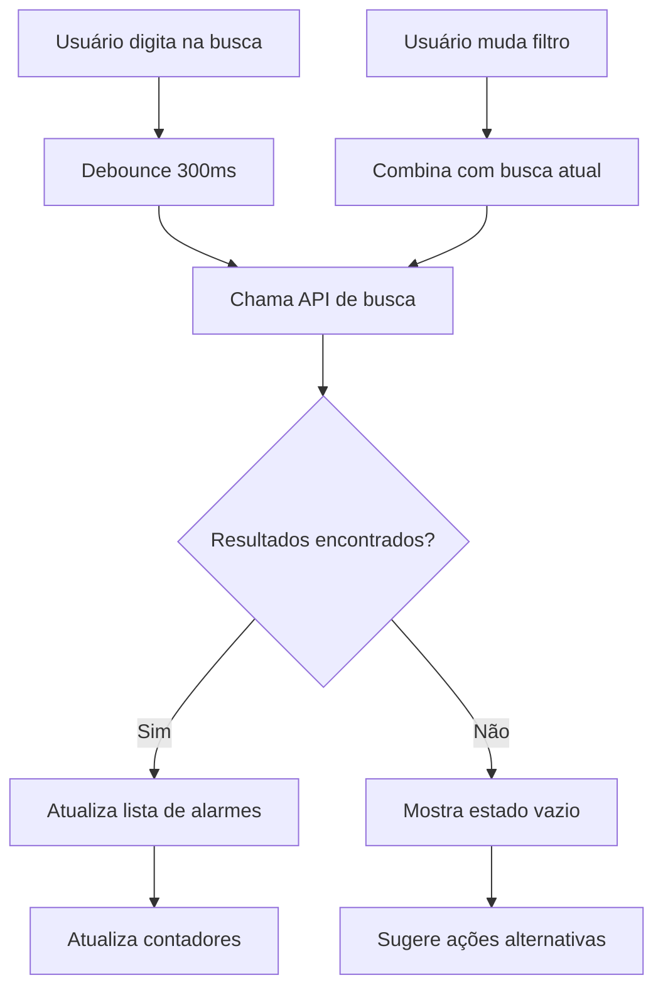
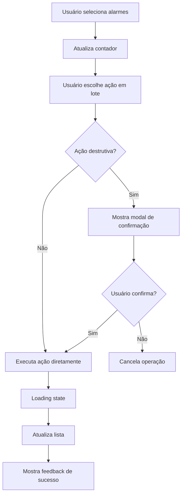

# ⚙️ Especificação da Tela de Gerenciamento de Alarmes — Smart Alarm

## 📋 **Template Base de Referência**

**🎨 Base Template**: [Horizon UI Tailwind React](https://react-themes.com/product/horizon-tailwind-react)  
**🔗 Live Preview**: [Data Tables Demo](https://horizon-ui.com/horizon-tailwind-react/admin/data-tables)  
**🎯 Adaptações**: Interface avançada de gerenciamento com filtros e ações em lote

### **Componentes do Template a Adaptar**

- ✅ **Advanced Data Table**: Lista completa de alarmes com ordenação
- ✅ **Complex Filters**: Sistema de filtros avançados (status, categoria, horário)
- ✅ **Bulk Selection**: Seleção múltipla para ações em lote
- ✅ **Action Menus**: Menus contextuais para cada alarme
- ✅ **Quick Edit Modal**: Edição rápida inline ou modal
- ✅ **Export Controls**: Funcionalidades de exportação de dados

---

## 🎯 Objetivo

A tela de gerenciamento de alarmes é o centro de controle CRUD do Smart Alarm, oferecendo uma interface poderosa e intuitiva para visualizar, organizar, filtrar e gerenciar todos os alarmes do usuário. Deve combinar eficiência operacional com acessibilidade excepcional, permitindo que usuários neurodivergentes organizem seus alarmes com facilidade através de múltiplas visualizações, filtros avançados, busca em tempo real e operações em lote.

---

## 🎨 Estrutura Visual

### Layout Principal - Lista com Sidebar de Filtros (Desktop ≥1024px)

```text
┌─────────────────────────────────────────────────────────────────────────────┐
│ 🔔 Smart Alarm                    🌐 Status: Online     👤 João Silva  [⚙️] │
├─────────────────────────────────────────────────────────────────────────────┤
│                                                                             │
│ ← Dashboard    ⏰ Gerenciar Alarmes                    [📅 Calendário] [📊] │
│                                                                             │
│ ┌─────────────┬─────────────────────────────────────────────────────────┐   │
│ │ 🎛️ FILTROS   │ 🔍 Buscar alarmes...                    [➕ Novo Alarme] │   │
│ │             ├─────────────────────────────────────────────────────────┤   │
│ │ Categorias: │ [📋 Lista] [🎴 Cards] [📊 Stats]        [⚙️] [⬇️] [🗑️]  │   │
│ │ ☑️ Medicação │                                                         │   │
│ │ ☑️ Exercício │ ✅ 12 Selecionados   [✅ Todos] [🔄 Ativar] [🗑️ Remover]│   │
│ │ ☑️ Reuniões  │                                                         │   │
│ │ ☑️ Refeições │ ┌─────────────────────────────────────────────────────┐ │   │
│ │ ☐ Pessoal   │ │ 💊 Medicamento da Manhã      ⏰ 08:00  📅 Diário   │ │   │
│ │ ☐ Trabalho  │ │ Tomar vitaminas e suplementos          🔔 Ativo    │ │   │
│ │             │ │ [✏️ Editar] [📋 Duplicar] [🔕 Pausar] [🗑️ Excluir] │ │   │
│ │ Status:     │ └─────────────────────────────────────────────────────┘ │   │
│ │ ☑️ Ativos   │                                                         │   │
│ │ ☑️ Inativos │ ┌─────────────────────────────────────────────────────┐ │   │
│ │ ☐ Pausados  │ │ 🏃 Exercício Matinal          ⏰ 07:00  📅 Seg-Sex  │ │   │
│ │             │ │ Corrida no parque - 30 minutos         🔕 Inativo  │ │   │
│ │ Data:       │ │ [✏️ Editar] [📋 Duplicar] [🔔 Ativar] [🗑️ Excluir] │ │   │
│ │ ○ Hoje      │ └─────────────────────────────────────────────────────┘ │   │
│ │ ○ Semana    │                                                         │   │
│ │ ● Todos     │ ┌─────────────────────────────────────────────────────┐ │   │
│ │             │ │ 📞 Reunião de Equipe         ⏰ 14:30  📅 Ter/Qui   │ │   │
│ │ Ordenar:    │ │ Reunião semanal do projeto            🔔 Ativo     │ │   │
│ │ • Hora      │ │ [✏️ Editar] [📋 Duplicar] [🔕 Pausar] [🗑️ Excluir] │ │   │
│ │ ○ Nome      │ └─────────────────────────────────────────────────────┘ │   │
│ │ ○ Criação   │                                                         │   │
│ │             │ ┌─────────────────────────────────────────────────────┐ │   │
│ │ [🔄 Resetar]│ │ 🍽️ Almoço                    ⏰ 12:00  📅 Diário   │ │   │
│ │             │ │ Lembrete para fazer a refeição        🔔 Ativo     │ │   │
│ │             │ │ [✏️ Editar] [📋 Duplicar] [🔕 Pausar] [🗑️ Excluir] │ │   │
│ │             │ └─────────────────────────────────────────────────────┘ │   │
│ └─────────────┤                                                         │   │
│               │ Mostrando 4 de 47 alarmes                               │   │
│               │ [← Anterior] Página 1 de 12 [Próximo →]                │   │
│               │                                                         │   │
│               └─────────────────────────────────────────────────────────┘   │
│                                                                             │
└─────────────────────────────────────────────────────────────────────────────┘
```

### Layout Mobile - Cards Empilhados (<768px)

```text
┌─────────────────────────────────┐
│ 🔔 Smart Alarm        [☰] [👤] │
├─────────────────────────────────┤
│ ← Dashboard  ⏰ Alarmes         │
│                                 │
│ 🔍 Buscar...         [🎛️] [➕] │
│                                 │
│ [✅ 3 selecionados] [Ações ⬇️]  │
│                                 │
│ ┌─────────────────────────────┐ │
│ │ ☑️ 💊 Medicamento 08:00     │ │
│ │    Vitaminas - Ativo        │ │
│ │    📅 Diário                │ │
│ │    [✏️] [📋] [🔕] [🗑️]     │ │
│ └─────────────────────────────┘ │
│                                 │
│ ┌─────────────────────────────┐ │
│ │ ☐ 🏃 Exercício 07:00        │ │
│ │    Corrida - Inativo        │ │
│ │    📅 Seg-Sex               │ │
│ │    [✏️] [📋] [🔔] [🗑️]     │ │
│ └─────────────────────────────┘ │
│                                 │
│ ┌─────────────────────────────┐ │
│ │ ☑️ 📞 Reunião 14:30         │ │
│ │    Equipe - Ativo           │ │
│ │    📅 Ter/Qui               │ │
│ │    [✏️] [📋] [🔕] [🗑️]     │ │
│ └─────────────────────────────┘ │
│                                 │
│ Mostrando 3 de 47               │
│ [← Anterior] 1/12 [Próximo →]  │
│                                 │
│ [🎛️ Filtros] [📊 Estatísticas] │
│                                 │
└─────────────────────────────────┘
```

---

## 📱 Estados da Tela

### 1. **Estado de Carregamento (Loading)**

```text
┌─────────────────────────────────────────────────────────────────────────────┐
│ ⏰ Gerenciar Alarmes                                                        │
├─────────────────────────────────────────────────────────────────────────────┤
│                                                                             │
│ 🔍 Buscar alarmes...                            ⏳ Carregando...           │
│                                                                             │
│ ┌─────────────────────────────────────────────────────────────────────┐     │
│ │ ██████████████████████████████████████████████████████████████████  │     │
│ │ ██████████████████████████████████████████████████████████████████  │     │
│ └─────────────────────────────────────────────────────────────────────┘     │
│                                                                             │
│ ┌─────────────────────────────────────────────────────────────────────┐     │
│ │ ██████████████████████████████████████████████████████████████████  │     │
│ │ ██████████████████████████████████████████████████████████████████  │     │
│ └─────────────────────────────────────────────────────────────────────┘     │
│                                                                             │
│                        Carregando seus alarmes...                          │
│                                                                             │
└─────────────────────────────────────────────────────────────────────────────┘
```

**Características**:

- Skeleton cards para estrutura dos alarmes
- Progress indicator suave
- Texto acessível para screen readers
- Timeout de 30s com fallback

### 2. **Estado Vazio (Empty State)**

```text
┌─────────────────────────────────────────────────────────────────────────────┐
│ ⏰ Gerenciar Alarmes                                    [➕ Novo Alarme]    │
├─────────────────────────────────────────────────────────────────────────────┤
│                                                                             │
│ 🔍 Buscar alarmes...                                                        │
│                                                                             │
│                                   ⏰                                       │
│                                                                             │
│                          Você ainda não tem alarmes                        │
│                                                                             │
│                    Comece criando seu primeiro alarme para                 │
│                      organizar sua rotina e nunca esquecer                 │
│                           dos compromissos importantes!                     │
│                                                                             │
│                              [➕ Criar Alarme]                             │
│                              [📥 Importar Dados]                           │
│                              [📖 Ver Tutorial]                             │
│                                                                             │
│                                                                             │
│ 💡 Dica: Use categorias para organizar seus alarmes por tipo               │
│                                                                             │
└─────────────────────────────────────────────────────────────────────────────┘
```

### 3. **Estado de Busca Sem Resultados**

```text
┌─────────────────────────────────────────────────────────────────────────────┐
│ ⏰ Gerenciar Alarmes                                                        │
├─────────────────────────────────────────────────────────────────────────────┤
│                                                                             │
│ 🔍 medicamento antibiotico     [❌ Limpar]              [🎛️ Filtros]      │
│                                                                             │
│                                   🔍                                       │
│                                                                             │
│                        Nenhum alarme encontrado                            │
│                                                                             │
│                    Não encontramos alarmes com o termo                     │
│                          "medicamento antibiotico"                         │
│                                                                             │
│                            [🔍 Buscar Novamente]                           │
│                            [🎛️ Ajustar Filtros]                           │
│                            [➕ Criar Novo Alarme]                          │
│                                                                             │
│                                                                             │
│ 💡 Tente termos mais simples ou verifique os filtros ativos                │
│                                                                             │
└─────────────────────────────────────────────────────────────────────────────┘
```

### 4. **Estado de Erro**

```text
┌─────────────────────────────────────────────────────────────────────────────┐
│ ⏰ Gerenciar Alarmes                                                        │
├─────────────────────────────────────────────────────────────────────────────┤
│                                                                             │
│                                   ❌                                       │
│                                                                             │
│                           Erro ao carregar alarmes                         │
│                                                                             │
│                     Não foi possível carregar seus dados.                  │
│                      Verifique sua conexão com a internet.                 │
│                                                                             │
│                            [🔄 Tentar Novamente]                           │
│                            [📱 Trabalhar Offline]                          │
│                            [🏠 Voltar ao Dashboard]                        │
│                                                                             │
│                                                                             │
│ ℹ️ Seus dados estão seguros e serão sincronizados quando possível          │
│                                                                             │
└─────────────────────────────────────────────────────────────────────────────┘
```

---

## 🧩 Componentes Detalhados

### 1. **AlarmCard**

**Responsabilidade**: Representação visual individual de cada alarme com ações inline

**Props TypeScript**:

```typescript
interface AlarmCardProps {
  alarm: Alarm;
  isSelected: boolean;
  onToggleSelect: (alarmId: string) => void;
  onEdit: (alarm: Alarm) => void;
  onDuplicate: (alarm: Alarm) => void;
  onToggleActive: (alarmId: string, active: boolean) => void;
  onDelete: (alarmId: string) => void;
  viewMode: 'list' | 'grid';
  showDetails: boolean;
}

interface Alarm {
  id: string;
  title: string;
  description?: string;
  time: string; // HH:mm format
  category: AlarmCategory;
  isActive: boolean;
  recurrence: RecurrencePattern;
  createdAt: Date;
  updatedAt: Date;
  nextTrigger?: Date;
  tags: string[];
}
```

**Estados Visuais**:

- `selected`: Checkbox ativo, borda destacada
- `active`: Cores vibrantes, ícone de sino ativo
- `inactive`: Cores acinzentadas, ícone de sino riscado
- `error`: Borda vermelha (se há erro de sincronização)
- `editing`: Modal inline ou overlay de edição

**Ações Disponíveis**:

```typescript
const ALARM_ACTIONS = {
  edit: { icon: '✏️', label: 'Editar', shortcut: 'E' },
  duplicate: { icon: '📋', label: 'Duplicar', shortcut: 'D' },
  toggle: { icon: '🔔/🔕', label: 'Ativar/Pausar', shortcut: 'Space' },
  delete: { icon: '🗑️', label: 'Excluir', shortcut: 'Del' },
  details: { icon: '👁️', label: 'Ver Detalhes', shortcut: 'Enter' }
};
```

### 2. **FilterSidebar**

**Responsabilidade**: Sistema avançado de filtros e ordenação

**Props TypeScript**:

```typescript
interface FilterSidebarProps {
  filters: AlarmFilters;
  alarmCounts: FilterCounts;
  onFiltersChange: (filters: AlarmFilters) => void;
  onReset: () => void;
  isCollapsed: boolean;
  onToggleCollapse: () => void;
}

interface AlarmFilters {
  categories: AlarmCategory[];
  status: ('active' | 'inactive' | 'paused')[];
  dateRange: 'today' | 'week' | 'month' | 'all' | DateRange;
  sortBy: 'time' | 'name' | 'created' | 'updated';
  sortOrder: 'asc' | 'desc';
  tags: string[];
}

interface FilterCounts {
  total: number;
  byCategory: Record<AlarmCategory, number>;
  byStatus: Record<string, number>;
  filtered: number;
}
```

**Seções do Filtro**:

1. **Categorias**: Checkboxes com contadores
2. **Status**: Multi-select para ativo/inativo/pausado
3. **Período**: Radio buttons + date picker customizado
4. **Tags**: Autocomplete com tags existentes
5. **Ordenação**: Dropdown com opções de sort

### 3. **SearchBar**

**Responsabilidade**: Busca em tempo real com autocomplete e filtros rápidos

**Props TypeScript**:

```typescript
interface SearchBarProps {
  value: string;
  onSearchChange: (query: string) => void;
  onFilterToggle: () => void;
  suggestions: SearchSuggestion[];
  isLoading: boolean;
  filtersActive: boolean;
  placeholder?: string;
}

interface SearchSuggestion {
  id: string;
  text: string;
  type: 'alarm' | 'category' | 'tag';
  highlight: string;
}
```

**Funcionalidades**:

- Busca debounced (300ms)
- Autocomplete com histórico
- Busca em título, descrição, categoria e tags
- Filtros rápidos (atalhos de teclado)
- Limpeza rápida com `Esc`

### 4. **BulkActionsBar**

**Responsabilidade**: Operações em lote para múltiplos alarmes

**Props TypeScript**:

```typescript
interface BulkActionsBarProps {
  selectedCount: number;
  totalCount: number;
  onSelectAll: () => void;
  onDeselectAll: () => void;
  onBulkEdit: (action: BulkAction) => void;
  disabled: boolean;
}

type BulkAction = 
  | { type: 'activate' }
  | { type: 'deactivate' }
  | { type: 'delete' }
  | { type: 'duplicate' }
  | { type: 'changeCategory'; category: AlarmCategory }
  | { type: 'addTags'; tags: string[] }
  | { type: 'export'; format: 'json' | 'csv' };
```

**Ações Disponíveis**:

- Selecionar todos/nenhum
- Ativar/desativar selecionados
- Excluir com confirmação
- Duplicar selecionados
- Alterar categoria em lote
- Adicionar/remover tags
- Exportar dados

---

## 🎮 Fluxos de Interação

### 1. **Busca e Filtragem**

**Fluxo**: Usuário digita → Debounce → API → Atualiza lista



**Implementação**:

```typescript
const useAlarmSearch = () => {
  const [searchQuery, setSearchQuery] = useState('');
  const [filters, setFilters] = useState<AlarmFilters>(defaultFilters);
  
  const debouncedSearch = useMemo(
    () => debounce((query: string) => {
      // Combina busca com filtros ativos
      const searchParams = {
        query,
        ...filters,
        limit: 20,
        offset: 0
      };
      
      searchAlarms(searchParams);
    }, 300),
    [filters]
  );
  
  useEffect(() => {
    debouncedSearch(searchQuery);
  }, [searchQuery, debouncedSearch]);
  
  return { searchQuery, setSearchQuery, filters, setFilters };
};
```

### 2. **Seleção e Ações em Lote**

**Fluxo**: Seleção → Validação → Confirmação → Execução



**Implementação**:

```typescript
const useBulkActions = () => {
  const [selectedIds, setSelectedIds] = useState<string[]>([]);
  const [isProcessing, setIsProcessing] = useState(false);
  
  const executeBulkAction = async (action: BulkAction) => {
    if (selectedIds.length === 0) return;
    
    // Ações destrutivas requerem confirmação
    if (['delete'].includes(action.type)) {
      const confirmed = await showConfirmationDialog({
        title: 'Confirmar exclusão',
        message: `Deseja excluir ${selectedIds.length} alarme(s)?`,
        confirmText: 'Excluir',
        cancelText: 'Cancelar'
      });
      
      if (!confirmed) return;
    }
    
    setIsProcessing(true);
    
    try {
      await bulkUpdateAlarms(selectedIds, action);
      
      // Feedback de sucesso
      toast.success(`${selectedIds.length} alarme(s) atualizados com sucesso!`);
      
      // Limpa seleção
      setSelectedIds([]);
      
      // Recarrega lista
      refetch();
      
    } catch (error) {
      toast.error('Erro ao atualizar alarmes. Tente novamente.');
    } finally {
      setIsProcessing(false);
    }
  };
  
  return {
    selectedIds,
    setSelectedIds,
    isProcessing,
    executeBulkAction
  };
};
```

### 3. **Navegação por Teclado**

**Atalhos Principais**:

- `Ctrl/Cmd + F`: Focar na busca
- `Tab`: Navegar entre alarmes
- `Space`: Selecionar/deselecionar alarme
- `Enter`: Editar alarme focado
- `Delete`: Excluir alarme focado
- `Ctrl/Cmd + A`: Selecionar todos
- `Esc`: Limpar seleção/busca

**Implementação**:

```typescript
const useKeyboardShortcuts = (alarms: Alarm[], onAction: (action: string, alarm?: Alarm) => void) => {
  const [focusedIndex, setFocusedIndex] = useState(0);
  
  useEffect(() => {
    const handleKeyDown = (event: KeyboardEvent) => {
      // Previne ações se estiver digitando
      if (event.target instanceof HTMLInputElement) return;
      
      switch (event.key) {
        case 'ArrowUp':
          event.preventDefault();
          setFocusedIndex(prev => Math.max(0, prev - 1));
          break;
          
        case 'ArrowDown':
          event.preventDefault();
          setFocusedIndex(prev => Math.min(alarms.length - 1, prev + 1));
          break;
          
        case ' ':
          event.preventDefault();
          onAction('toggleSelect', alarms[focusedIndex]);
          break;
          
        case 'Enter':
          event.preventDefault();
          onAction('edit', alarms[focusedIndex]);
          break;
          
        case 'Delete':
          event.preventDefault();
          onAction('delete', alarms[focusedIndex]);
          break;
          
        case 'f':
          if (event.ctrlKey || event.metaKey) {
            event.preventDefault();
            document.getElementById('search-input')?.focus();
          }
          break;
      }
    };
    
    document.addEventListener('keydown', handleKeyDown);
    return () => document.removeEventListener('keydown', handleKeyDown);
  }, [alarms, focusedIndex, onAction]);
  
  return { focusedIndex, setFocusedIndex };
};
```

---

## 🔌 API Integration

### 1. **Endpoints Utilizados**

```typescript
// Listar alarmes com filtros e paginação
GET /api/alarms?page=1&limit=20&category=medication&status=active&sort=time&search=medicamento

// Busca avançada
GET /api/alarms/search?q=medicamento&categories[]=medication&categories[]=personal&startDate=2025-07-01

// Operações em lote
POST /api/alarms/bulk-update
{
  "alarmIds": ["alarm-1", "alarm-2", "alarm-3"],
  "action": {
    "type": "activate"
  }
}

// Estatísticas e contadores
GET /api/alarms/stats?groupBy=category,status

// Tags autocomplete
GET /api/alarms/tags?q=medi&limit=10
```

### 2. **Paginação e Caching**

```typescript
const useAlarmsPagination = (filters: AlarmFilters) => {
  const [page, setPage] = useState(1);
  const [limit, setLimit] = useState(20);
  
  const queryKey = ['alarms', 'paginated', { filters, page, limit }];
  
  const {
    data,
    isLoading,
    error,
    fetchNextPage,
    hasNextPage,
    isFetchingNextPage
  } = useInfiniteQuery({
    queryKey,
    queryFn: ({ pageParam = 1 }) => 
      fetchAlarms({ ...filters, page: pageParam, limit }),
    getNextPageParam: (lastPage, allPages) => 
      lastPage.hasMore ? allPages.length + 1 : undefined,
    staleTime: 2 * 60 * 1000, // 2 minutos
    keepPreviousData: true, // Mantém dados durante refetch
  });
  
  const alarms = useMemo(() => 
    data?.pages.flatMap(page => page.alarms) ?? [],
    [data]
  );
  
  return {
    alarms,
    isLoading,
    error,
    hasNextPage,
    fetchNextPage,
    isFetchingNextPage,
    page,
    setPage
  };
};
```

### 3. **Sincronização e Conflitos**

```typescript
// Resolver conflitos de sincronização
const useConflictResolution = () => {
  const handleSyncConflict = (conflict: SyncConflict) => {
    return new Promise<ConflictResolution>((resolve) => {
      // Mostra modal de resolução de conflito
      showConflictModal({
        localVersion: conflict.localVersion,
        serverVersion: conflict.serverVersion,
        onResolve: (resolution: ConflictResolution) => {
          resolve(resolution);
        }
      });
    });
  };
  
  const syncPendingChanges = async () => {
    const pendingChanges = await getPendingChanges();
    
    for (const change of pendingChanges) {
      try {
        await syncChange(change);
        await markAsSynced(change.id);
      } catch (error) {
        if (error.type === 'CONFLICT') {
          const resolution = await handleSyncConflict(error.conflict);
          await resolveConflict(change.id, resolution);
        } else {
          console.error('Sync failed:', error);
        }
      }
    }
  };
  
  return { handleSyncConflict, syncPendingChanges };
};
```

---

## ♿ Acessibilidade

### 1. **Estrutura Semântica**

```html
<main role="main" aria-label="Gerenciamento de alarmes">
  <header>
    <h1>Gerenciar Alarmes</h1>
    <nav aria-label="Ações principais">
      <button>Novo Alarme</button>
    </nav>
  </header>
  
  <aside role="complementary" aria-label="Filtros de alarmes">
    <form role="search">
      <fieldset>
        <legend>Filtrar por categoria</legend>
        <!-- Checkboxes de categorias -->
      </fieldset>
    </form>
  </aside>
  
  <section role="region" aria-label="Lista de alarmes">
    <div role="toolbar" aria-label="Ações em lote">
      <span aria-live="polite" aria-atomic="true">
        {selectedCount} alarme(s) selecionados
      </span>
    </div>
    
    <ul role="list" aria-label="Alarmes disponíveis">
      {alarms.map(alarm => (
        <li key={alarm.id} role="listitem">
          <article aria-labelledby={`alarm-title-${alarm.id}`}>
            <!-- Conteúdo do alarme -->
          </article>
        </li>
      ))}
    </ul>
  </section>
</main>
```

### 2. **Screen Reader Support**

```typescript
const useScreenReaderFeedback = () => {
  const announceSelection = (count: number, total: number) => {
    const message = count === 0 
      ? 'Nenhum alarme selecionado'
      : count === total
      ? `Todos os ${total} alarmes selecionados`
      : `${count} de ${total} alarmes selecionados`;
      
    announce(message, 'polite');
  };
  
  const announceBulkAction = (action: string, count: number, success: boolean) => {
    const message = success
      ? `${count} alarme(s) ${action} com sucesso`
      : `Erro ao ${action} ${count} alarme(s)`;
      
    announce(message, 'assertive');
  };
  
  const announceFilterChange = (activeFilters: number, resultCount: number) => {
    const message = activeFilters === 0
      ? `Mostrando todos os ${resultCount} alarmes`
      : `${activeFilters} filtro(s) ativo(s). ${resultCount} alarme(s) encontrados`;
      
    announce(message, 'polite');
  };
  
  return {
    announceSelection,
    announceBulkAction,
    announceFilterChange
  };
};
```

### 3. **Alto Contraste e Temas**

```css
@media (prefers-contrast: high) {
  .alarm-card {
    border: 2px solid currentColor;
    background: Canvas;
    color: CanvasText;
  }
  
  .alarm-card[aria-selected="true"] {
    border-color: Highlight;
    background: Highlight;
    color: HighlightText;
  }
  
  .alarm-card--active {
    border-left: 6px solid #00ff00;
  }
  
  .alarm-card--inactive {
    border-left: 6px solid #ff0000;
  }
}

@media (prefers-reduced-motion: reduce) {
  .alarm-card,
  .filter-sidebar,
  .bulk-actions-bar {
    transition: none !important;
    animation: none !important;
  }
  
  .loading-skeleton {
    animation: none;
    background: #f0f0f0;
  }
}
```

---

## 🧪 Estratégia de Testes

### 1. **Testes Unitários**

```typescript
describe('AlarmCard', () => {
  it('renders alarm information correctly', () => {
    const mockAlarm = {
      id: 'alarm-1',
      title: 'Medicamento',
      time: '08:00',
      category: 'medication',
      isActive: true,
      recurrence: 'daily'
    };
    
    render(<AlarmCard alarm={mockAlarm} {...defaultProps} />);
    
    expect(screen.getByText('Medicamento')).toBeInTheDocument();
    expect(screen.getByText('08:00')).toBeInTheDocument();
    expect(screen.getByText('💊')).toBeInTheDocument(); // categoria icon
    expect(screen.getByLabelText('Alarme ativo')).toBeInTheDocument();
  });
  
  it('handles selection toggle correctly', async () => {
    const onToggleSelect = jest.fn();
    const user = userEvent.setup();
    
    render(<AlarmCard {...defaultProps} onToggleSelect={onToggleSelect} />);
    
    const checkbox = screen.getByRole('checkbox');
    await user.click(checkbox);
    
    expect(onToggleSelect).toHaveBeenCalledWith('alarm-1');
  });
  
  it('supports keyboard navigation', async () => {
    const user = userEvent.setup();
    render(<AlarmCard {...defaultProps} />);
    
    const card = screen.getByRole('article');
    card.focus();
    
    // Testa atalhos de teclado
    await user.keyboard(' '); // Selecionar
    expect(screen.getByRole('checkbox')).toBeChecked();
    
    await user.keyboard('{Enter}'); // Editar
    expect(defaultProps.onEdit).toHaveBeenCalled();
  });
});
```

### 2. **Testes de Integração**

```typescript
describe('Alarm Management Integration', () => {
  it('filters alarms by category', async () => {
    const user = userEvent.setup();
    render(<AlarmManagementPage />);
    
    // Aguarda carregamento inicial
    await waitFor(() => {
      expect(screen.getAllByRole('article')).toHaveLength(10);
    });
    
    // Desmarca categoria 'medication'
    const medicationFilter = screen.getByLabelText('Medicação');
    await user.click(medicationFilter);
    
    // Verifica se alarmes de medicação foram removidos
    await waitFor(() => {
      expect(screen.getAllByRole('article')).toHaveLength(7);
      expect(screen.queryByText('Medicamento da Manhã')).not.toBeInTheDocument();
    });
  });
  
  it('performs bulk delete operation', async () => {
    const user = userEvent.setup();
    render(<AlarmManagementPage />);
    
    // Seleciona múltiplos alarmes
    const checkboxes = await screen.findAllByRole('checkbox');
    await user.click(checkboxes[0]);
    await user.click(checkboxes[1]);
    await user.click(checkboxes[2]);
    
    // Abre menu de ações em lote
    const bulkActionsBtn = screen.getByText('Ações');
    await user.click(bulkActionsBtn);
    
    // Clica em excluir
    const deleteBtn = screen.getByText('Excluir selecionados');
    await user.click(deleteBtn);
    
    // Confirma exclusão
    const confirmBtn = await screen.findByText('Confirmar exclusão');
    await user.click(confirmBtn);
    
    // Verifica feedback de sucesso
    await waitFor(() => {
      expect(screen.getByText('3 alarme(s) excluídos com sucesso')).toBeInTheDocument();
    });
  });
});
```

### 3. **Testes de Acessibilidade**

```typescript
describe('Alarm Management Accessibility', () => {
  it('has no accessibility violations', async () => {
    const { container } = render(<AlarmManagementPage />);
    const results = await axe(container);
    expect(results).toHaveNoViolations();
  });
  
  it('announces selection changes to screen readers', async () => {
    const user = userEvent.setup();
    render(<AlarmManagementPage />);
    
    const checkbox = await screen.findByRole('checkbox');
    await user.click(checkbox);
    
    await waitFor(() => {
      expect(screen.getByRole('status')).toHaveTextContent('1 de 10 alarmes selecionados');
    });
  });
  
  it('supports keyboard navigation between alarms', async () => {
    const user = userEvent.setup();
    render(<AlarmManagementPage />);
    
    const firstAlarm = await screen.findByRole('article');
    firstAlarm.focus();
    
    await user.keyboard('{ArrowDown}');
    
    const alarms = screen.getAllByRole('article');
    expect(alarms[1]).toHaveFocus();
  });
});
```

---

## ⚡ Performance

### 1. **Virtualização de Lista**

```typescript
import { FixedSizeList as List } from 'react-window';

const VirtualizedAlarmList = ({ alarms, onAlarmAction }: VirtualizedAlarmListProps) => {
  const itemCount = alarms.length;
  const itemHeight = 120; // altura fixa do AlarmCard
  
  const AlarmItem = ({ index, style }: { index: number; style: CSSProperties }) => {
    const alarm = alarms[index];
    
    return (
      <div style={style}>
        <AlarmCard 
          alarm={alarm}
          onEdit={onAlarmAction}
          onDelete={onAlarmAction}
          // ... outras props
        />
      </div>
    );
  };
  
  return (
    <List
      height={600} // altura do container
      itemCount={itemCount}
      itemSize={itemHeight}
      overscanCount={5} // itens extras para renderizar
    >
      {AlarmItem}
    </List>
  );
};
```

### 2. **Otimização de Re-renders**

```typescript
// Memoização de componentes pesados
const AlarmCard = memo(({ alarm, isSelected, onToggleSelect, ...props }: AlarmCardProps) => {
  const handleToggleSelect = useCallback(() => {
    onToggleSelect(alarm.id);
  }, [alarm.id, onToggleSelect]);
  
  const categoryConfig = useMemo(() => 
    CATEGORY_CONFIG[alarm.category], 
    [alarm.category]
  );
  
  return (
    <article 
      className={cn(
        'alarm-card',
        isSelected && 'alarm-card--selected',
        alarm.isActive ? 'alarm-card--active' : 'alarm-card--inactive'
      )}
    >
      {/* Conteúdo do card */}
    </article>
  );
}, (prevProps, nextProps) => {
  // Comparação customizada para otimizar re-renders
  return (
    prevProps.alarm.id === nextProps.alarm.id &&
    prevProps.alarm.updatedAt === nextProps.alarm.updatedAt &&
    prevProps.isSelected === nextProps.isSelected
  );
});
```

### 3. **Debounce e Throttling**

```typescript
// Hook para busca com debounce
const useDebouncedSearch = (initialQuery = '', delay = 300) => {
  const [query, setQuery] = useState(initialQuery);
  const [debouncedQuery, setDebouncedQuery] = useState(initialQuery);
  
  useEffect(() => {
    const timer = setTimeout(() => {
      setDebouncedQuery(query);
    }, delay);
    
    return () => clearTimeout(timer);
  }, [query, delay]);
  
  return [debouncedQuery, setQuery] as const;
};

// Hook para throttling de scroll events
const useThrottledScroll = (callback: () => void, delay = 100) => {
  const throttledCallback = useCallback(
    throttle(callback, delay),
    [callback, delay]
  );
  
  useEffect(() => {
    const handleScroll = () => throttledCallback();
    
    window.addEventListener('scroll', handleScroll);
    return () => window.removeEventListener('scroll', handleScroll);
  }, [throttledCallback]);
};
```

---

## 📝 Checklist de Implementação

### **🏗️ Estrutura Base**

- [ ] Criar componente `AlarmManagementPage` principal
- [ ] Implementar layout responsivo com sidebar de filtros
- [ ] Configurar roteamento e navegação
- [ ] Criar sistema de grid/list toggle

### **🧩 Componentes Core**

- [ ] Desenvolver `AlarmCard` com todas as ações inline
- [ ] Implementar `FilterSidebar` com todos os filtros
- [ ] Criar `SearchBar` com autocomplete
- [ ] Desenvolver `BulkActionsBar` para seleção múltipla

### **🔍 Busca e Filtros**

- [ ] Implementar busca em tempo real com debounce
- [ ] Criar sistema de filtros por categoria, status, data
- [ ] Adicionar filtros por tags e ordenação
- [ ] Implementar reset e salvar filtros favoritos

### **📱 Estados da Interface**

- [ ] Implementar loading states com skeleton
- [ ] Criar empty states com CTAs apropriados
- [ ] Configurar error states com recovery options
- [ ] Adicionar estados de "sem resultados" para busca

### **🎮 Interações**

- [ ] Configurar seleção múltipla com keyboard support
- [ ] Implementar todas as ações em lote
- [ ] Adicionar atalhos de teclado para ações comuns
- [ ] Criar confirmações para ações destrutivas

### **🔌 API e Dados**

- [ ] Configurar paginação infinita ou por páginas
- [ ] Implementar cache inteligente com React Query
- [ ] Criar hooks para operações CRUD
- [ ] Configurar sincronização offline

### **♿ Acessibilidade**

- [ ] Implementar estrutura semântica completa
- [ ] Configurar navegação por teclado
- [ ] Adicionar announcements para screen readers
- [ ] Implementar suporte a alto contraste

### **🧪 Testes**

- [ ] Escrever testes unitários para todos os componentes
- [ ] Criar testes de integração para fluxos principais
- [ ] Implementar testes de acessibilidade
- [ ] Configurar testes E2E para operações críticas

### **⚡ Performance**

- [ ] Implementar virtualização para listas grandes
- [ ] Configurar memoização apropriada
- [ ] Otimizar re-renders desnecessários
- [ ] Implementar lazy loading de dados

### **📱 Mobile e PWA**

- [ ] Adaptar layout para mobile
- [ ] Implementar gestos touch apropriados
- [ ] Configurar offine support
- [ ] Testar em diferentes tamanhos de tela

### **🎨 UI/UX Final**

- [ ] Implementar todas as animações e transições
- [ ] Configurar temas e personalização
- [ ] Adicionar tooltips e ajuda contextual
- [ ] Realizar testes de usabilidade

---

**📅 Estimativa Total**: ~8-10 horas de desenvolvimento
**🎯 Próximo Passo**: Continuar com ETAPA 1.3 - Especificação do Formulário de Alarme

Esta especificação fornece uma base sólida para implementar uma tela de gerenciamento robusta, eficiente e acessível, seguindo todas as melhores práticas do Smart Alarm.
