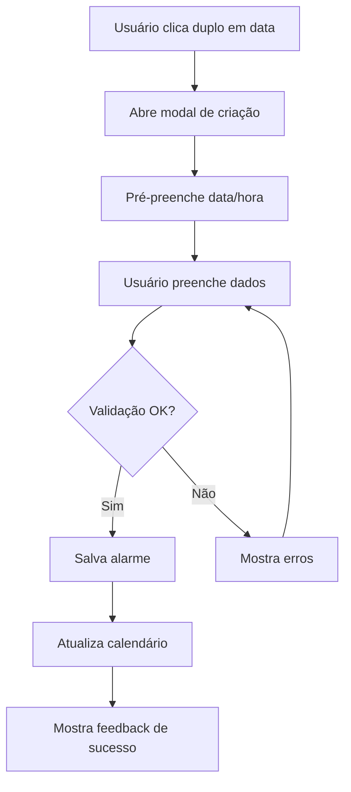
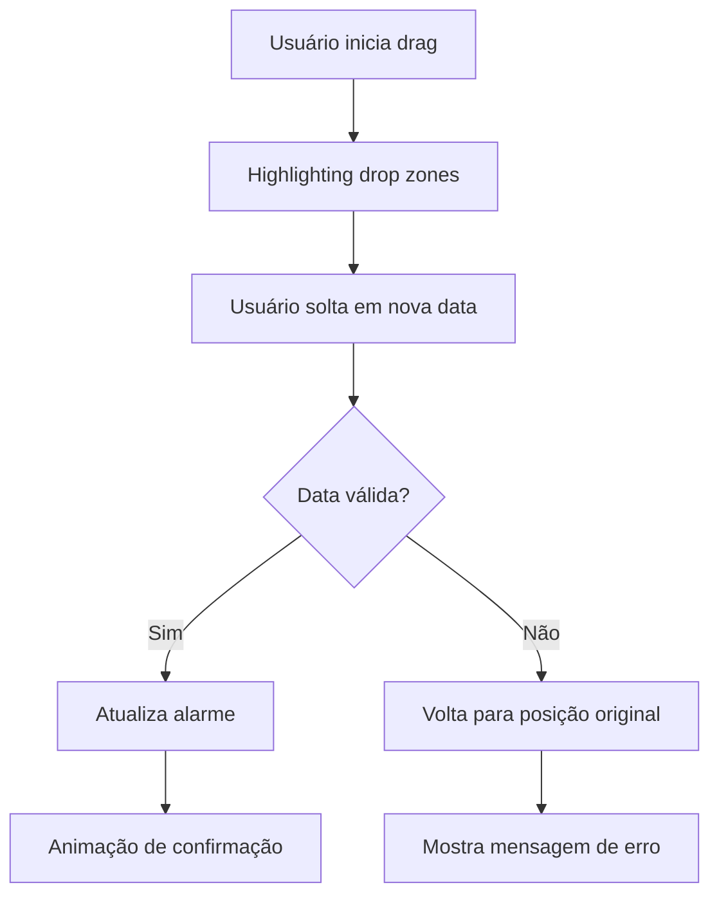

# 📅 Especificação da Tela de Calendário — Smart Alarm

## 📋 **Template Base de Referência**

**🎨 Base Template**: [Horizon UI Tailwind React](https://react-themes.com/product/horizon-tailwind-react)  
**🔗 Live Preview**: [Calendar Dashboard](https://horizon-ui.com/horizon-tailwind-react/admin/default)  
**🎯 Adaptações**: Interface de calendário personalizada com visualização de alarmes

### **Componentes do Template a Adaptar**

- ✅ **Calendar Grid**: Layout de calendário responsivo
- ✅ **Event Indicators**: Marcadores visuais para alarmes
- ✅ **Date Navigation**: Controles de navegação temporal
- ✅ **Day/Week/Month Views**: Múltiplas visualizações
- ✅ **Quick Actions**: Adição rápida de alarmes
- ✅ **Event Details**: Popups com detalhes de alarmes

---

## 🎯 Objetivo

A tela de calendário é o coração visual do Smart Alarm, oferecendo uma interface rica e acessível para visualização, criação e gerenciamento de alarmes através de diferentes perspectivas temporais. Deve suportar múltiplas visualizações (mensal, semanal, diária, lista), interações intuitivas (drag-drop, click-to-create), e manter excelência em acessibilidade para usuários neurodivergentes. É a principal ferramenta de organização temporal do sistema.

---

## 🎨 Estrutura Visual

### Layout Principal - Visualização Mensal (Desktop ≥1024px)

```text
┌─────────────────────────────────────────────────────────────────────────────┐
│ 🔔 Smart Alarm                    🌐 Status: Online     👤 João Silva  [⚙️] │
├─────────────────────────────────────────────────────────────────────────────┤
│                                                                             │
│ ← Junho 2025    📅 Julho 2025    Agosto 2025 →    [📋 Lista] [📊 Stats]   │
│                                                                             │
│ [📅 Mês] [📅 Semana] [📅 Dia] [📋 Lista]     🔍 Buscar...    [➕ Novo]    │
│                                                                             │
│ ┌─────────┬─────────┬─────────┬─────────┬─────────┬─────────┬─────────┐     │
│ │   Dom   │   Seg   │   Ter   │   Qua   │   Qui   │   Sex   │   Sab   │     │
│ ├─────────┼─────────┼─────────┼─────────┼─────────┼─────────┼─────────┤     │
│ │    29   │    30   │     1   │     2   │     3   │     4   │     5   │     │
│ │         │         │         │ 💊 14:30│ 🏃 07:00│         │         │     │
│ │         │         │         │ 📞 16:00│ 💊 20:00│         │         │     │
│ ├─────────┼─────────┼─────────┼─────────┼─────────┼─────────┼─────────┤     │
│ │     6   │     7   │     8   │     9   │    10   │    11   │    12   │     │
│ │ 🏃 09:00│ 💊 08:00│         │ 📞 10:30│ 🏃 07:00│ 💊 14:30│         │     │
│ │         │ 🏃 18:00│         │ 🍽️ 12:00│         │         │         │     │
│ ├─────────┼─────────┼─────────┼─────────┼─────────┼─────────┼─────────┤     │
│ │    13   │    14   │    15   │    16   │    17   │    18   │    19   │     │
│ │         │ 💊 14:30│ 🏃 07:00│         │ 📞 09:00│ 💊 08:00│ ⭐ HOJE │     │
│ │         │ 📞 16:00│ 💊 20:00│         │ 🍽️ 12:00│ 🏃 18:00│ 💊 08:00│     │
│ │         │         │         │         │         │         │ 🏃 09:00│     │
│ │         │         │         │         │         │         │ 💊 14:30│     │
│ ├─────────┼─────────┼─────────┼─────────┼─────────┼─────────┼─────────┤     │
│ │    20   │    21   │    22   │    23   │    24   │    25   │    26   │     │
│ │ 🏃 07:00│ 💊 14:30│         │ 📞 10:00│ 💊 08:00│         │ 🏃 09:00│     │
│ │ 💊 20:00│         │         │ 🍽️ 12:00│ 🏃 18:00│         │         │     │
│ ├─────────┼─────────┼─────────┼─────────┼─────────┼─────────┼─────────┤     │
│ │    27   │    28   │    29   │    30   │    31   │     1   │     2   │     │
│ │         │ 💊 14:30│ 🏃 07:00│ 💊 08:00│ 📞 15:30│         │         │     │
│ │         │ 📞 16:00│         │ 🍽️ 12:00│         │         │         │     │
│ └─────────┴─────────┴─────────┴─────────┴─────────┴─────────┴─────────┘     │
│                                                                             │
│ 📊 Legenda:  💊 Medicamentos  🏃 Exercícios  📞 Compromissos  🍽️ Refeições │
│                                                                             │
│ 💡 Dica: Arraste alarmes entre datas ou clique duas vezes para criar        │
│                                                                             │
└─────────────────────────────────────────────────────────────────────────────┘
```

### Layout Mobile - Visualização Semanal (<768px)

```text
┌─────────────────────────────────┐
│ 🔔 Smart Alarm        [☰] [👤] │
├─────────────────────────────────┤
│ ← Semana 15-21 Jul →            │
│                                 │
│ [Sem] [Dia] [Lista]   [➕ Novo] │
│                                 │
│ ┌─────────────────────────────┐ │
│ │ Seg 15/07           💊 08:00│ │
│ │ ──────────────────────────  │ │
│ │ 📞 10:30  🍽️ 12:00  💊 20:00│ │
│ └─────────────────────────────┘ │
│                                 │
│ ┌─────────────────────────────┐ │
│ │ Ter 16/07           🏃 07:00│ │
│ │ ──────────────────────────  │ │
│ │ 💊 14:30  📞 16:00          │ │
│ └─────────────────────────────┘ │
│                                 │
│ ┌─────────────────────────────┐ │
│ │ ⭐ Sáb 19/07 (HOJE)  💊 08:00│ │
│ │ ──────────────────────────  │ │
│ │ 🏃 09:00  💊 14:30  📞 18:00│ │
│ └─────────────────────────────┘ │
│                                 │
│ [🔄 Sincronizar]               │
│                                 │
│ 💡 Toque duplo para criar alarme│
│                                 │
└─────────────────────────────────┘
```

---

## 📱 Estados da Tela

### 1. **Estado de Carregamento (Loading)**

```text
┌─────────────────────────────────────────────────────────────────────────────┐
│ 📅 Calendário                                                               │
├─────────────────────────────────────────────────────────────────────────────┤
│                                                                             │
│                              ⏳ Carregando...                              │
│                                                                             │
│                     ████████████████████████                              │
│                                                                             │
│                        Sincronizando alarmes                               │
│                                                                             │
└─────────────────────────────────────────────────────────────────────────────┘
```

**Características**:

- Skeleton loading para estrutura do calendário
- Progress bar para sincronização
- Mensagem de status acessível via screen reader
- Timeout de 30 segundos com fallback para modo offline

### 2. **Estado Vazio (Empty State)**

```text
┌─────────────────────────────────────────────────────────────────────────────┐
│ 📅 Julho 2025                                              [➕ Novo Alarme] │
├─────────────────────────────────────────────────────────────────────────────┤
│                                                                             │
│                                   📅                                       │
│                                                                             │
│                           Nenhum alarme este mês                           │
│                                                                             │
│                   Que tal começar criando seu primeiro alarme?             │
│                                                                             │
│                              [➕ Criar Alarme]                             │
│                              [📥 Importar Dados]                           │
│                                                                             │
│                                                                             │
│ 💡 Dica: Use o atalho Ctrl+N (Cmd+N no Mac) para criar rapidamente!       │
│                                                                             │
└─────────────────────────────────────────────────────────────────────────────┘
```

### 3. **Estado de Erro (Error State)**

```text
┌─────────────────────────────────────────────────────────────────────────────┐
│ 📅 Calendário                                                               │
├─────────────────────────────────────────────────────────────────────────────┤
│                                                                             │
│                                   ❌                                       │
│                                                                             │
│                        Erro ao carregar calendário                         │
│                                                                             │
│                     Não foi possível sincronizar os dados                  │
│                                                                             │
│                            [🔄 Tentar Novamente]                           │
│                            [📱 Trabalhar Offline]                          │
│                                                                             │
│                                                                             │
│ ℹ️ Seus dados locais estão seguros e serão sincronizados quando possível   │
│                                                                             │
└─────────────────────────────────────────────────────────────────────────────┘
```

### 4. **Estado Offline**

```text
┌─────────────────────────────────────────────────────────────────────────────┐
│ 📅 Calendário                                    🔒 OFFLINE                │
├─────────────────────────────────────────────────────────────────────────────┤
│                                                                             │
│ [Dados locais - Última sync: há 2 horas]                                   │
│                                                                             │
│ ┌─────────┬─────────┬─────────┬─────────┬─────────┬─────────┬─────────┐     │
│ │   Dom   │   Seg   │   Ter   │   Qua   │   Qui   │   Sex   │   Sab   │     │
│ ├─────────┼─────────┼─────────┼─────────┼─────────┼─────────┼─────────┤     │
│ │     1   │     2   │     3   │     4   │     5   │     6   │     7   │     │
│ │         │ 💊 08:00│ 🏃 07:00│         │ 📞 10:30│ 💊 14:30│         │     │
│ │         │ 🍽️ 12:00│         │         │ 🍽️ 12:00│         │         │     │
│ └─────────┴─────────┴─────────┴─────────┴─────────┴─────────┴─────────┘     │
│                                                                             │
│ ⚠️ Você está trabalhando offline. Mudanças serão sincronizadas              │
│    automaticamente quando a conexão for restaurada.                        │
│                                                                             │
└─────────────────────────────────────────────────────────────────────────────┘
```

---

## 🧩 Componentes Detalhados

### 1. **CalendarHeader**

**Responsabilidade**: Navegação temporal e controles principais

**Props TypeScript**:

```typescript
interface CalendarHeaderProps {
  currentDate: Date;
  viewMode: 'month' | 'week' | 'day' | 'list';
  onDateChange: (date: Date) => void;
  onViewModeChange: (mode: CalendarViewMode) => void;
  onCreateAlarm: () => void;
  isOnline: boolean;
  lastSyncTime?: Date;
}
```

**Componentes Internos**:

- `DateNavigator`: Setas de navegação + seletor de mês/ano
- `ViewModeTabs`: Tabs para alternar visualizações
- `SearchBar`: Busca de alarmes por nome/categoria
- `CreateAlarmButton`: Botão principal de ação
- `SyncStatus`: Indicador de status de conectividade

**Acessibilidade**:

- `role="navigation"` no container principal
- Navegação por teclado (Tab, Arrow keys, Enter/Space)
- `aria-label` descritivo para cada controle
- Screen reader announcements para mudanças de data
- Alto contraste para indicadores de status

### 2. **CalendarView**

**Responsabilidade**: Container principal das visualizações do calendário

**Props TypeScript**:

```typescript
interface CalendarViewProps {
  viewMode: CalendarViewMode;
  currentDate: Date;
  alarms: AlarmEvent[];
  onAlarmClick: (alarm: AlarmEvent) => void;
  onAlarmDrop: (alarmId: string, newDate: Date) => void;
  onDateClick: (date: Date) => void;
  onDoubleClick: (date: Date, time?: string) => void;
  isLoading: boolean;
  error?: string;
}
```

**Subcomponentes por View**:

- `MonthView`: Grade 7x6 com células de dias
- `WeekView`: Visualização horizontal de 7 dias
- `DayView`: Visualização detalhada de um único dia
- `ListView`: Lista cronológica de alarmes

### 3. **EventCard**

**Responsabilidade**: Representação visual individual de cada alarme

**Props TypeScript**:

```typescript
interface EventCardProps {
  alarm: AlarmEvent;
  size: 'small' | 'medium' | 'large';
  isDraggable: boolean;
  onClick: (alarm: AlarmEvent) => void;
  onEdit: (alarm: AlarmEvent) => void;
  onToggle: (alarmId: string, active: boolean) => void;
  onDelete: (alarmId: string) => void;
  className?: string;
}
```

**Estados Visuais**:

- `active`: Alarme ativo (cores vibrantes)
- `inactive`: Alarme desativado (cores acinzentadas)
- `overdue`: Alarme em atraso (borda vermelha)
- `upcoming`: Próximo alarme (destaque especial)
- `dragging`: Estado durante drag & drop

**Categorias com Ícones**:

```typescript
const CATEGORY_CONFIG = {
  medication: { icon: '💊', color: '#10B981', label: 'Medicamento' },
  exercise: { icon: '🏃', color: '#3B82F6', label: 'Exercício' },
  meeting: { icon: '📞', color: '#8B5CF6', label: 'Reunião' },
  meal: { icon: '🍽️', color: '#F59E0B', label: 'Refeição' },
  personal: { icon: '👤', color: '#EF4444', label: 'Pessoal' },
  work: { icon: '💼', color: '#6B7280', label: 'Trabalho' }
};
```

### 4. **FilterPanel**

**Responsabilidade**: Filtros avançados e busca

**Props TypeScript**:

```typescript
interface FilterPanelProps {
  categories: CategoryFilter[];
  dateRange: DateRange;
  searchQuery: string;
  showInactive: boolean;
  onCategoryToggle: (category: string) => void;
  onDateRangeChange: (range: DateRange) => void;
  onSearchChange: (query: string) => void;
  onShowInactiveToggle: (show: boolean) => void;
  onReset: () => void;
}
```

**Funcionalidades**:

- Filtro por categorias (múltipla seleção)
- Range de datas customizável
- Busca em tempo real (debounced 300ms)
- Toggle para mostrar/ocultar inativos
- Botão de reset com confirmação

---

## 🎮 Fluxos de Interação

### 1. **Criação Rápida de Alarme**

**Fluxo**: Clique duplo em data → Modal de criação → Salvar



**Implementação**:

```typescript
const handleDateDoubleClick = (date: Date, time?: string) => {
  const defaultTime = time || '09:00';
  const newAlarm = {
    date,
    time: defaultTime,
    title: '',
    category: 'personal'
  };
  
  openAlarmModal({
    mode: 'create',
    alarm: newAlarm,
    onSave: handleAlarmSave
  });
};
```

### 2. **Drag & Drop de Alarmes**

**Fluxo**: Arrasta alarme → Valida drop → Atualiza data



**Implementação**:

```typescript
const handleAlarmDrop = async (alarmId: string, newDate: Date) => {
  try {
    // Validação de data
    if (newDate < new Date()) {
      throw new Error('Não é possível mover alarme para data passada');
    }
    
    // Atualização otimista
    updateAlarmDateOptimistically(alarmId, newDate);
    
    // Chama API
    await updateAlarmDate(alarmId, newDate);
    
    // Feedback de sucesso
    showToast('Alarme movido com sucesso!', 'success');
    
  } catch (error) {
    // Reverte mudança otimista
    revertAlarmUpdate(alarmId);
    showToast(error.message, 'error');
  }
};
```

### 3. **Navegação por Teclado**

**Controles Principais**:

- `Tab` / `Shift+Tab`: Navegação entre elementos
- `Arrow Keys`: Navegação entre células de datas
- `Enter` / `Space`: Ativar ação no elemento focado
- `Ctrl+N` / `Cmd+N`: Criar novo alarme
- `Escape`: Fechar modals/menus
- `Page Up/Down`: Navegar meses/semanas
- `Home/End`: Primeiro/último dia do período

**Implementação**:

```typescript
const useKeyboardNavigation = (viewMode: CalendarViewMode) => {
  useEffect(() => {
    const handleKeyDown = (event: KeyboardEvent) => {
      switch (event.key) {
        case 'ArrowLeft':
          event.preventDefault();
          navigatePrevious();
          break;
        case 'ArrowRight':
          event.preventDefault();
          navigateNext();
          break;
        case 'Enter':
        case ' ':
          event.preventDefault();
          activateFocusedElement();
          break;
        // ... outros controles
      }
    };
    
    document.addEventListener('keydown', handleKeyDown);
    return () => document.removeEventListener('keydown', handleKeyDown);
  }, [viewMode]);
};
```

---

## 🔌 API Integration

### 1. **Endpoints Utilizados**

```typescript
// Buscar alarmes por período
GET /api/alarms/calendar?startDate=2025-07-01&endDate=2025-07-31

// Criar novo alarme
POST /api/alarms
{
  "title": "Medicamento da Manhã",
  "datetime": "2025-07-19T08:00:00Z",
  "category": "medication",
  "isRecurring": true,
  "recurrencePattern": "daily"
}

// Atualizar data do alarme (drag & drop)
PATCH /api/alarms/{id}/datetime
{
  "datetime": "2025-07-20T08:00:00Z"
}

// Buscar alarmes (com filtros)
GET /api/alarms/search?q=medicamento&category=medication&startDate=2025-07-01
```

### 2. **Cache e Sincronização**

```typescript
// Strategy de cache usando React Query
const useCalendarAlarms = (dateRange: DateRange) => {
  return useQuery({
    queryKey: ['calendar-alarms', dateRange],
    queryFn: () => fetchCalendarAlarms(dateRange),
    staleTime: 5 * 60 * 1000, // 5 minutos
    cacheTime: 10 * 60 * 1000, // 10 minutos
    refetchOnWindowFocus: true,
    refetchInterval: 60 * 1000, // 1 minuto quando ativo
  });
};

// Sincronização offline com IndexedDB
const useOfflineSync = () => {
  const syncPendingChanges = async () => {
    const pendingChanges = await getPendingChanges();
    
    for (const change of pendingChanges) {
      try {
        await syncChangeToServer(change);
        await markChangeAsSynced(change.id);
      } catch (error) {
        console.warn('Sync failed for change:', change.id, error);
      }
    }
  };
  
  // Auto-sync quando conexão é restaurada
  useEffect(() => {
    const handleOnline = () => {
      syncPendingChanges();
    };
    
    window.addEventListener('online', handleOnline);
    return () => window.removeEventListener('online', handleOnline);
  }, []);
};
```

### 3. **Error Handling**

```typescript
// Hook para tratamento de erros da API
const useCalendarErrors = () => {
  const handleApiError = (error: ApiError) => {
    switch (error.code) {
      case 'NETWORK_ERROR':
        // Modo offline automático
        setOfflineMode(true);
        showToast('Conexão perdida. Trabalhando offline.', 'warning');
        break;
        
      case 'VALIDATION_ERROR':
        // Mostra erros de validação
        showValidationErrors(error.details);
        break;
        
      case 'CONFLICT_ERROR':
        // Conflito de sincronização
        showConflictResolutionDialog(error.conflicts);
        break;
        
      default:
        showToast('Erro inesperado. Tente novamente.', 'error');
    }
  };
  
  return { handleApiError };
};
```

---

## ♿ Acessibilidade

### 1. **WCAG 2.1 AA+ Compliance**

**Estrutura Semântica**:

```html
<main role="main" aria-label="Calendário de alarmes">
  <header role="banner">
    <nav role="navigation" aria-label="Navegação do calendário">
      <!-- Controles de navegação -->
    </nav>
  </header>
  
  <section role="region" aria-label="Visualização do calendário">
    <table role="grid" aria-label="Grade do calendário">
      <caption>Julho 2025 - Visualização mensal</caption>
      <thead>
        <tr role="row">
          <th role="columnheader">Domingo</th>
          <!-- ... outros dias -->
        </tr>
      </thead>
      <tbody>
        <tr role="row">
          <td role="gridcell" aria-selected="false" tabindex="0">
            <time datetime="2025-07-19">19</time>
            <div role="list" aria-label="Alarmes do dia 19">
              <div role="listitem">Medicamento 08:00</div>
            </div>
          </td>
        </tr>
      </tbody>
    </table>
  </section>
</main>
```

**Screen Reader Support**:

- Announcements para mudanças de data/visualização
- Descrições detalhadas dos alarmes
- Status de carregamento/sincronização
- Feedback para ações drag & drop

```typescript
const useScreenReaderAnnouncements = () => {
  const announce = (message: string, priority: 'polite' | 'assertive' = 'polite') => {
    const announcement = document.createElement('div');
    announcement.setAttribute('aria-live', priority);
    announcement.setAttribute('aria-atomic', 'true');
    announcement.className = 'sr-only';
    announcement.textContent = message;
    
    document.body.appendChild(announcement);
    setTimeout(() => document.body.removeChild(announcement), 1000);
  };
  
  return { announce };
};
```

### 2. **Suporte a Neurodivergência**

**Redução de Movimento**:

```typescript
const useReducedMotion = () => {
  const [prefersReducedMotion, setPrefersReducedMotion] = useState(false);
  
  useEffect(() => {
    const mediaQuery = window.matchMedia('(prefers-reduced-motion: reduce)');
    setPrefersReducedMotion(mediaQuery.matches);
    
    const handleChange = () => setPrefersReducedMotion(mediaQuery.matches);
    mediaQuery.addEventListener('change', handleChange);
    
    return () => mediaQuery.removeEventListener('change', handleChange);
  }, []);
  
  return prefersReducedMotion;
};

// Aplicação condicional de animações
const CalendarCell = ({ children, ...props }) => {
  const prefersReducedMotion = useReducedMotion();
  
  return (
    <div
      className={cn(
        'transition-colors duration-200',
        !prefersReducedMotion && 'hover:scale-105 transition-transform'
      )}
      {...props}
    >
      {children}
    </div>
  );
};
```

**Alto Contraste**:

```css
@media (prefers-contrast: high) {
  .calendar-cell {
    border: 2px solid currentColor;
    background: Canvas;
    color: CanvasText;
  }
  
  .alarm-card {
    border: 3px solid currentColor;
    background: Highlight;
    color: HighlightText;
  }
  
  .alarm-card:focus {
    outline: 4px solid ButtonText;
    outline-offset: 2px;
  }
}
```

### 3. **Navegação por Teclado Avançada**

**Focus Management**:

```typescript
const useFocusManagement = () => {
  const [focusedDate, setFocusedDate] = useState<Date>(new Date());
  const [focusedAlarm, setFocusedAlarm] = useState<string | null>(null);
  
  const moveFocus = (direction: 'up' | 'down' | 'left' | 'right') => {
    const newDate = new Date(focusedDate);
    
    switch (direction) {
      case 'left':
        newDate.setDate(newDate.getDate() - 1);
        break;
      case 'right':
        newDate.setDate(newDate.getDate() + 1);
        break;
      case 'up':
        newDate.setDate(newDate.getDate() - 7);
        break;
      case 'down':
        newDate.setDate(newDate.getDate() + 7);
        break;
    }
    
    setFocusedDate(newDate);
    focusElement(`calendar-cell-${formatDate(newDate)}`);
  };
  
  return { focusedDate, focusedAlarm, moveFocus, setFocusedAlarm };
};
```

---

## 🧪 Estratégia de Testes

### 1. **Testes Unitários (Vitest + Testing Library)**

```typescript
// calendar-view.test.tsx
describe('CalendarView', () => {
  it('renders monthly view with correct structure', () => {
    render(
      <CalendarView
        viewMode="month"
        currentDate={new Date('2025-07-19')}
        alarms={mockAlarms}
        onAlarmClick={jest.fn()}
        onAlarmDrop={jest.fn()}
        onDateClick={jest.fn()}
        onDoubleClick={jest.fn()}
        isLoading={false}
      />
    );
    
    expect(screen.getByRole('grid')).toBeInTheDocument();
    expect(screen.getByText('Julho 2025')).toBeInTheDocument();
    expect(screen.getAllByRole('columnheader')).toHaveLength(7);
  });
  
  it('handles alarm drag and drop correctly', async () => {
    const onAlarmDrop = jest.fn();
    const user = userEvent.setup();
    
    render(<CalendarView {...defaultProps} onAlarmDrop={onAlarmDrop} />);
    
    const alarm = screen.getByText('Medicamento 08:00');
    const targetCell = screen.getByTestId('calendar-cell-2025-07-20');
    
    await user.dragAndDrop(alarm, targetCell);
    
    expect(onAlarmDrop).toHaveBeenCalledWith(
      'alarm-123',
      new Date('2025-07-20')
    );
  });
});
```

### 2. **Testes de Integração**

```typescript
// calendar-integration.test.tsx
describe('Calendar Integration', () => {
  it('syncs alarms when coming back online', async () => {
    const { rerender } = render(<CalendarView {...props} />);
    
    // Simula ficar offline
    mockApiCall('GET', '/api/alarms/calendar').mockRejectedValue(
      new Error('Network error')
    );
    
    // Faz mudanças offline
    await userEvent.click(screen.getByTestId('create-alarm-btn'));
    await userEvent.type(screen.getByLabelText('Título'), 'Novo alarme');
    await userEvent.click(screen.getByText('Salvar'));
    
    // Simula voltar online
    mockApiCall('GET', '/api/alarms/calendar').mockResolvedValue(mockAlarms);
    mockApiCall('POST', '/api/alarms').mockResolvedValue({ id: 'new-alarm' });
    
    fireEvent.online(window);
    
    await waitFor(() => {
      expect(screen.getByText('Sincronização concluída')).toBeInTheDocument();
    });
  });
});
```

### 3. **Testes de Acessibilidade (jest-axe)**

```typescript
// calendar-accessibility.test.tsx
import { axe, toHaveNoViolations } from 'jest-axe';

expect.extend(toHaveNoViolations);

describe('Calendar Accessibility', () => {
  it('has no accessibility violations', async () => {
    const { container } = render(<CalendarView {...props} />);
    const results = await axe(container);
    
    expect(results).toHaveNoViolations();
  });
  
  it('supports keyboard navigation', async () => {
    const user = userEvent.setup();
    render(<CalendarView {...props} />);
    
    const firstCell = screen.getByTestId('calendar-cell-2025-07-01');
    firstCell.focus();
    
    // Testa navegação com arrow keys
    await user.keyboard('{ArrowRight}');
    expect(screen.getByTestId('calendar-cell-2025-07-02')).toHaveFocus();
    
    await user.keyboard('{ArrowDown}');
    expect(screen.getByTestId('calendar-cell-2025-07-09')).toHaveFocus();
  });
  
  it('announces changes to screen readers', async () => {
    render(<CalendarView {...props} />);
    
    const nextMonthBtn = screen.getByLabelText('Próximo mês');
    await userEvent.click(nextMonthBtn);
    
    await waitFor(() => {
      expect(screen.getByRole('status')).toHaveTextContent(
        'Navegando para Agosto 2025'
      );
    });
  });
});
```

### 4. **Testes E2E (Playwright)**

```typescript
// calendar.e2e.test.ts
test.describe('Calendar E2E', () => {
  test('complete alarm creation workflow', async ({ page }) => {
    await page.goto('/calendar');
    
    // Aguarda carregamento
    await page.waitForSelector('[data-testid="calendar-grid"]');
    
    // Clica duplo em uma data
    await page.dblclick('[data-testid="calendar-cell-2025-07-19"]');
    
    // Preenche formulário de alarme
    await page.fill('[name="title"]', 'Medicamento da Tarde');
    await page.selectOption('[name="category"]', 'medication');
    await page.fill('[name="time"]', '14:30');
    
    // Salva alarme
    await page.click('[data-testid="save-alarm-btn"]');
    
    // Verifica se apareceu no calendário
    await expect(page.locator('text=Medicamento da Tarde')).toBeVisible();
  });
  
  test('drag and drop alarm between dates', async ({ page }) => {
    await page.goto('/calendar');
    
    const alarm = page.locator('[data-alarm-id="123"]');
    const targetCell = page.locator('[data-testid="calendar-cell-2025-07-20"]');
    
    await alarm.dragTo(targetCell);
    
    // Verifica confirmação
    await expect(page.locator('text=Alarme movido com sucesso')).toBeVisible();
  });
});
```

---

## ⚡ Performance

### 1. **Otimizações de Renderização**

```typescript
// Virtualização para listas grandes
const VirtualizedEventList = ({ events }: { events: AlarmEvent[] }) => {
  const containerRef = useRef<HTMLDivElement>(null);
  const { virtualItems, totalSize } = useVirtualizer({
    count: events.length,
    getScrollElement: () => containerRef.current,
    estimateSize: useCallback(() => 80, []), // altura estimada do item
    overscan: 10, // itens extras para renderizar fora da view
  });
  
  return (
    <div ref={containerRef} className="h-96 overflow-auto">
      <div style={{ height: totalSize, position: 'relative' }}>
        {virtualItems.map((item) => (
          <EventCard
            key={item.key}
            alarm={events[item.index]}
            style={{
              position: 'absolute',
              top: item.start,
              left: 0,
              width: '100%',
              height: item.size,
            }}
          />
        ))}
      </div>
    </div>
  );
};

// Memoização de componentes pesados
const CalendarCell = memo(({ date, alarms, onDateClick }: CalendarCellProps) => {
  const cellAlarms = useMemo(
    () => alarms.filter(alarm => isSameDay(alarm.date, date)),
    [alarms, date]
  );
  
  return (
    <div
      className="calendar-cell"
      onClick={() => onDateClick(date)}
      role="gridcell"
    >
      <time dateTime={formatISO(date)}>{format(date, 'd')}</time>
      {cellAlarms.map(alarm => (
        <EventCard key={alarm.id} alarm={alarm} size="small" />
      ))}
    </div>
  );
}, areEqual); // comparação customizada para props
```

### 2. **Caching Inteligente**

```typescript
// Cache com invalidação baseada em mudanças
const useCalendarCache = () => {
  const queryClient = useQueryClient();
  
  const invalidateCalendarData = useCallback((changedDate: Date) => {
    // Invalida apenas os meses/semanas afetados
    const affectedKeys = [
      ['calendar-alarms', startOfMonth(changedDate), endOfMonth(changedDate)],
      ['calendar-alarms', startOfWeek(changedDate), endOfWeek(changedDate)],
    ];
    
    affectedKeys.forEach(key => {
      queryClient.invalidateQueries({ queryKey: key });
    });
  }, [queryClient]);
  
  return { invalidateCalendarData };
};

// Pre-loading de dados adjacentes
const usePrefetchAdjacentMonths = (currentDate: Date) => {
  const queryClient = useQueryClient();
  
  useEffect(() => {
    const prefetchMonth = (date: Date) => {
      queryClient.prefetchQuery({
        queryKey: ['calendar-alarms', startOfMonth(date), endOfMonth(date)],
        queryFn: () => fetchCalendarAlarms({
          startDate: startOfMonth(date),
          endDate: endOfMonth(date)
        }),
        staleTime: 2 * 60 * 1000, // 2 minutos
      });
    };
    
    // Pre-fetch próximo e anterior mês
    prefetchMonth(addMonths(currentDate, 1));
    prefetchMonth(subMonths(currentDate, 1));
  }, [currentDate, queryClient]);
};
```

### 3. **Bundle Splitting**

```typescript
// Lazy loading de componentes pesados
const CalendarStatistics = lazy(() => import('./CalendarStatistics'));
const AlarmForm = lazy(() => import('./AlarmForm'));
const ImportDialog = lazy(() => import('./ImportDialog'));

// Code splitting por rota
const CalendarPage = () => {
  return (
    <Suspense fallback={<CalendarSkeleton />}>
      <Routes>
        <Route path="/" element={<CalendarView />} />
        <Route path="/stats" element={<CalendarStatistics />} />
        <Route path="/import" element={<ImportDialog />} />
      </Routes>
    </Suspense>
  );
};
```

### 4. **Web Workers para Processamento**

```typescript
// web-worker para cálculos pesados
// calendar-worker.ts
self.addEventListener('message', (event) => {
  const { type, data } = event.data;
  
  switch (type) {
    case 'CALCULATE_RECURRING_EVENTS':
      const events = calculateRecurringEvents(data.alarm, data.dateRange);
      self.postMessage({ type: 'RECURRING_EVENTS_RESULT', events });
      break;
      
    case 'OPTIMIZE_CALENDAR_LAYOUT':
      const layout = optimizeCalendarLayout(data.alarms, data.viewMode);
      self.postMessage({ type: 'LAYOUT_RESULT', layout });
      break;
  }
});

// Hook para usar web worker
const useCalendarWorker = () => {
  const workerRef = useRef<Worker>();
  
  useEffect(() => {
    workerRef.current = new Worker('/calendar-worker.js');
    return () => workerRef.current?.terminate();
  }, []);
  
  const calculateRecurringEvents = (alarm: Alarm, dateRange: DateRange) => {
    return new Promise((resolve) => {
      const handleMessage = (event: MessageEvent) => {
        if (event.data.type === 'RECURRING_EVENTS_RESULT') {
          resolve(event.data.events);
          workerRef.current?.removeEventListener('message', handleMessage);
        }
      };
      
      workerRef.current?.addEventListener('message', handleMessage);
      workerRef.current?.postMessage({
        type: 'CALCULATE_RECURRING_EVENTS',
        data: { alarm, dateRange }
      });
    });
  };
  
  return { calculateRecurringEvents };
};
```

---

## 📝 Checklist de Implementação

### **🏗️ Estrutura Base**

- [ ] Criar componente `CalendarView` principal
- [ ] Implementar `CalendarHeader` com navegação temporal
- [ ] Criar layout responsivo (desktop/mobile)
- [ ] Configurar roteamento interno (`/month`, `/week`, `/day`, `/list`)

### **📱 Estados e Loading**

- [ ] Implementar skeleton loading para carregamento
- [ ] Criar empty state com CTA para criar alarme
- [ ] Configurar error state com opções de retry/offline
- [ ] Implementar indicador de modo offline

### **🧩 Componentes Core**

- [ ] Desenvolver `EventCard` com todas as categorias
- [ ] Implementar `FilterPanel` com busca e filtros
- [ ] Criar visualizações: `MonthView`, `WeekView`, `DayView`, `ListView`
- [ ] Configurar drag & drop functionality

### **🎮 Interações**

- [ ] Implementar clique duplo para criar alarme
- [ ] Configurar drag & drop entre datas
- [ ] Adicionar navegação por teclado completa
- [ ] Implementar ações CRUD inline (editar, deletar, toggle)

### **🔌 API e Data**

- [ ] Configurar React Query para cache
- [ ] Implementar sincronização offline (IndexedDB)
- [ ] Criar hooks para operações CRUD
- [ ] Configurar error handling e retry logic

### **♿ Acessibilidade**

- [ ] Implementar estrutura semântica (ARIA roles)
- [ ] Configurar navegação por teclado
- [ ] Adicionar suporte a screen readers
- [ ] Implementar opções para neurodivergentes

### **🧪 Testes**

- [ ] Escrever testes unitários para componentes
- [ ] Criar testes de integração para fluxos
- [ ] Implementar testes de acessibilidade
- [ ] Configurar testes E2E principais

### **⚡ Performance**

- [ ] Implementar virtualização para listas grandes
- [ ] Configurar code splitting e lazy loading
- [ ] Otimizar re-renders com memoização
- [ ] Implementar prefetch de dados adjacentes

### **📱 PWA e Offline**

- [ ] Configurar cache de dados offline
- [ ] Implementar sincronização automática
- [ ] Criar indicadores de status de conectividade
- [ ] Testar todos os fluxos offline

### **🎨 UI/UX Final**

- [ ] Implementar todas as animações (respeitando prefers-reduced-motion)
- [ ] Configurar temas claro/escuro
- [ ] Adicionar tooltips e ajuda contextual
- [ ] Testar em diferentes dispositivos e resoluções

---

**📅 Estimativa Total**: ~6-8 horas de desenvolvimento
**🎯 Próximo Passo**: Iniciar implementação da estrutura base com `CalendarView` e `CalendarHeader`

Esta especificação fornece a base completa para implementar uma tela de calendário robusta, acessível e performática para o Smart Alarm. Todos os padrões seguem as melhores práticas estabelecidas no design system do projeto.
