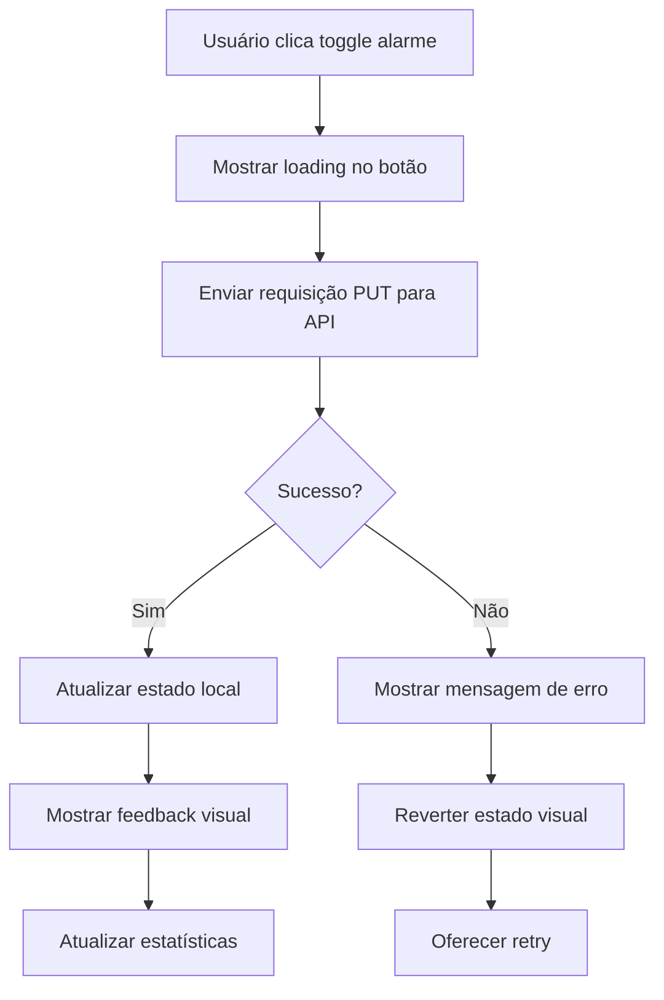

# 🏠 Especificação da Tela Principal (Dashboard) — Smart Alarm

## 📋 **Template Base de Referência**

**🎨 Base Template**: [Horizon UI Tailwind React](https://react-themes.com/product/horizon-tailwind-react)  
**🔗 Live Preview**: [Dashboard Demo](https://horizon-ui.com/horizon-tailwind-react/admin/default)  
**🎯 Adaptações**: Dashboard customizado para gerenciamento de alarmes com foco em acessibilidade

### **Componentes do Template a Adaptar**

- ✅ **Layout Principal**: Header + Sidebar + Content Area
- ✅ **Metric Cards**: Estatísticas de alarmes (ativos, inativos, próximos)
- ✅ **Data Tables**: Lista de alarmes de hoje com ações
- ✅ **Quick Actions**: Botões de ação rápida customizados
- ✅ **Status Indicators**: Estados de sincronização e conectividade
- ✅ **Responsive Grid**: Layout adaptativo mobile/desktop

---

## 🎯 Objetivo

A tela principal (Dashboard) é a primeira tela que o usuário vê após fazer login. Ela deve fornecer uma visão geral rápida e acionável do estado atual dos alarmes, próximos compromissos e acesso às funcionalidades principais do sistema. É o hub central da aplicação, priorizando clareza visual e acessibilidade para usuários neurodivergentes.

---

## 🎨 Estrutura Visual

### Layout Principal (Desktop ≥1024px)

```text
┌─────────────────────────────────────────────────────────────────────────────┐
│ 🔔 Smart Alarm                    🌐 Status: Online     👤 João Silva  [⚙️] │
├─────────────────────────────────────────────────────────────────────────────┤
│                                                                             │
│ 📅 Hoje - Sábado, 19 de Julho de 2025                                     │
│                                                                             │
│ ┌─────────────────────┐  ┌─────────────────────┐  ┌─────────────────────┐   │
│ │ 📊 Resumo Rápido    │  │ ⏰ Próximos (6h)    │  │ 🚀 Ações Rápidas   │   │
│ │                     │  │                     │  │                     │   │
│ │ ✅ 3 Ativos         │  │ 🏃 09:00 Exercício  │  │ [➕ Novo Alarme]   │   │
│ │ ❌ 2 Inativos       │  │ 💊 14:30 Medicação  │  │ [📅 Ver Calendário] │   │
│ │ 📊 5 Total          │  │ 📞 16:00 Reunião    │  │ [📋 Gerenciar]     │   │
│ │                     │  │                     │  │ [📤 Importar]      │   │
│ └─────────────────────┘  └─────────────────────┘  └─────────────────────┘   │
│                                                                             │
│ 📋 Alarmes de Hoje                                         [🔄 Sincronizar] │
│ ┌─────────────────────────────────────────────────────────────────────────┐ │
│ │ ⏰ 07:00  💊 Medicamento da Manhã           [🔔 Ativo] [✏️] [❌]       │ │
│ │ ⏰ 09:00  🏃 Exercício Matinal               [🔕 Inativo] [✏️] [❌]     │ │
│ │ ⏰ 12:00  🍽️ Almoço                         [🔔 Ativo] [✏️] [❌]       │ │
│ │ ⏰ 14:30  💊 Medicamento da Tarde           [🔔 Ativo] [✏️] [❌]       │ │
│ │ ⏰ 18:00  🏃 Exercício Vespertino            [🔕 Inativo] [✏️] [❌]     │ │
│ └─────────────────────────────────────────────────────────────────────────┘ │
│                                                                             │
│ 📈 Insights Rápidos (IA)                                                   │
│ 💡 Você tem 80% de aderência aos medicamentos esta semana!                 │
│ 📊 Seus horários de exercício mais eficazes são: 07:00-09:00               │
│                                                                             │
└─────────────────────────────────────────────────────────────────────────────┘
```

### Layout Mobile (<768px)

```text
┌─────────────────────────────┐
│ 🔔 Smart Alarm    [☰] [👤] │
├─────────────────────────────┤
│ 🌐 Online                   │
│                             │
│ 📅 Sáb, 19 Jul 2025        │
│                             │
│ ┌─────────────────────────┐ │
│ │ 📊 Resumo               │ │
│ │ ✅ 3 Ativos            │ │
│ │ ❌ 2 Inativos          │ │
│ └─────────────────────────┘ │
│                             │
│ ┌─────────────────────────┐ │
│ │ ⏰ Próximos             │ │
│ │ 🏃 09:00 Exercício     │ │
│ │ 💊 14:30 Medicação     │ │
│ └─────────────────────────┘ │
│                             │
│ [➕ Novo] [📅 Calendário]  │
│                             │
│ 📋 Hoje                     │
│ ┌─────────────────────────┐ │
│ │ ⏰ 07:00 💊 Medicamento │ │
│ │ [🔔] [✏️] [❌]         │ │
│ └─────────────────────────┘ │
│ ┌─────────────────────────┐ │
│ │ ⏰ 09:00 🏃 Exercício   │ │
│ │ [🔕] [✏️] [❌]         │ │
│ └─────────────────────────┘ │
│                             │
│ 💡 Insights IA             │
│ 80% aderência medicamentos │
└─────────────────────────────┘
```

---

## 🧩 Componentes Necessários

### 1. **Header Component (Organismo)**

- **Localização**: `src/components/organisms/Header/`
- **Responsabilidades**:
  - Logo do sistema
  - Status de conectividade (Online/Offline)
  - Informações do usuário logado
  - Menu de configurações
  - Indicador de sincronização

**Props Interface**:

```typescript
interface HeaderProps {
  user: User;
  isOnline: boolean;
  lastSyncTime: Date | null;
  onSettingsClick: () => void;
  onUserMenuClick: () => void;
  className?: string;
}
```

### 2. **Dashboard Stats Cards (Moléculas)**

- **Localização**: `src/components/molecules/StatsCard/`
- **Responsabilidades**:
  - Exibir resumo numérico (ativos, inativos, total)
  - Cores acessíveis e alto contraste
  - Ícones descritivos

**Props Interface**:

```typescript
interface StatsCardProps {
  title: string;
  value: number;
  icon: string;
  variant: 'active' | 'inactive' | 'total';
  loading?: boolean;
  className?: string;
}
```

### 3. **Upcoming Alarms List (Moléculas)**

- **Localização**: `src/components/molecules/UpcomingAlarmsList/`
- **Responsabilidades**:
  - Mostrar próximos alarmes (6-8 horas)
  - Ordenar por horário
  - Indicar tempo restante

**Props Interface**:

```typescript
interface UpcomingAlarmsListProps {
  alarms: Alarm[];
  timeframe: number; // horas
  loading?: boolean;
  onAlarmClick: (alarm: Alarm) => void;
  className?: string;
}
```

### 4. **Quick Actions Panel (Moléculas)**

- **Localização**: `src/components/molecules/QuickActionsPanel/`
- **Responsabilidades**:
  - Botões para ações frequentes
  - Navegação rápida
  - Acessibilidade completa

**Props Interface**:

```typescript
interface QuickActionsPanelProps {
  onNewAlarm: () => void;
  onViewCalendar: () => void;
  onManageAlarms: () => void;
  onImportAlarms: () => void;
  className?: string;
}
```

### 5. **Today Alarms List (Organismos)**

- **Localização**: `src/components/organisms/TodayAlarmsList/`
- **Responsabilidades**:
  - Lista completa de alarmes do dia
  - Ações inline (toggle, editar, deletar)
  - Estados visuais claros

**Props Interface**:

```typescript
interface TodayAlarmsListProps {
  alarms: Alarm[];
  loading?: boolean;
  onToggleAlarm: (id: string, active: boolean) => Promise<void>;
  onEditAlarm: (alarm: Alarm) => void;
  onDeleteAlarm: (id: string) => Promise<void>;
  onRefresh: () => Promise<void>;
  className?: string;
}
```

### 6. **AI Insights Panel (Moléculas)**

- **Localização**: `src/components/molecules/AIInsightsPanel/`
- **Responsabilidades**:
  - Exibir insights da IA
  - Recomendações personalizadas
  - Estatísticas de aderência

**Props Interface**:

```typescript
interface AIInsightsPanelProps {
  insights: AIInsight[];
  loading?: boolean;
  onDismissInsight: (id: string) => void;
  className?: string;
}
```

---

## 📊 Estados da Tela

### 1. **Loading State (Carregamento Inicial)**

- **Quando**: Primeira carga da tela
- **Comportamento**:
  - Skeleton loading para cada seção
  - Shimmer effect nos cards
  - Botões desabilitados
  - Manter estrutura visual

### 2. **Success State (Dados Carregados)**

- **Quando**: Dados carregados com sucesso
- **Comportamento**:
  - Exibir todos os componentes com dados
  - Habilitar todas as interações
  - Mostrar insights da IA (se disponível)

### 3. **Empty State (Sem Alarmes)**

- **Quando**: Usuário não possui alarmes
- **Comportamento**:
  - Card de boas-vindas
  - Call-to-action para criar primeiro alarme
  - Tutorial opcional
  - Botão destacado "Criar Meu Primeiro Alarme"

### 4. **Offline State (Sem Conectividade)**

- **Quando**: Aplicação está offline
- **Comportamento**:
  - Banner de status offline
  - Dados do cache local
  - Indicar última sincronização
  - Desabilitar ações que requerem internet

### 5. **Error State (Erro de Carregamento)**

- **Quando**: Falha ao carregar dados
- **Comportamento**:
  - Mensagem de erro clara
  - Botão "Tentar Novamente"
  - Fallback para dados em cache
  - Support contact se persistir

### 6. **Sync State (Sincronizando)**

- **Quando**: Dados sendo sincronizados
- **Comportamento**:
  - Indicador de sincronização ativo
  - Manter interface responsiva
  - Feedback visual discreto

---

## 🔄 Fluxos de Interação

### 1. **Fluxo de Carregamento Inicial**

```mermaid
graph TD
    A[Usuário acessa Dashboard] --> B[Verificar token de autenticação]
    B --> C{Token válido?}
    C -->|Não| D[Redirecionar para Login]
    C -->|Sim| E[Mostrar Loading State]
    E --> F[Carregar dados do usuário]
    F --> G[Carregar alarmes do dia]
    G --> H[Carregar próximos alarmes]
    H --> I[Carregar insights IA]
    I --> J[Exibir Success State]
    
    F --> K{Erro no carregamento?}
    G --> K
    H --> K
    I --> K
    K -->|Sim| L[Exibir Error State]
    K -->|Não| J
    L --> M[Usuário clica "Tentar Novamente"]
    M --> F
```

### 2. **Fluxo de Toggle de Alarme**



### 3. **Fluxo de Criação de Novo Alarme**

```mermaid
graph TD
    A[Usuário clica "Novo Alarme"] --> B[Navegar para formulário de alarme]
    B --> C[Usuário preenche formulário]
    C --> D[Usuário salva alarme]
    D --> E[Retornar para Dashboard]
    E --> F[Atualizar lista de alarmes]
    F --> G[Atualizar estatísticas]
    G --> H[Mostrar notificação de sucesso]
```

---

## ♿ Acessibilidade (WCAG 2.1 AA+)

### 1. **Estrutura Semântica**

```html
<!-- Estrutura HTML acessível -->
<main role="main" aria-labelledby="dashboard-title">
  <h1 id="dashboard-title">Painel Principal - Smart Alarm</h1>
  
  <section aria-labelledby="stats-section">
    <h2 id="stats-section" class="sr-only">Estatísticas Rápidas</h2>
    <!-- Stats cards -->
  </section>
  
  <section aria-labelledby="today-alarms">
    <h2 id="today-alarms">Alarmes de Hoje</h2>
    <ul role="list" aria-label="Lista de alarmes programados para hoje">
      <!-- Alarm items -->
    </ul>
  </section>
</main>
```

### 2. **Navegação por Teclado**

- **Tab Order**: Lógica de navegação clara
- **Skip Links**: Pular para conteúdo principal
- **Focus Management**: Focus visível e lógico
- **Keyboard Shortcuts**:
  - `Alt + N` = Novo alarme
  - `Alt + C` = Ver calendário
  - `Alt + R` = Recarregar dados

### 3. **Screen Reader Support**

```typescript
// Exemplo de implementação
const TodayAlarmsList: React.FC<TodayAlarmsListProps> = ({ alarms, onToggleAlarm }) => {
  const announceToggle = useScreenReaderAnnouncement();
  
  const handleToggle = async (alarm: Alarm) => {
    const newStatus = !alarm.isActive;
    await onToggleAlarm(alarm.id, newStatus);
    
    announceToggle(
      `Alarme ${alarm.name} ${newStatus ? 'ativado' : 'desativado'} com sucesso`
    );
  };

  return (
    <ul role="list" aria-label="Lista de alarmes de hoje">
      {alarms.map(alarm => (
        <li key={alarm.id} role="listitem">
          <button
            onClick={() => handleToggle(alarm)}
            aria-label={`${alarm.isActive ? 'Desativar' : 'Ativar'} alarme ${alarm.name} às ${alarm.time}`}
            aria-pressed={alarm.isActive}
          >
            {alarm.isActive ? '🔔' : '🔕'}
          </button>
          <span aria-hidden="true">{alarm.name}</span>
          <span className="sr-only">
            Alarme {alarm.name} programado para {alarm.time}, 
            atualmente {alarm.isActive ? 'ativo' : 'inativo'}
          </span>
        </li>
      ))}
    </ul>
  );
};
```

### 4. **Alto Contraste e Temas**

```css
/* Tema padrão */
.dashboard {
  --bg-primary: #ffffff;
  --bg-secondary: #f8f9fa;
  --text-primary: #212529;
  --border-color: #dee2e6;
}

/* Alto contraste */
.dashboard.theme-high-contrast {
  --bg-primary: #000000;
  --bg-secondary: #1a1a1a;
  --text-primary: #ffffff;
  --border-color: #ffffff;
}

/* Reduzir movimento */
@media (prefers-reduced-motion: reduce) {
  .dashboard * {
    animation-duration: 0.01ms !important;
    animation-iteration-count: 1 !important;
    transition-duration: 0.01ms !important;
  }
}
```

---

## 🔌 Integração com APIs

### 1. **Endpoints Necessários**

#### GET `/api/v1/dashboard/summary`

```typescript
interface DashboardSummaryResponse {
  user: User;
  stats: {
    totalAlarms: number;
    activeAlarms: number;
    inactiveAlarms: number;
  };
  todayAlarms: Alarm[];
  upcomingAlarms: Alarm[];
  aiInsights: AIInsight[];
  lastSyncTime: string;
}
```

#### PUT `/api/v1/alarms/{id}/toggle`

```typescript
interface ToggleAlarmRequest {
  isActive: boolean;
}

interface ToggleAlarmResponse {
  success: boolean;
  alarm: Alarm;
  message: string;
}
```

### 2. **Custom Hooks para Data Fetching**

#### useDashboardData Hook

```typescript
// src/hooks/useDashboardData.ts
export const useDashboardData = () => {
  const [data, setData] = useState<DashboardData | null>(null);
  const [loading, setLoading] = useState(true);
  const [error, setError] = useState<string | null>(null);
  const [lastRefresh, setLastRefresh] = useState<Date>(new Date());

  const fetchDashboardData = useCallback(async () => {
    try {
      setLoading(true);
      setError(null);
      
      const response = await fetch('/api/v1/dashboard/summary', {
        headers: {
          'Authorization': `Bearer ${getAuthToken()}`,
          'Content-Type': 'application/json'
        }
      });

      if (!response.ok) {
        throw new Error(`HTTP ${response.status}: ${response.statusText}`);
      }

      const dashboardData = await response.json();
      setData(dashboardData);
      setLastRefresh(new Date());
      
      // Cache data for offline use
      await cacheManager.set('dashboard-data', dashboardData);
      
    } catch (err) {
      setError(err instanceof Error ? err.message : 'Erro desconhecido');
      
      // Try to load from cache
      const cachedData = await cacheManager.get('dashboard-data');
      if (cachedData) {
        setData(cachedData);
      }
    } finally {
      setLoading(false);
    }
  }, []);

  const toggleAlarm = useCallback(async (alarmId: string, isActive: boolean) => {
    try {
      const response = await fetch(`/api/v1/alarms/${alarmId}/toggle`, {
        method: 'PUT',
        headers: {
          'Authorization': `Bearer ${getAuthToken()}`,
          'Content-Type': 'application/json'
        },
        body: JSON.stringify({ isActive })
      });

      if (!response.ok) {
        throw new Error('Falha ao atualizar alarme');
      }

      const result = await response.json();
      
      // Update local state
      setData(prevData => {
        if (!prevData) return prevData;
        
        return {
          ...prevData,
          todayAlarms: prevData.todayAlarms.map(alarm =>
            alarm.id === alarmId ? { ...alarm, isActive } : alarm
          ),
          stats: {
            ...prevData.stats,
            activeAlarms: isActive 
              ? prevData.stats.activeAlarms + 1 
              : prevData.stats.activeAlarms - 1,
            inactiveAlarms: isActive 
              ? prevData.stats.inactiveAlarms - 1 
              : prevData.stats.inactiveAlarms + 1
          }
        };
      });

      return result;
      
    } catch (err) {
      throw new Error(err instanceof Error ? err.message : 'Erro ao atualizar alarme');
    }
  }, []);

  useEffect(() => {
    fetchDashboardData();
  }, [fetchDashboardData]);

  // Auto-refresh every 5 minutes
  useEffect(() => {
    const interval = setInterval(fetchDashboardData, 5 * 60 * 1000);
    return () => clearInterval(interval);
  }, [fetchDashboardData]);

  return {
    data,
    loading,
    error,
    lastRefresh,
    refetch: fetchDashboardData,
    toggleAlarm
  };
};
```

### 3. **Offline Support com Service Worker**

```typescript
// src/services/sw/dashboardSync.ts
export class DashboardSyncService {
  private static CACHE_NAME = 'dashboard-cache-v1';
  
  static async cacheDashboardData(data: DashboardData): Promise<void> {
    const cache = await caches.open(this.CACHE_NAME);
    await cache.put(
      '/api/v1/dashboard/summary',
      new Response(JSON.stringify(data), {
        headers: { 'Content-Type': 'application/json' }
      })
    );
  }
  
  static async getCachedDashboardData(): Promise<DashboardData | null> {
    try {
      const cache = await caches.open(this.CACHE_NAME);
      const response = await cache.match('/api/v1/dashboard/summary');
      return response ? await response.json() : null;
    } catch {
      return null;
    }
  }
  
  static async queueAlarmToggle(alarmId: string, isActive: boolean): Promise<void> {
    // Queue para sincronização quando voltar online
    const syncQueue = await this.getSyncQueue();
    syncQueue.push({
      type: 'TOGGLE_ALARM',
      payload: { alarmId, isActive },
      timestamp: Date.now()
    });
    
    await localStorage.setItem('sync-queue', JSON.stringify(syncQueue));
  }
  
  private static async getSyncQueue(): Promise<SyncQueueItem[]> {
    const stored = localStorage.getItem('sync-queue');
    return stored ? JSON.parse(stored) : [];
  }
}
```

---

## 🧪 Estratégia de Testes

### 1. **Testes de Unidade (Components)**

#### Teste do Header Component

```typescript
// src/components/organisms/Header/Header.test.tsx
describe('Header Component', () => {
  const mockUser: User = {
    id: '1',
    name: 'João Silva',
    email: 'joao@example.com'
  };

  it('should display user name correctly', () => {
    render(
      <Header 
        user={mockUser} 
        isOnline={true} 
        lastSyncTime={new Date()} 
        onSettingsClick={vi.fn()}
        onUserMenuClick={vi.fn()}
      />
    );

    expect(screen.getByText('João Silva')).toBeInTheDocument();
  });

  it('should show offline indicator when not connected', () => {
    render(
      <Header 
        user={mockUser} 
        isOnline={false} 
        lastSyncTime={null}
        onSettingsClick={vi.fn()}
        onUserMenuClick={vi.fn()}
      />
    );

    expect(screen.getByText(/offline/i)).toBeInTheDocument();
  });

  it('should be accessible via keyboard navigation', async () => {
    const handleSettings = vi.fn();
    render(
      <Header 
        user={mockUser} 
        isOnline={true} 
        lastSyncTime={new Date()}
        onSettingsClick={handleSettings}
        onUserMenuClick={vi.fn()}
      />
    );

    const settingsButton = screen.getByRole('button', { name: /configurações/i });
    
    // Test keyboard navigation
    settingsButton.focus();
    expect(settingsButton).toHaveFocus();
    
    // Test keyboard activation
    await user.keyboard('{Enter}');
    expect(handleSettings).toHaveBeenCalledTimes(1);
  });
});
```

#### Teste do useDashboardData Hook

```typescript
// src/hooks/useDashboardData.test.ts
describe('useDashboardData Hook', () => {
  const mockDashboardData: DashboardData = {
    user: { id: '1', name: 'Test User', email: 'test@example.com' },
    stats: { totalAlarms: 5, activeAlarms: 3, inactiveAlarms: 2 },
    todayAlarms: [],
    upcomingAlarms: [],
    aiInsights: [],
    lastSyncTime: new Date().toISOString()
  };

  beforeEach(() => {
    vi.clearAllMocks();
    fetchMock.resetMocks();
  });

  it('should fetch dashboard data on mount', async () => {
    fetchMock.mockResponseOnce(JSON.stringify(mockDashboardData));
    
    const { result } = renderHook(() => useDashboardData());
    
    expect(result.current.loading).toBe(true);
    
    await waitFor(() => {
      expect(result.current.loading).toBe(false);
    });
    
    expect(result.current.data).toEqual(mockDashboardData);
    expect(result.current.error).toBeNull();
  });

  it('should handle API errors gracefully', async () => {
    fetchMock.mockRejectOnce(new Error('Network Error'));
    
    // Mock cached data
    const mockCachedData = { ...mockDashboardData };
    vi.spyOn(cacheManager, 'get').mockResolvedValue(mockCachedData);
    
    const { result } = renderHook(() => useDashboardData());
    
    await waitFor(() => {
      expect(result.current.loading).toBe(false);
    });
    
    expect(result.current.error).toBe('Network Error');
    expect(result.current.data).toEqual(mockCachedData); // Fallback to cache
  });

  it('should toggle alarm status optimistically', async () => {
    fetchMock
      .mockResponseOnce(JSON.stringify(mockDashboardData))
      .mockResponseOnce(JSON.stringify({ success: true, alarm: { id: '1', isActive: false } }));
    
    const { result } = renderHook(() => useDashboardData());
    
    await waitFor(() => {
      expect(result.current.data).toEqual(mockDashboardData);
    });
    
    await act(async () => {
      await result.current.toggleAlarm('1', false);
    });
    
    // Should update stats optimistically
    expect(result.current.data?.stats.activeAlarms).toBe(2);
    expect(result.current.data?.stats.inactiveAlarms).toBe(3);
  });
});
```

### 2. **Testes de Integração**

#### Teste da Tela Completa

```typescript
// src/pages/Dashboard/Dashboard.integration.test.tsx
describe('Dashboard Integration Tests', () => {
  it('should load and display dashboard data correctly', async () => {
    const mockData: DashboardData = {
      user: { id: '1', name: 'João Silva', email: 'joao@test.com' },
      stats: { totalAlarms: 3, activeAlarms: 2, inactiveAlarms: 1 },
      todayAlarms: [
        {
          id: '1',
          name: 'Medicamento',
          time: '09:00',
          isActive: true,
          category: 'health'
        }
      ],
      upcomingAlarms: [],
      aiInsights: [],
      lastSyncTime: new Date().toISOString()
    };

    server.use(
      rest.get('/api/v1/dashboard/summary', (req, res, ctx) => {
        return res(ctx.json(mockData));
      })
    );

    render(<Dashboard />);

    // Should show loading initially
    expect(screen.getByText(/carregando/i)).toBeInTheDocument();

    // Should display data after loading
    await waitFor(() => {
      expect(screen.getByText('João Silva')).toBeInTheDocument();
      expect(screen.getByText('2 Ativos')).toBeInTheDocument();
      expect(screen.getByText('Medicamento')).toBeInTheDocument();
    });
  });

  it('should handle alarm toggle interaction', async () => {
    server.use(
      rest.get('/api/v1/dashboard/summary', (req, res, ctx) => {
        return res(ctx.json(mockDashboardData));
      }),
      rest.put('/api/v1/alarms/:id/toggle', (req, res, ctx) => {
        return res(ctx.json({ success: true }));
      })
    );

    render(<Dashboard />);

    await waitFor(() => {
      expect(screen.getByText('Medicamento')).toBeInTheDocument();
    });

    const toggleButton = screen.getByRole('button', { name: /desativar alarme medicamento/i });
    
    await user.click(toggleButton);

    // Should show updated state
    await waitFor(() => {
      expect(screen.getByRole('button', { name: /ativar alarme medicamento/i })).toBeInTheDocument();
    });
  });
});
```

### 3. **Testes de Acessibilidade**

```typescript
// src/pages/Dashboard/Dashboard.a11y.test.tsx
describe('Dashboard Accessibility Tests', () => {
  it('should have no accessibility violations', async () => {
    server.use(
      rest.get('/api/v1/dashboard/summary', (req, res, ctx) => {
        return res(ctx.json(mockDashboardData));
      })
    );

    const { container } = render(<Dashboard />);

    await waitFor(() => {
      expect(screen.getByRole('main')).toBeInTheDocument();
    });

    const results = await axe(container);
    expect(results).toHaveNoViolations();
  });

  it('should support keyboard navigation', async () => {
    render(<Dashboard />);

    await waitFor(() => {
      expect(screen.getByRole('main')).toBeInTheDocument();
    });

    // Test tab navigation
    const tabbableElements = screen.getAllByRole('button').concat(
      screen.getAllByRole('link')
    );

    for (let i = 0; i < tabbableElements.length; i++) {
      await user.tab();
      expect(tabbableElements[i]).toHaveFocus();
    }
  });

  it('should announce alarm state changes to screen readers', async () => {
    const mockAnnounce = vi.fn();
    vi.spyOn(require('../../../hooks/useScreenReaderAnnouncement'), 'useScreenReaderAnnouncement')
      .mockReturnValue(mockAnnounce);

    render(<Dashboard />);

    const toggleButton = await screen.findByRole('button', { name: /desativar/i });
    await user.click(toggleButton);

    expect(mockAnnounce).toHaveBeenCalledWith(
      expect.stringContaining('desativado com sucesso')
    );
  });
});
```

---

## ⚡ Considerações de Performance

### 1. **Otimizações de Carregamento**

#### Code Splitting com React.lazy

```typescript
// src/pages/Dashboard/Dashboard.lazy.tsx
import { lazy } from 'react';

// Lazy load dos componentes pesados
const AIInsightsPanel = lazy(() => import('../../components/molecules/AIInsightsPanel'));
const AdvancedStats = lazy(() => import('../../components/molecules/AdvancedStats'));

export const Dashboard: React.FC = () => {
  return (
    <main>
      {/* Componentes críticos carregam imediatamente */}
      <Header />
      <StatsCards />
      <TodayAlarmsList />
      
      {/* Componentes secundários em Suspense */}
      <Suspense fallback={<InsightsPlaceholder />}>
        <AIInsightsPanel />
      </Suspense>
    </main>
  );
};
```

#### Memoização de Componentes

```typescript
// src/components/molecules/StatsCard/StatsCard.tsx
export const StatsCard = React.memo<StatsCardProps>(({ 
  title, value, icon, variant, loading 
}) => {
  const cardStyle = useMemo(() => ({
    '--card-color': getVariantColor(variant),
    '--card-bg': getVariantBackground(variant)
  }), [variant]);

  if (loading) {
    return <StatsCardSkeleton />;
  }

  return (
    <div className="stats-card" style={cardStyle}>
      <Icon name={icon} aria-hidden="true" />
      <div>
        <span className="stats-title">{title}</span>
        <span className="stats-value">{value}</span>
      </div>
    </div>
  );
});
```

### 2. **Cache e Sincronização**

#### Implementação de Cache Inteligente

```typescript
// src/services/cache/dashboardCache.ts
export class DashboardCacheService {
  private static readonly CACHE_DURATION = 5 * 60 * 1000; // 5 minutos
  
  static async get(key: string): Promise<any | null> {
    try {
      const stored = localStorage.getItem(key);
      if (!stored) return null;
      
      const { data, timestamp } = JSON.parse(stored);
      const now = Date.now();
      
      // Cache expired
      if (now - timestamp > this.CACHE_DURATION) {
        localStorage.removeItem(key);
        return null;
      }
      
      return data;
    } catch {
      return null;
    }
  }
  
  static async set(key: string, data: any): Promise<void> {
    try {
      const cacheItem = {
        data,
        timestamp: Date.now()
      };
      
      localStorage.setItem(key, JSON.stringify(cacheItem));
    } catch (error) {
      console.warn('Failed to cache data:', error);
    }
  }
  
  // Pre-load próxima tela provável
  static preloadCalendarData(): void {
    // Pre-fetch dados do calendário em background
    fetch('/api/v1/calendar/current-month', {
      headers: { 'Authorization': `Bearer ${getAuthToken()}` }
    }).then(response => response.json())
      .then(data => this.set('calendar-current-month', data))
      .catch(() => {}); // Silently fail
  }
}
```

### 3. **Bundle Optimization**

#### Webpack/Vite Configuration

```typescript
// vite.config.ts
export default defineConfig({
  build: {
    rollupOptions: {
      output: {
        manualChunks: {
          // Vendor chunks
          react: ['react', 'react-dom'],
          calendar: ['react-big-calendar', 'date-fns'],
          
          // Feature chunks
          dashboard: [
            './src/pages/Dashboard',
            './src/components/organisms/Header',
            './src/components/molecules/StatsCard'
          ],
          
          // Lazy chunks
          insights: ['./src/components/molecules/AIInsightsPanel'],
          settings: ['./src/pages/Settings']
        }
      }
    },
    
    // Code splitting threshold
    chunkSizeWarningLimit: 500,
    
    // Minification
    minify: 'terser',
    terserOptions: {
      compress: {
        drop_console: true,
        drop_debugger: true
      }
    }
  }
});
```

---

## 📝 Checklist de Implementação

### 🏗️ **Estrutura Base**

- [ ] Criar estrutura de componentes (atoms, molecules, organisms)
- [ ] Configurar roteamento para Dashboard
- [ ] Implementar layout responsivo (desktop, tablet, mobile)
- [ ] Configurar TypeScript interfaces e tipos

### 🎨 **Interface Visual**

- [ ] Implementar Header component
- [ ] Criar StatsCard components com diferentes variants
- [ ] Implementar TodayAlarmsList com ações inline
- [ ] Criar QuickActionsPanel com navegação
- [ ] Implementar UpcomingAlarmsList
- [ ] Adicionar AIInsightsPanel (placeholder inicial)

### 🔄 **Estados e Dados**

- [ ] Implementar useDashboardData hook
- [ ] Configurar estados de loading, error, empty, offline
- [ ] Implementar toggle de alarmes com otimistic updates
- [ ] Configurar auto-refresh a cada 5 minutos
- [ ] Implementar cache local com Dexie.js

### ♿ **Acessibilidade**

- [ ] Implementar estrutura semântica HTML
- [ ] Configurar navegação por teclado
- [ ] Adicionar ARIA labels e roles
- [ ] Implementar anúncios para screen readers
- [ ] Configurar skip links e foco visual
- [ ] Testar com NVDA/JAWS

### 🔌 **Integração API**

- [ ] Configurar endpoints de dashboard summary
- [ ] Implementar toggle de alarmes
- [ ] Configurar tratamento de erros HTTP
- [ ] Implementar retry logic
- [ ] Configurar headers de autenticação

### 🧪 **Testes**

- [ ] Escrever testes unitários para todos os componentes
- [ ] Implementar testes de integração da tela completa
- [ ] Configurar testes de acessibilidade com jest-axe
- [ ] Testar fluxos offline/online
- [ ] Implementar testes E2E básicos

### ⚡ **Performance**

- [ ] Implementar code splitting para componentes secundários
- [ ] Configurar memoização adequada
- [ ] Implementar skeleton loading
- [ ] Configurar cache inteligente
- [ ] Otimizar bundle size

### 📱 **PWA**

- [ ] Configurar Service Worker para cache de dashboard
- [ ] Implementar background sync para ações offline
- [ ] Configurar notificações push (preparar estrutura)
- [ ] Testar funcionalidade offline completa

---

## 🚀 **Critérios de Aceitação**

### ✅ **Funcionais**

- [ ] Usuário vê resumo estatístico dos alarmes
- [ ] Usuário visualiza alarmes do dia atual
- [ ] Usuário pode ativar/desativar alarmes inline
- [ ] Usuário acessa ações rápidas (novo, calendário, gerenciar)
- [ ] Dashboard funciona offline com dados em cache
- [ ] Auto-refresh mantém dados atualizados
- [ ] Navegação fluida para outras telas

### ✅ **Técnicos**

- [ ] Componentes seguem Atomic Design
- [ ] TypeScript strict mode sem erros
- [ ] Cobertura de testes ≥ 90%
- [ ] Lighthouse score ≥ 90 (Performance, Accessibility, PWA)
- [ ] Bundle size da tela ≤ 200KB gzipped
- [ ] First Contentful Paint ≤ 1.5s
- [ ] Cumulative Layout Shift ≤ 0.1

### ✅ **Acessibilidade**

- [ ] WCAG 2.1 AA compliant (zero violações axe)
- [ ] 100% navegável por teclado
- [ ] Screen readers anunciam mudanças corretamente
- [ ] Alto contraste funcional
- [ ] Redução de movimento respeitada
- [ ] Foco visual sempre claro

### ✅ **UX/UI**

- [ ] Interface intuitiva para novos usuários
- [ ] Estados de loading/error informativos
- [ ] Feedback imediato para todas as ações
- [ ] Design responsivo perfeito em todos os breakpoints
- [ ] Consistência visual com design system
- [ ] Performance percebida otimizada

---

## 📚 **Recursos para Desenvolvedores Juniores**

### 🎓 **Documentação Essencial**

- [React Hooks Official Docs](https://react.dev/reference/react)
- [TypeScript Handbook](https://www.typescriptlang.org/docs/)
- [WCAG 2.1 Guidelines](https://www.w3.org/WAI/WCAG21/quickref/)
- [Testing Library Docs](https://testing-library.com/)

### 🛠️ **Ferramentas Recomendadas**

- **VS Code Extensions**: ES7 React snippets, TypeScript Hero, axe Accessibility Linter
- **Browser Extensions**: React Developer Tools, axe DevTools, Lighthouse
- **Testing**: Chrome DevTools Accessibility pane, NVDA screen reader

### 💡 **Dicas de Implementação**

1. **Comece pelo layout estrutural** antes de adicionar interações
2. **Implemente mobile-first** e escale para desktop
3. **Use TypeScript rigorosamente** - evite `any` a todo custo
4. **Teste acessibilidade constantemente** durante desenvolvimento
5. **Monitore performance** com Lighthouse a cada build
6. **Documente decisões técnicas** em comentários no código

### 🐛 **Debugging Common Issues**

- **Problema de foco perdido**: Use `React.useRef` e `element.focus()`
- **State não atualiza**: Verifique dependências no `useEffect`
- **Memory leaks**: Limpe listeners e intervals no cleanup
- **Bundle muito grande**: Analise com `npm run build -- --analyze`
- **Testes flaky**: Use `waitFor` e `findBy` ao invés de `getBy`

**Lembrete Final**: Esta é uma tela crítica - invista tempo extra em testes e acessibilidade. Usuários neurodivergentes dependem da clareza e previsibilidade desta interface.
