# 🎭 Smart Alarm - Screen Flow & User Stories

## 🌊 Screen Navigation Flow

## 📱 Screen Interaction Details

### Core Navigation Pattern

```mermaid
graph LR
    subgraph "Main Navigation Bar"
        A[🏠 Dashboard] 
        B[📅 Calendar]
        C[⏰ Alarms]
        D[📊 Analytics]
        E[⚙️ Settings]
    end
    
    subgraph "Contextual Actions"
        F[+ Quick Add Alarm]
        G[🔍 Search]
        H[📥 Import]
        I[🔔 Notifications]
    end
    
    A -.-> F
    B -.-> F
    C -.-> H
    C -.-> G
```

### Modal Dialog Flow

## 📋 User Stories

### 🎯 Epic 1: Authentication & Onboarding

#### Story 1.1: User Login
**As a** returning user  
**I want to** log into my Smart Alarm account  
**So that** I can access my personalized alarm settings and data

**Acceptance Criteria:**
- WHEN I navigate to the login screen, THE SYSTEM SHALL display email and password fields
- WHEN I enter valid credentials, THE SYSTEM SHALL authenticate me and redirect to the dashboard
- WHEN I enter invalid credentials, THE SYSTEM SHALL display a clear error message
- WHEN FIDO2/WebAuthn is available, THE SYSTEM SHALL offer biometric authentication option
- WHEN I check "Remember Me", THE SYSTEM SHALL maintain my session for 30 days
- IF I forget my password, THE SYSTEM SHALL provide a password reset option

#### Story 1.2: Biometric Authentication
**As a** user with accessibility needs  
**I want to** use biometric authentication (FIDO2/WebAuthn)  
**So that** I can access my account without typing passwords

**Acceptance Criteria:**
- WHEN my device supports biometric authentication, THE SYSTEM SHALL offer this option
- WHEN I enable biometric login, THE SYSTEM SHALL securely store my authentication credentials
- WHEN I use biometric authentication, THE SYSTEM SHALL authenticate me within 3 seconds
- IF biometric authentication fails, THE SYSTEM SHALL fallback to traditional login

### 🎯 Epic 2: Dashboard & Home Experience

#### Story 2.1: Today's Alarms Overview
**As a** daily user  
**I want to** see today's scheduled alarms on the dashboard  
**So that** I can quickly understand my day's schedule

**Acceptance Criteria:**
- WHEN I access the dashboard, THE SYSTEM SHALL display all alarms scheduled for today
- WHEN an alarm is overdue, THE SYSTEM SHALL highlight it with visual and accessibility indicators
- WHEN I have no alarms today, THE SYSTEM SHALL display an encouraging message with quick-add option
- WHEN alarms are approaching (within 30 minutes), THE SYSTEM SHALL provide visual countdown indicators

#### Story 2.2: Quick Alarm Creation
**As a** busy user  
**I want to** quickly create alarms from the dashboard  
**So that** I don't have to navigate through multiple screens

**Acceptance Criteria:**
- WHEN I click the "Quick Add" button, THE SYSTEM SHALL open an inline alarm creation form
- WHEN I fill minimal required fields (name, time), THE SYSTEM SHALL create the alarm with smart defaults
- WHEN I create a quick alarm, THE SYSTEM SHALL provide immediate visual feedback
- WHEN I need advanced options, THE SYSTEM SHALL offer a link to the full alarm form

### 🎯 Epic 3: Calendar Management

#### Story 3.1: Calendar Views
**As a** user with cognitive accessibility needs  
**I want to** switch between calendar grid and list views  
**So that** I can use the format that works best for my processing style

**Acceptance Criteria:**
- WHEN I access the calendar, THE SYSTEM SHALL default to my previously selected view preference
- WHEN I switch to list view, THE SYSTEM SHALL display alarms in chronological order with clear time markers
- WHEN I switch to grid view, THE SYSTEM SHALL display alarms in a traditional calendar format
- WHEN using keyboard navigation, THE SYSTEM SHALL provide logical tab order in both views
- WHEN I select a date, THE SYSTEM SHALL show all alarms for that day in a focused view

#### Story 3.2: Calendar Navigation
**As a** user relying on keyboard navigation  
**I want to** navigate the calendar using only keyboard inputs  
**So that** I can efficiently manage my alarms without using a mouse

**Acceptance Criteria:**
- WHEN I use arrow keys, THE SYSTEM SHALL move focus between calendar dates logically
- WHEN I press Enter on a date, THE SYSTEM SHALL show that day's alarms or create a new alarm
- WHEN I press Escape, THE SYSTEM SHALL close any open dialogs and return focus appropriately
- WHEN I use Tab/Shift+Tab, THE SYSTEM SHALL navigate between calendar controls and content areas
- WHEN focus changes, THE SYSTEM SHALL provide clear visual and screen reader indicators

### 🎯 Epic 4: Alarm Management

#### Story 4.1: Alarm List Management
**As a** user with multiple alarms  
**I want to** see all my alarms in an organized list  
**So that** I can easily find, edit, and manage them

**Acceptance Criteria:**
- WHEN I access the alarm management screen, THE SYSTEM SHALL display all alarms in categorized groups
- WHEN I search for alarms, THE SYSTEM SHALL filter results by name, category, or time
- WHEN I need to quickly enable/disable alarms, THE SYSTEM SHALL provide toggle switches
- WHEN I want to modify an alarm, THE SYSTEM SHALL provide edit and duplicate options
- WHEN displaying many alarms, THE SYSTEM SHALL implement pagination or virtual scrolling for performance

#### Story 4.2: Alarm Creation and Editing
**As a** user creating medication reminders  
**I want to** set up recurring alarms with specific intervals  
**So that** I can maintain my medication schedule accurately

**Acceptance Criteria:**
- WHEN I create a new alarm, THE SYSTEM SHALL provide preset categories (medication, work, exercise, etc.)
- WHEN I set recurrence patterns, THE SYSTEM SHALL offer daily, weekly, monthly, and custom options
- WHEN I select medication category, THE SYSTEM SHALL suggest relevant defaults and reminders
- WHEN I save an alarm, THE SYSTEM SHALL validate all required fields and show confirmation
- WHEN editing existing alarms, THE SYSTEM SHALL preserve all settings while allowing modifications

#### Story 4.3: CSV Import
**As a** user migrating from another system  
**I want to** import my existing alarms via CSV file  
**So that** I don't have to manually recreate all my alarms

**Acceptance Criteria:**
- WHEN I access the import feature, THE SYSTEM SHALL provide a clear CSV template and format guide
- WHEN I upload a CSV file, THE SYSTEM SHALL validate the format and show a preview before import
- WHEN there are format errors, THE SYSTEM SHALL highlight specific rows and columns with issues
- WHEN import succeeds, THE SYSTEM SHALL provide a detailed report of imported, skipped, and failed items
- WHEN import fails, THE SYSTEM SHALL allow me to download an error report for correction

### 🎯 Epic 5: Holiday and Exception Management

#### Story 5.1: Holiday Configuration
**As a** user in a specific region  
**I want to** configure how my alarms behave on holidays  
**So that** my medication and work reminders adapt to my holiday schedule

**Acceptance Criteria:**
- WHEN I access holiday settings, THE SYSTEM SHALL show national, regional, and religious holidays for my location
- WHEN I configure holiday preferences, THE SYSTEM SHALL offer options: disable, delay, or maintain normal schedule
- WHEN holidays are approaching, THE SYSTEM SHALL preview how my alarms will be affected
- WHEN I create custom holidays, THE SYSTEM SHALL allow naming, date setting, and preference configuration

#### Story 5.2: Exception Periods
**As a** user planning vacation  
**I want to** set exception periods for travel or time off  
**So that** my alarms adjust automatically during these periods

**Acceptance Criteria:**
- WHEN I create an exception period, THE SYSTEM SHALL allow start/end dates and custom rules
- WHEN exception periods overlap with alarms, THE SYSTEM SHALL show impact preview
- WHEN I'm in an exception period, THE SYSTEM SHALL apply the configured rules automatically
- WHEN exception periods end, THE SYSTEM SHALL resume normal alarm schedules

### 🎯 Epic 6: Accessibility and Personalization

#### Story 6.1: Visual Accessibility
**As a** user with visual impairments  
**I want to** customize the visual appearance of the interface  
**So that** I can comfortably use the system

**Acceptance Criteria:**
- WHEN I access accessibility settings, THE SYSTEM SHALL offer high contrast, large text, and reduced motion options
- WHEN I enable high contrast mode, THE SYSTEM SHALL apply consistent contrast ratios throughout the interface
- WHEN I select dyslexia-friendly fonts, THE SYSTEM SHALL update all text display accordingly
- WHEN I reduce motion, THE SYSTEM SHALL minimize animations and transitions while maintaining functionality

#### Story 6.2: Screen Reader Support
**As a** user relying on screen readers  
**I want to** navigate and use all features via assistive technology  
**So that** I can independently manage my alarms

**Acceptance Criteria:**
- WHEN using a screen reader, THE SYSTEM SHALL provide descriptive labels for all interactive elements
- WHEN content updates dynamically, THE SYSTEM SHALL announce changes appropriately
- WHEN navigating forms, THE SYSTEM SHALL associate labels with inputs and provide error announcements
- WHEN using calendar views, THE SYSTEM SHALL provide spatial information and date context

### 🎯 Epic 7: System Settings and Configuration

#### Story 7.1: Notification Configuration
**As a** user with hearing differences  
**I want to** customize notification types and intensities  
**So that** I can receive alarms in ways that work for me

**Acceptance Criteria:**
- WHEN I configure notifications, THE SYSTEM SHALL offer visual, audio, and vibration options
- WHEN testing notification settings, THE SYSTEM SHALL provide immediate preview functionality
- WHEN notifications are active, THE SYSTEM SHALL respect browser and device permission settings
- WHEN I need stronger notifications, THE SYSTEM SHALL allow intensity and duration customization

#### Story 7.2: Data Export and Backup
**As a** long-term user  
**I want to** export my alarm data and settings  
**So that** I can backup my configuration or migrate to another device

**Acceptance Criteria:**
- WHEN I request data export, THE SYSTEM SHALL generate a comprehensive backup file
- WHEN exporting data, THE SYSTEM SHALL include alarms, preferences, and configuration settings
- WHEN I import backup data, THE SYSTEM SHALL validate compatibility and merge with existing data
- WHEN export/import operations occur, THE SYSTEM SHALL provide progress indicators and completion status

### 🎯 Epic 8: Analytics and Insights

#### Story 8.1: Usage Statistics
**As a** user tracking my habits  
**I want to** see statistics about my alarm usage and compliance  
**So that** I can understand and improve my routines

**Acceptance Criteria:**
- WHEN I access analytics, THE SYSTEM SHALL display alarm completion rates over time
- WHEN viewing statistics, THE SYSTEM SHALL show patterns by category, time, and day of week
- WHEN analytics identify patterns, THE SYSTEM SHALL suggest optimizations for better compliance
- WHEN displaying data, THE SYSTEM SHALL respect my privacy settings and allow data deletion

#### Story 8.2: AI-Powered Recommendations
**As a** user wanting to optimize my schedule  
**I want to** receive intelligent suggestions based on my alarm patterns  
**So that** I can improve my routine effectiveness

**Acceptance Criteria:**
- WHEN I have sufficient usage data, THE SYSTEM SHALL analyze patterns and suggest improvements
- WHEN recommendations are available, THE SYSTEM SHALL present them with clear explanations
- WHEN I accept recommendations, THE SYSTEM SHALL implement changes with my confirmation
- WHEN I decline recommendations, THE SYSTEM SHALL remember my preferences for future suggestions

## 🔄 State Management Flow

## 📝 Implementation Notes

### Accessibility Considerations
- All screens must be navigable via keyboard
- Screen reader announcements for dynamic content
- High contrast and reduced motion options
- Clear focus indicators and error messages

### Responsive Design
- Mobile-first approach with progressive enhancement
- Touch-friendly controls for mobile devices
- Adaptive layouts for different screen sizes
- Consistent navigation patterns across devices

### Performance Optimization
- Lazy loading for non-critical screens
- Virtual scrolling for large alarm lists
- Optimistic updates for better perceived performance
- Caching strategies for frequently accessed data

### Security & Privacy
- Secure token storage and management
- Encrypted local storage for sensitive data
- Privacy controls for data sharing and analytics
- Compliance with LGPD and accessibility standards
