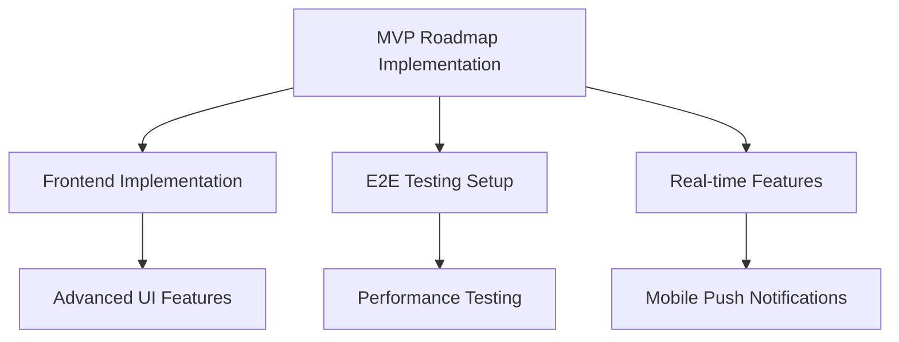

# Smart Alarm Implementation Plans Index

## Overview

This directory contains all implementation plans for the Smart Alarm project, organized by purpose and chronological order. Each plan follows the standardized implementation plan template for consistency and automated processing.

## Current Active Plans

### 🎯 MVP Implementation (Priority: CRITICAL)

#### **[feature-mvp-roadmap-implementation-1.md](feature-mvp-roadmap-implementation-1.md)**

- **Purpose**: Resolve 4 critical gaps identified in MVP roadmap analysis
- **Scope**: API completion, Frontend implementation, E2E testing, Real-time features
- **Status**: 📋 Ready for Implementation
- **Timeline**: 12 weeks (5 phases)
- **Priority**: 🔥 CRITICAL - Blocks user access to system

### 🖥️ Frontend Development (Priority: HIGH)

#### **[feature-frontend-implementation-1.md](feature-frontend-implementation-1.md)**

- **Purpose**: Detailed frontend implementation strategy
- **Scope**: React 18 + TypeScript PWA with accessibility focus
- **Status**: 📋 Ready for Implementation  
- **Timeline**: 8 weeks
- **Priority**: ⚡ HIGH - Core user experience

## Historical References

### 📚 Project Evolution Documentation

#### **[project-evolution-historical-1.md](project-evolution-historical-1.md)**

- **Purpose**: Historical context and project evolution analysis
- **Scope**: Backend completion story and user experience gap identification
- **Status**: ✅ Complete - Reference Only
- **Priority**: 📖 REFERENCE - Historical context

## Plan Status Legend

- 🔥 **CRITICAL**: Blocks core functionality or user access
- ⚡ **HIGH**: Important for user experience or system quality
- 🔧 **MEDIUM**: Improvements and optimizations
- 📖 **REFERENCE**: Documentation and historical context
- ✅ **COMPLETE**: Implementation finished
- 📋 **READY**: Plan complete, ready for implementation
- 🚧 **IN-PROGRESS**: Currently being implemented
- ⏸️ **PAUSED**: On hold for dependencies or resources

## Implementation Workflow

### Phase Execution Order

1. **Phase 1**: [MVP Roadmap Implementation](feature-mvp-roadmap-implementation-1.md) - Weeks 1-12
   - API Completion (Weeks 1-2)
   - Frontend Foundation (Weeks 3-4)
   - Core UI Implementation (Weeks 5-8)
   - E2E Testing (Weeks 9-10)
   - Real-time Features (Weeks 11-12)

2. **Phase 2**: Advanced Features (Future Planning)
   - AI-driven insights and recommendations
   - Advanced accessibility features
   - Performance optimizations
   - Mobile app development

### Dependencies and Relationships

## Quality Standards

All implementation plans in this directory must:

- Follow the standardized template format
- Include comprehensive task breakdown
- Specify clear acceptance criteria
- Document risks and mitigation strategies
- Reference related specifications
- Maintain version control and update history

## Usage Guidelines

### For Development Teams

1. Start with the highest priority active plan
2. Follow the task sequence as specified
3. Update completion status and dates
4. Document any deviations or issues

### For Project Management

1. Use priority levels for resource allocation
2. Monitor progress through task completion tables
3. Review dependencies before phase transitions
4. Update Memory Bank after significant milestones

### For Stakeholders

1. Focus on CRITICAL and HIGH priority plans
2. Review timelines and milestones
3. Track overall project progress through this index
4. Reference historical documents for context

## Related Documentation

- [Memory Bank](../../memory-bank/README.md) - Project context and patterns
- [System Architecture](../architecture/system-architecture.md) - Technical architecture
- [MVP Roadmap](../business/Roadmap%20MVP%20-%20Smart%20Alarm.md) - Business requirements
- [Progress Tracking](../../memory-bank/progress.md) - Implementation progress
