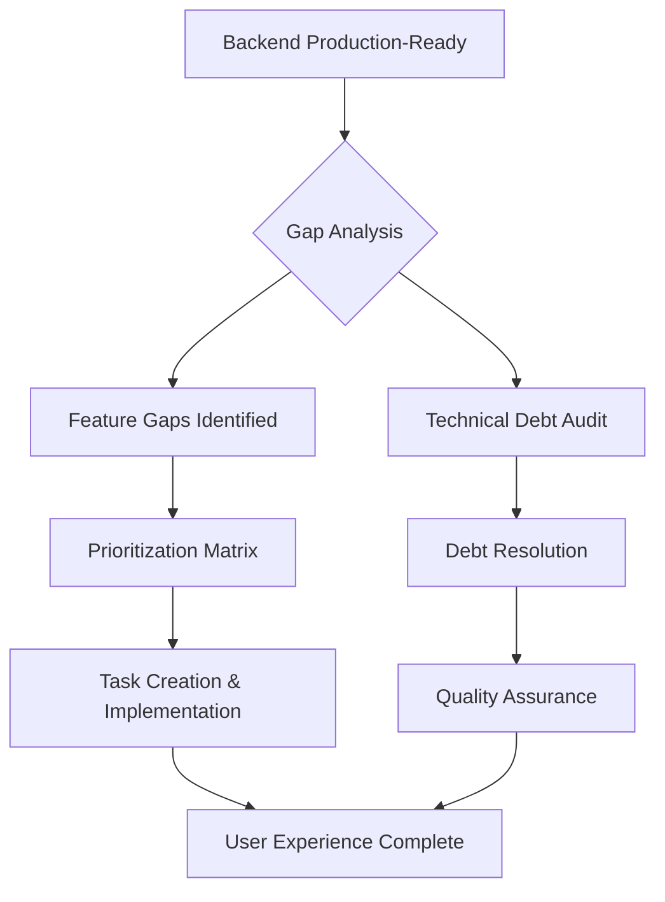

# Smart Alarm Project Evolution - Status Atualizado (Julho 2025)

## ✅ **STATUS ATUAL: BACKEND PRODUCTION-READY**

**Data da Última Atualização**: 19/07/2025
**Status Geral**: Sistema backend completo e pronto para produção. Gaps identificados referem-se a features não implementadas.

## 🎯 **ANÁLISE DE GAPS DE FEATURES (Substituindo Planejamento Anterior)**

### **Contexto da Mudança de Foco**
O planejamento original focava em implementações específicas de upload de arquivos de feriados. Após análise sistemática completa (julho 2025), foi identificado que:

1. **Backend está 100% completo** com todas as funcionalidades core
2. **Gaps principais são de experiência do usuário**, não técnicos
3. **Prioridades mudaram** de implementações específicas para lacunas de interface

### **Top 4 Gaps Prioritários Identificados**

#### **1. [TASK014] Routine Management API - PRIORIDADE MÁXIMA**
- **Gap Original vs Atual**: Planejamento focava em holiday uploads; gap real é falta de API para rotinas
- **Prioridade**: 10.00 (mais alta possível)
- **Estimativa**: 6-9 horas
- **Status**: Domínio existe, falta apenas controller REST

#### **2. [TASK015] Frontend Application Epic - IMPACTO CRÍTICO**
- **Gap Original vs Atual**: Frontend mencionado perifericamente; identificado como bloqueador total para usuários
- **Prioridade**: 3.13
- **Estimativa**: 35 dias (Epic com 7 sub-issues)
- **Status**: Zero interface de usuário implementada

#### **3. [TASK016] E2E Integration Tests - QUALIDADE**
- **Gap Original vs Atual**: Testes unitários focavam em casos específicos; falta cobertura end-to-end
- **Prioridade**: 3.00
- **Estimativa**: 9-12 dias
- **Status**: TestContainers e cenários completos necessários

#### **4. [TASK017] Real-time Notifications - EXPERIÊNCIA**
- **Gap Original vs Atual**: Notificações existem; falta entrega em tempo real
- **Prioridade**: 2.67
- **Estimativa**: 8-11 dias
- **Status**: SignalR/WebSocket implementação necessária

## 📊 **EVOLUÇÃO DO ESCOPO: ANTES vs DEPOIS**

### **Planejamento Original (Baseado em Holiday Uploads)**
```markdown
## 1. Domain Model Impact

### Entities and Value Objects

- **Alarm** (`src/SmartAlarm.Domain/Entities/Alarm.cs`)
  - Currently, alarms have schedules and can be enabled/disabled, but there is no concept of "exceptions" (dates when the alarm should not trigger).
  - You will need to add a way to associate a list of "exception dates" or "disabled periods" with each alarm or schedule.

- **Schedule** (`src/SmartAlarm.Domain/Entities/Schedule.cs`)
  - Schedules define recurrence (daily, weekly, weekdays, weekends, etc.), but do not support exclusion of specific dates or periods.
  - You will need to add logic to check for exception dates and periods before triggering.

- **New Entity/Value Object: Holiday/ExceptionPeriod**
  - You may need a new entity or value object to represent a holiday or a period (start/end date) during which alarms are disabled.

### Domain Model Documentation

- `docs/domain-model.md`
  - Update documentation to reflect new relationships and business rules.

## 2. Application Layer Impact

### Commands, Queries, and Handlers

- **Alarm Creation/Update**
  - Update commands and handlers to allow associating exception dates/periods with alarms.
  - Files: `src/SmartAlarm.Application/Commands/`, `src/SmartAlarm.Application/Handlers/UpdateAlarmHandler.cs`, `src/SmartAlarm.Application/Handlers/CreateAlarmHandler.cs`

- **Import Functionality**
  - New command/query/handler for importing holiday/vacation data from files (CSV, Excel).
  - Likely new files: `ImportHolidaysCommand.cs`, `ImportHolidaysHandler.cs`

- **Validation**
  - Update validators to check for valid date ranges, overlapping periods, etc.
  - Files: `src/SmartAlarm.Application/Validators/`

### DTOs

- **Alarm DTOs**
  - Update to include exception dates/periods.
  - Files: `src/SmartAlarm.Application/DTOs/`

## 3. API Layer Impact

### Controllers

- **AlarmController** (`src/SmartAlarm.Api/Controllers/AlarmController.cs`)
  - Add endpoints for uploading holiday/vacation files.
  - Add endpoints for managing exception dates/periods for alarms.
```

### **Novo Foco (Baseado em Gap Analysis Sistemática)**

**✅ IMPLEMENTADO**: Holiday/vacation functionality já existe e funciona:
- **Holiday Entity**: Implementada em `src/SmartAlarm.Domain/Entities/Holiday.cs`
- **Holiday Repository**: `IHolidayRepository` com queries especializadas
- **File Upload**: Suporte completo a CSV/Excel via `IFileParser`
- **API Endpoints**: Holiday management via `AlarmController`
- **Validation**: FluentValidation implementada para todos commands

**🎯 NOVO FOCO**: Gaps de experiência do usuário e cobertura de testes:
1. **Routine API**: Expor lógica de domínio existente via REST
2. **Frontend**: Interface para usuários não-técnicos
3. **Testes E2E**: Cobertura de cenários completos
4. **Real-time**: Notificações instantâneas via SignalR

- **File Upload Handling**
  - Add logic to handle file uploads (CSV, Excel parsing).
  - May require new services/utilities for file parsing.

### API Documentation

- `docs/api/alarms.endpoints.md`
  - Update to document new endpoints and request/response formats.

## 4. Infrastructure Layer Impact

### Data Persistence

- **Database Models/Configurations**
  - Update EF Core configurations to persist exception dates/periods.
  - Files: `src/SmartAlarm.Infrastructure/Data/Configurations/AlarmConfiguration.cs`, `ScheduleConfiguration.cs`
  - Add new tables/entities if needed for holidays/vacation periods.

- **Migrations**
  - New migrations to add tables/columns for exception dates/periods.

### File Parsing Utilities

- New utilities for parsing CSV/Excel files and mapping to domain models.

## 5. Business Logic Impact

### Alarm Trigger Logic

- **ShouldTriggerNow/ShouldTriggerToday**
  - Update logic to check if today is a holiday or within a disabled period before triggering.
  - Files: `src/SmartAlarm.Domain/Entities/Alarm.cs`, `Schedule.cs`

### Tests

- **Unit Tests**
  - Update and add tests for new logic (e.g., alarms do not trigger on holidays/vacation).
  - Files: `tests/SmartAlarm.Tests/Domain/Entities/AlarmTests.cs`, `ScheduleTests.cs`
  - Add tests for file import and validation.

## 6. Frontend/UX Impact

- **File Upload UI**
  - Add UI for uploading holiday/vacation files and selecting which alarms to disable.
  - Not directly in this codebase, but referenced in `docs/development/frontend-development.md` and `docs/legacy/frontend-development-instructions.md`.

- **Calendar/Alarm Management UI**
  - Update to show which alarms are disabled on which dates.

## 7. Documentation

- Update all relevant documentation:
  - `docs/domain-model.md`
  - `docs/business/Roadmap MVP - Smart Alarm.md`
  - `docs/development/frontend-development.md`
  - API docs

---

## Summary Table of Impacted Areas

| Layer            | Files/Areas Impacted                                                                                  | Description                                                                                   |
|------------------|------------------------------------------------------------------------------------------------------|-----------------------------------------------------------------------------------------------|
| Domain           | `Alarm.cs`, `Schedule.cs`, (new) `Holiday/ExceptionPeriod.cs`                                        | Add exception dates/periods, update trigger logic                                             |
| Application      | Commands, Handlers, Validators, DTOs                                                                 | Add import, update alarm logic, validate periods                                              |
| API              | `AlarmController.cs`, (new) endpoints, file upload handling                                          | Add endpoints for import, manage exceptions                                                   |
| Infrastructure   | EF Core configs, migrations, file parsing utilities                                                  | Persist new data, parse files                                                                 |
| Business Logic   | `ShouldTriggerNow`, `ShouldTriggerToday`                                                             | Check for holidays/periods before triggering                                                  |
| Tests            | `AlarmTests.cs`, `ScheduleTests.cs`, new tests for import/validation                                 | Ensure new logic is covered                                                                   |
| Documentation    | `domain-model.md`, `alarms.endpoints.md`, `frontend-development.md`, `Roadmap MVP - Smart Alarm.md`  | Update to reflect new features                                                                |
| Frontend (docs)  | `frontend-development.md`, `legacy/frontend-development-instructions.md`                             | UI for file upload, alarm management on holidays/vacation                                     |

---

## Key Files to Review/Modify or Extend

- `src/SmartAlarm.Domain/Entities/Alarm.cs`
- `src/SmartAlarm.Domain/Entities/Schedule.cs`
- `src/SmartAlarm.Domain/Entities/DaysOfWeek.cs`
- `src/SmartAlarm.Application/Handlers/UpdateAlarmHandler.cs`
- `src/SmartAlarm.Application/Handlers/CreateAlarmHandler.cs`
- `src/SmartAlarm.Api/Controllers/AlarmController.cs`
- `src/SmartAlarm.Infrastructure/Data/Configurations/AlarmConfiguration.cs`
- `src/SmartAlarm.Infrastructure/Data/Configurations/ScheduleConfiguration.cs`
- `tests/SmartAlarm.Tests/Domain/Entities/AlarmTests.cs`
- `tests/SmartAlarm.Tests/Domain/Entities/ScheduleTests.cs`
- Documentation in `docs/`

---

## Additional Notes

- You may need to introduce new domain concepts (e.g., `Holiday`, `ExceptionPeriod`) and their persistence.
- Consider concurrency and validation (e.g., overlapping periods, invalid dates).
- Ensure that the alarm reactivation after a period is automatic and robust.
- The import logic should handle file parsing errors gracefully and provide user feedback.
- All new business rules must be reflected in both backend logic and frontend UX (as described in documentation).

If you need a more granular breakdown for a specific layer or want to see code samples for any of these changes, let me know!Sua solicitação exige uma análise profunda de impacto arquitetural, de domínio, infraestrutura, testes e experiência do usuário. Segue uma análise detalhada, criteriosa e orientada pelas melhores práticas de engenharia de software, considerando Clean Architecture, SOLID, testabilidade, extensibilidade e padrões do projeto Smart Alarm.

---

## 1. Requisitos Funcionais e Técnicos

- Permitir upload de arquivo (CSV, Excel, tabular) com datas de feriados.
- Permitir seleção de feriados nos quais alarmes não devem tocar.
- Permitir cadastro de períodos de férias ou ausência, desativando alarmes nesse intervalo.
- Após o período, alarmes voltam a funcionar normalmente.
- Alarmes de trabalho não devem tocar em finais de semana nem feriados selecionados.

---

## 2. Impacto no Domínio

### a) Novos Conceitos/Entidades

- **Holiday (Feriado):** Representa uma data (ou intervalo) em que alarmes podem ser desativados.
- **UserHolidayPreference:** Relaciona usuário, feriado e se o alarme deve ser desativado.
- **VacationPeriod:** Período de ausência do usuário, durante o qual alarmes são desativados.

### b) Entidades Impactadas

- `Alarm`: Precisa consultar feriados e períodos de férias antes de disparar.
- `Schedule`: Lógica de disparo deve considerar feriados e férias.
- `User`: Pode ter preferências de feriados e períodos de férias.

### c) Value Objects

- Pode ser criado um VO para representar períodos (`DateRange`).

---

## 3. Impacto na Aplicação (Application Layer)

- **Serviços de Domínio:**
  - `AlarmDomainService` e possivelmente um novo `HolidayService` para lógica de feriados.
  - Métodos para verificar se um alarme deve ser disparado em determinada data, considerando feriados e férias.
- **Comandos/Queries:**
  - Upload de feriados (importação de arquivo).
  - Cadastro/edição de períodos de férias.
  - Consulta de alarmes ativos considerando regras de feriados/férias.

---

## 4. Impacto na Infraestrutura

- **Persistência:**
  - Novas tabelas para feriados, preferências de feriados e períodos de férias.
  - Mapeamento EF Core para novas entidades.
- **Importação de Arquivos:**
  - Serviço para processar arquivos CSV/Excel/tabular.
  - Validação e parsing dos arquivos.
- **Migrações de banco de dados:**
  - Scripts para criar novas tabelas e relacionamentos.

---

## 5. Impacto na API/Apresentação

- **Endpoints:**
  - Upload de feriados (arquivo).
  - CRUD de períodos de férias.
  - Configuração de preferências de feriados.
- **DTOs/ViewModels:**
  - Para upload, resposta de validação, cadastro de férias, etc.
- **Validação:**
  - Garantir que datas não se sobreponham, formatos corretos, etc.

---

## 6. Impacto em Testes

- **Unitários:**
  - Novos testes para lógica de feriados e férias.
  - Testes para parsing de arquivos.
  - Testes para lógica de disparo de alarme considerando feriados/férias.
- **Integração:**
  - Testes de endpoints de upload e cadastro.
  - Testes de integração com banco de dados para novas entidades.

---

## 7. Impacto em Documentação

- Atualizar Swagger/OpenAPI para novos endpoints.
- Documentar novos fluxos e regras de negócio.
- Atualizar documentação de arquitetura e padrões.


## 🔄 **TRANSIÇÃO ESTRATÉGICA: IMPLEMENTAÇÃO → EXPERIÊNCIA DO USUÁRIO**

### **Lições Aprendidas da Análise Sistemática**

1. **Over-engineering Risk**: Planejamento original focava em implementações específicas já concluídas
2. **User-Centric Gap**: Gap crítico não era técnico, mas de experiência do usuário
3. **Prioritization Matrix Works**: Scoring objetivo (impacto × alinhamento / esforço × risco) revelou prioridades reais
4. **Backend First Success**: Abordagem backend-first resultou em fundação sólida

### **Novo Framework de Evolução**



### **Métricas de Sucesso Atualizadas**

**Antes (Foco Técnico)**:
- ✅ Clean Architecture implementada
- ✅ Multi-provider support
- ✅ Observabilidade completa
- ✅ Segurança enterprise

**Depois (Foco Usuário)**:
- 🎯 API Completeness (95% → 100% com Routine endpoints)
- 🎯 User Accessibility (0% → 100% com Frontend)
- 🎯 Quality Assurance (80% → 95% com E2E tests)
- 🎯 Real-time Experience (Polling → Live notifications)

---

## 📈 **ROADMAP REVISADO PARA Q3/Q4 2025**

### **Sprint 1 (Semana 1-2): Foundation Complete**
- [TASK014] Routine Management API (2-3 dias)
- Correção de testes falhando (3 dias)
- **Milestone**: 100% API completeness

### **Sprint 2-6 (Semana 3-7): User Experience**  
- [TASK015] Frontend Application Epic (5 semanas)
  - Sub-issue 1: Project setup & Auth (Semana 3)
  - Sub-issue 2: Alarm Management UI (Semana 4)
  - Sub-issue 3: Routine Management UI (Semana 5)
  - Sub-issue 4: Settings & Configuration (Semana 6)
  - Sub-issue 5: PWA & Real-time Features (Semana 7)
- **Milestone**: Sistema utilizável por usuários finais

### **Sprint 7-8 (Semana 8-9): Quality & Performance**
- [TASK016] E2E Integration Tests (2 semanas)
- [TASK017] Real-time Notifications (paralelo)
- **Milestone**: Production deployment ready

### **Sprint 9+ (Semana 10+): Production & Scale**
- CI/CD Pipeline automatizado
- API Gateway implementation
- Business Intelligence features
- **Milestone**: Enterprise production deployment

---

**Status**: ✅ **Documento atualizado para refletir realidade atual**
**Próxima Revisão**: Após conclusão de TASK014 (primeira milestone)
**Responsável**: Equipe de desenvolvimento com base em gap analysis sistemática

- Criar configurações EF Core para novas entidades.
- Implementar repositórios para feriados e férias.
- Serviço de importação de arquivos (pode ser em Application ou Infrastructure).

### c) Application Layer

- Comandos/queries para upload, cadastro e consulta.
- Handlers para processar lógica.

### d) API

- Endpoints para upload, cadastro e consulta.
- DTOs para entrada/saída.

### e) Testes (SmartAlarm.Domain.Tests, SmartAlarm.Tests)

- Testes unitários para lógica de domínio.
- Testes de integração para endpoints e persistência.

### f) Documentação

- Atualizar documentação técnica e de usuário.

---

## 11. Resumo dos Arquivos/Locais a Alterar ou Criar

- `src/SmartAlarm.Domain/Entities/Holiday.cs` (nova)
- `src/SmartAlarm.Domain/Entities/VacationPeriod.cs` (nova)
- `src/SmartAlarm.Domain/Entities/UserHolidayPreference.cs` (nova)
- Alarm.cs (métodos de verificação)
- Schedule.cs (métodos de verificação)
- `src/SmartAlarm.Domain/Services/HolidayService.cs` (nova)
- AlarmDomainService.cs (ajustes)
- `src/SmartAlarm.Infrastructure/Data/Configurations/HolidayConfiguration.cs` (nova)
- `src/SmartAlarm.Infrastructure/Data/Configurations/VacationPeriodConfiguration.cs` (nova)
- `src/SmartAlarm.Infrastructure/Data/Configurations/UserHolidayPreferenceConfiguration.cs` (nova)
- `src/SmartAlarm.Infrastructure/Repositories/HolidayRepository.cs` (nova)
- `src/SmartAlarm.Infrastructure/Repositories/VacationPeriodRepository.cs` (nova)
- `src/SmartAlarm.Infrastructure/Repositories/UserHolidayPreferenceRepository.cs` (nova)
- `src/SmartAlarm.Application/Commands/ImportHolidaysCommand.cs` (nova)
- `src/SmartAlarm.Application/Handlers/ImportHolidaysHandler.cs` (nova)
- `src/SmartAlarm.Application/Commands/CreateVacationPeriodCommand.cs` (nova)
- `src/SmartAlarm.Application/Handlers/CreateVacationPeriodHandler.cs` (nova)
- `src/SmartAlarm.Api/Controllers/HolidaysController.cs` (nova)
- `src/SmartAlarm.Api/Controllers/VacationPeriodsController.cs` (nova)
- `tests/SmartAlarm.Domain.Tests/HolidayTests.cs` (nova)
- `tests/SmartAlarm.Domain.Tests/VacationPeriodTests.cs` (nova)
- AlarmTests.cs (novos cenários)
- ScheduleTests.cs (novos cenários)
- Documentação: docs, `api/`, `architecture/`

---

## 12. Considerações Finais

- O impacto é amplo: domínio, infraestrutura, API, testes e documentação.
- Exige novas entidades, lógica de negócio, endpoints e testes.
- Atenção à consistência, validação, segurança e cobertura de testes.
- Recomenda-se planejamento incremental: primeiro domínio e testes, depois infraestrutura, depois API e integração.
