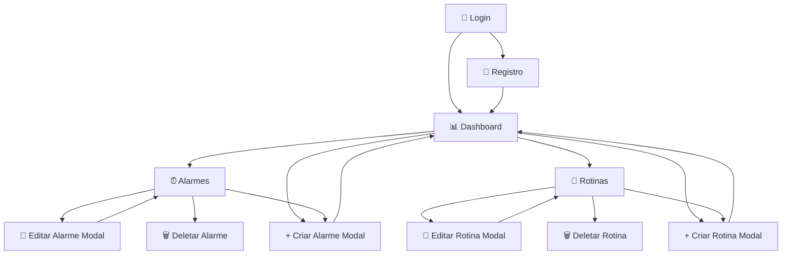

# Fluxograma das Telas - Smart Alarm

## 📊 **Mapa de Navegação do Sistema**



## 🎯 **Fluxos de Uso Principais**

### **Fluxo 1: Primeiro Acesso**

```
Login/Registro → Dashboard → Explorar Funcionalidades → Criar Primeiro Alarme → Criar Primeira Rotina
```

### **Fluxo 2: Uso Diário - Alarmes**

```
Dashboard → Verificar Alarmes → (Opcional) Criar Novo Alarme → (Opcional) Editar Alarme Existente
```

### **Fluxo 3: Uso Diário - Rotinas**

```
Dashboard → Verificar Rotinas → (Opcional) Criar Nova Rotina → (Opcional) Editar Rotina Existente
```

### **Fluxo 4: Gerenciamento Completo**

```
Dashboard → Página Dedicada (Alarmes/Rotinas) → Visualizar Lista Completa → Gerenciar Itens
```

## 📱 **Estrutura de Navegação**

### **Nível 1: Autenticação**

- **Login** (`/`)
- **Registro** (`/register`)

### **Nível 2: Dashboard**

- **Dashboard Principal** (`/dashboard`)

### **Nível 3: Gerenciamento**

- **Página de Alarmes** (`/alarms`)
- **Página de Rotinas** (`/routines`)

### **Nível 4: Modais**

- **Modal Criar/Editar Alarme** (Sobreposto)
- **Modal Criar/Editar Rotina** (Sobreposto)

## 🔄 **Estados das Telas**

### **Estados Globais**

- ✅ **Loading**: Spinner durante carregamento
- ❌ **Error**: Mensagem de erro com opção "Try Again"
- 📭 **Empty**: Estado vazio com call-to-action
- 🔄 **Success**: Feedback visual de sucesso

### **Estados de Formulário**

- 📝 **Editing**: Formulário em modo edição
- ✅ **Valid**: Campos válidos (verde)
- ❌ **Invalid**: Campos com erro (vermelho)
- 💾 **Saving**: Estado de salvamento

## 🎨 **Sistema de Cores por Contexto**

### **Alarmes (Azul)**

- Header: Azul 600
- Background: Azul 50
- Botões: Azul 600/500

### **Rotinas (Verde)**

- Header: Verde 600
- Background: Verde 50
- Botões: Verde 600/500

### **Dashboard (Neutro)**

- Header: Cinza 900
- Background: Cinza 50
- Cards: Branco com sombra

## 📏 **Breakpoints Responsivos**

### **Desktop (≥1024px)**

```
┌─────────────────────────────────────────────────────────────┐
│                        Header                               │
├─────────────────────────────────────────────────────────────┤
│                                                             │
│  ┌─────────────────┐    ┌─────────────────┐                │
│  │   Alarmes       │    │   Rotinas       │                │
│  │   (50% width)   │    │   (50% width)   │                │
│  └─────────────────┘    └─────────────────┘                │
│                                                             │
└─────────────────────────────────────────────────────────────┘
```

### **Tablet (768-1023px)**

```
┌─────────────────────────────────────────────────────────────┐
│                        Header                               │
├─────────────────────────────────────────────────────────────┤
│                                                             │
│  ┌─────────────────────────────────────────────────────────┐ │
│  │                   Alarmes                               │ │
│  │                 (100% width)                            │ │
│  └─────────────────────────────────────────────────────────┘ │
│                                                             │
│  ┌─────────────────────────────────────────────────────────┐ │
│  │                   Rotinas                               │ │
│  │                 (100% width)                            │ │
│  └─────────────────────────────────────────────────────────┘ │
│                                                             │
└─────────────────────────────────────────────────────────────┘
```

### **Mobile (≤767px)**

```
┌─────────────────────────────────────────┐
│               Header                    │
├─────────────────────────────────────────┤
│                                         │
│  ┌─────────────────────────────────────┐ │
│  │            Alarmes                  │ │
│  │          (100% width)               │ │
│  └─────────────────────────────────────┘ │
│                                         │
│  ┌─────────────────────────────────────┐ │
│  │            Rotinas                  │ │
│  │          (100% width)               │ │
│  └─────────────────────────────────────┘ │
│                                         │
└─────────────────────────────────────────┘
```

## ⌨️ **Navegação por Teclado**

### **Atalhos Globais**

- **Alt + D**: Ir para Dashboard
- **Alt + A**: Ir para Alarmes
- **Alt + R**: Ir para Rotinas
- **Ctrl + N**: Criar novo item (contexto atual)
- **Escape**: Fechar modal/voltar

### **Navegação em Listas**

- **Tab/Shift+Tab**: Navegar entre itens
- **Enter**: Editar item selecionado
- **Delete**: Deletar item selecionado
- **Arrow Up/Down**: Navegar verticalmente

### **Navegação em Formulários**

- **Tab**: Próximo campo
- **Shift+Tab**: Campo anterior
- **Enter**: Salvar formulário
- **Escape**: Cancelar edição

## 🔍 **Funcionalidades de Busca (Futuras)**

### **Busca Global**

- Campo de busca no header
- Busca em alarmes e rotinas simultaneamente
- Resultados destacados

### **Filtros Avançados**

- Por status (Ativo/Inativo)
- Por tipo (Único/Recorrente para alarmes)
- Por data de criação
- Por próxima execução

### **Ordenação**

- Por nome (A-Z, Z-A)
- Por data de criação
- Por próxima execução
- Por status

## 📊 **Analytics e Métricas (Futuras)**

### **Dashboard de Estatísticas**

- Total de alarmes/rotinas
- Alarmes executados hoje
- Rotinas em andamento
- Gráfico de atividade semanal

### **Relatórios**

- Relatório de uso mensal
- Alarmes mais utilizados
- Efetividade das rotinas
- Tempo médio de execução

---

**📅 Última Atualização**: 30/07/2025  
**🔄 Versão**: 1.0 (MVP Phase 3)  
**👥 Audiência**: Desenvolvedores e Product Managers
